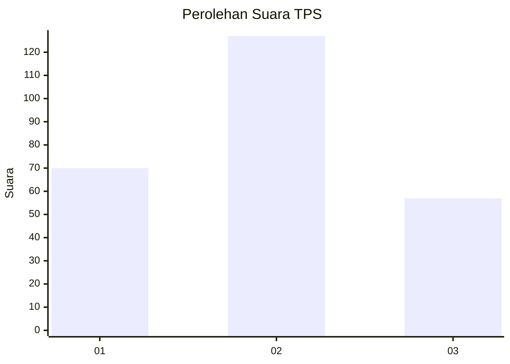
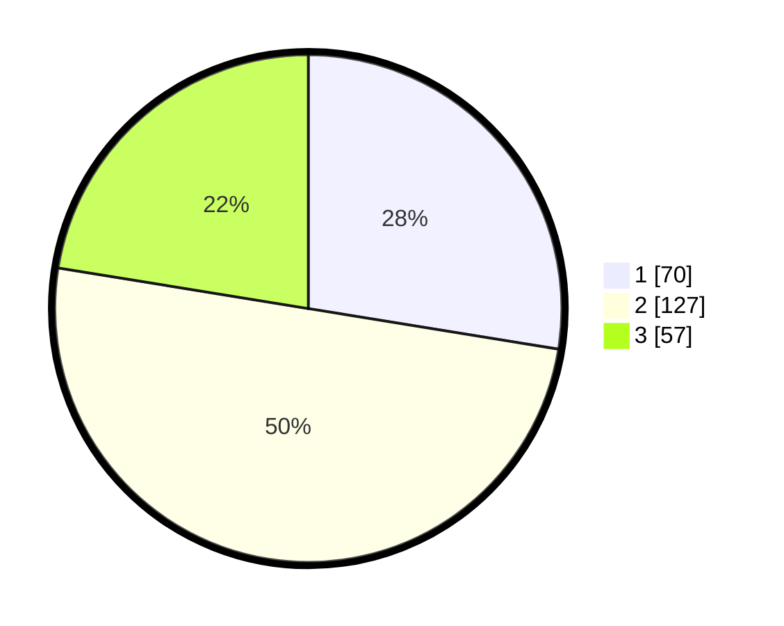

# Hasil

## Grafik

## Tabel

| No. | Nama Paslon    | Suara | Suara (raw) | Persentase |
|:--- |:-------------- | -----:| -----------:| ----------:|
| 1   | ANIES MUHAIMIN | 70    | [70][p-1]   | 27,56      |
| 2   | PRABOWO GIBRAN | 127   | [127][p-2]  | 50,00      |
| 3   | GANJAR MAHFUD  | 57    | [57][p-3]   | 22,44      |

[p-1]: https://github.com/gigit-pemilu/pemilu-2024/blob/main/pilpres/hitung-suara/sub/35-jawa-timur/sub/26-bangkalan/sub/18-galis/sub/2006-longkek/sub/003-tps/sub/paslon-1.txt
[p-2]: https://github.com/gigit-pemilu/pemilu-2024/blob/main/pilpres/hitung-suara/sub/35-jawa-timur/sub/26-bangkalan/sub/18-galis/sub/2006-longkek/sub/003-tps/sub/paslon-2.txt
[p-3]: https://github.com/gigit-pemilu/pemilu-2024/blob/main/pilpres/hitung-suara/sub/35-jawa-timur/sub/26-bangkalan/sub/18-galis/sub/2006-longkek/sub/003-tps/sub/paslon-3.txt

## Foto C Plano

https://sirekap-obj-formc.kpu.go.id/3e2c/pemilu/ppwp/35/26/18/20/06/3526182006003-20240215-104005--05289454-5afc-4dbc-b21a-9522a1eac4eb.jpg

https://sirekap-obj-formc.kpu.go.id/3e2c/pemilu/ppwp/35/26/18/20/06/3526182006003-20240215-104134--e7e98970-ae9e-4884-988a-8f876a3e55d1.jpg

https://sirekap-obj-formc.kpu.go.id/3e2c/pemilu/ppwp/35/26/18/20/06/3526182006003-20240215-113356--94e61863-a31c-44f3-9b6f-5be00e9741e9.jpg

## Metadata

| Key        | Value               |
| ---------- | ------------------- |
| Time Stamp | 2024-02-24 22:31:28 |

