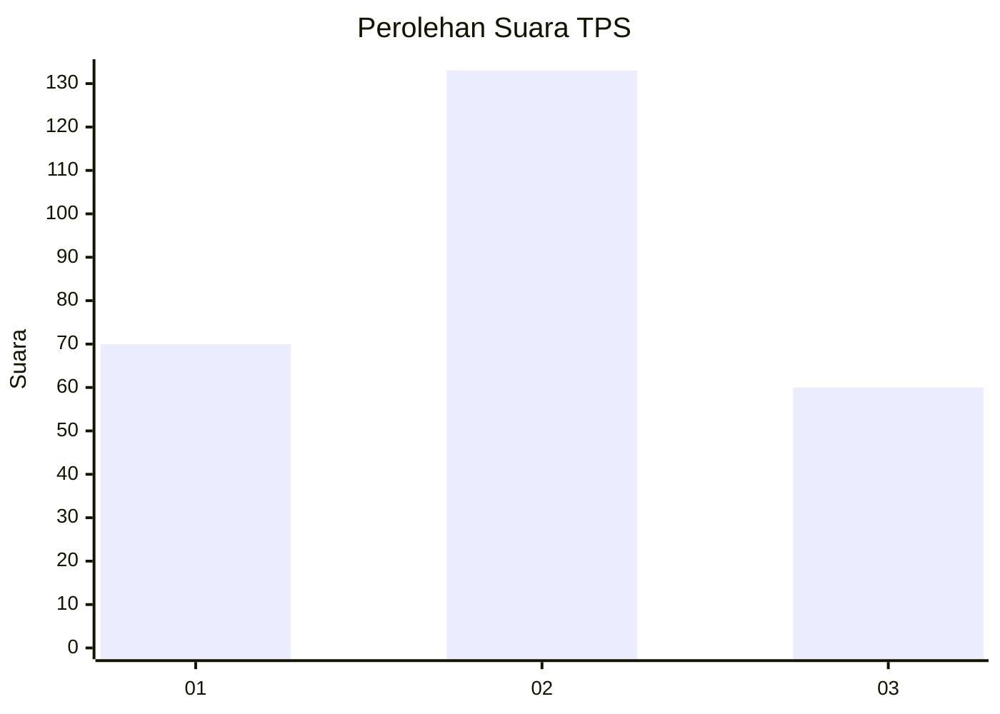
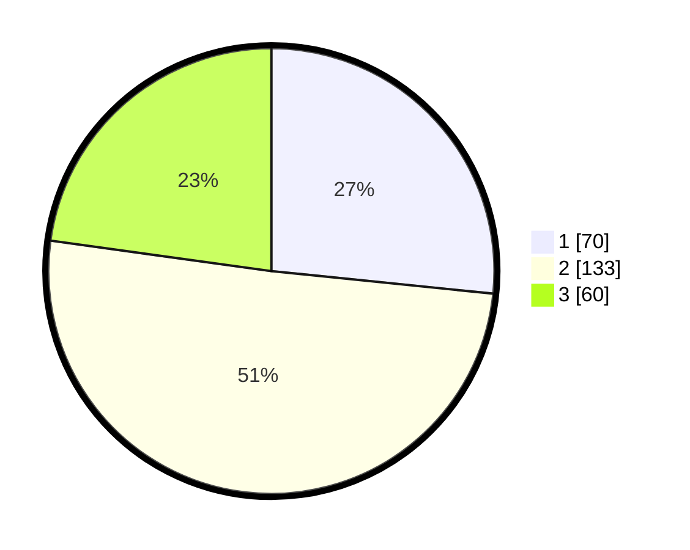

# Hasil

## Grafik

## Tabel

| No. | Nama Paslon    | Suara | Suara (raw) | Persentase |
|:--- |:-------------- | -----:| -----------:| ----------:|
| 1   | ANIES MUHAIMIN | 70    | [70][p-1]   | 26,62      |
| 2   | PRABOWO GIBRAN | 133   | [133][p-2]  | 50,57      |
| 3   | GANJAR MAHFUD  | 60    | [60][p-3]   | 22,81      |

[p-1]: https://github.com/gigit-pemilu/pemilu-2024/blob/main/pilpres/hitung-suara/sub/35-jawa-timur/sub/26-bangkalan/sub/18-galis/sub/2006-longkek/sub/005-tps/sub/paslon-1.txt
[p-2]: https://github.com/gigit-pemilu/pemilu-2024/blob/main/pilpres/hitung-suara/sub/35-jawa-timur/sub/26-bangkalan/sub/18-galis/sub/2006-longkek/sub/005-tps/sub/paslon-2.txt
[p-3]: https://github.com/gigit-pemilu/pemilu-2024/blob/main/pilpres/hitung-suara/sub/35-jawa-timur/sub/26-bangkalan/sub/18-galis/sub/2006-longkek/sub/005-tps/sub/paslon-3.txt

## Foto C Plano

https://sirekap-obj-formc.kpu.go.id/696b/pemilu/ppwp/35/26/18/20/06/3526182006005-20240215-113108--2f9fb4a5-0ee8-4926-8555-88c1d6303fdf.jpg

https://sirekap-obj-formc.kpu.go.id/696b/pemilu/ppwp/35/26/18/20/06/3526182006005-20240215-113411--3e956586-5c21-4713-bef7-e9f4cc39695b.jpg

https://sirekap-obj-formc.kpu.go.id/696b/pemilu/ppwp/35/26/18/20/06/3526182006005-20240215-113935--3dba234e-0223-4ed3-af9b-ebb769baedfc.jpg

## Metadata

| Key        | Value               |
| ---------- | ------------------- |
| Time Stamp | 2024-02-24 22:31:28 |

