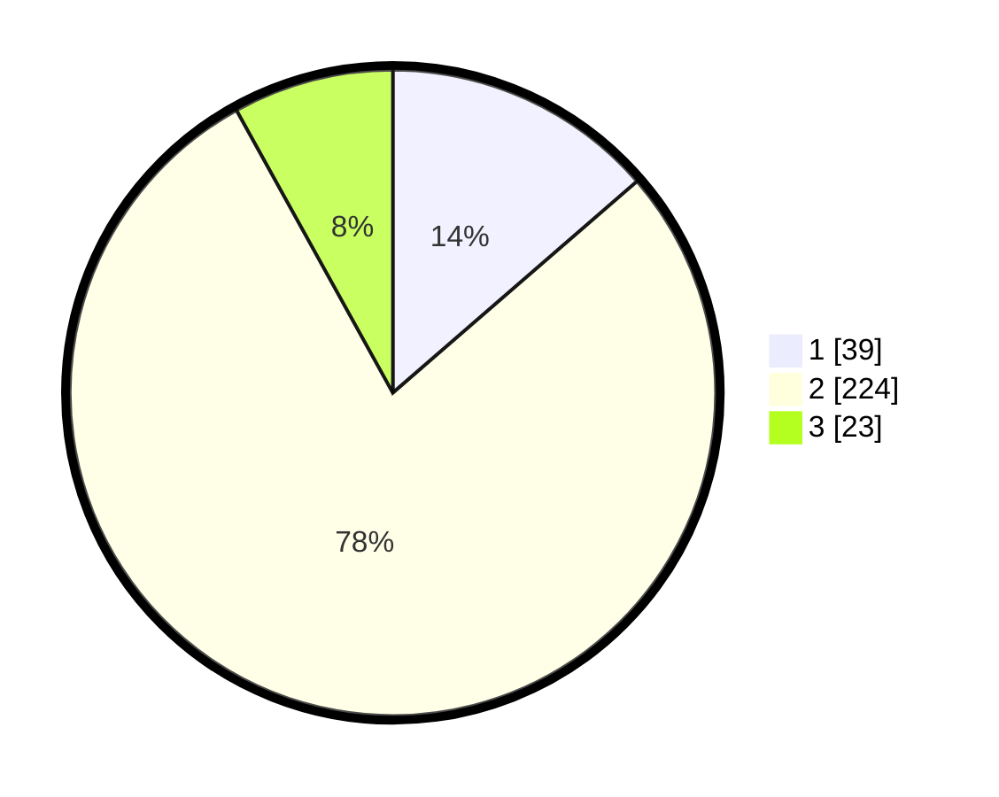

# Hasil

## Grafik

## Tabel

| No. | Nama Paslon    | Suara | Suara (raw) | Persentase |
|:--- |:-------------- | -----:| -----------:| ----------:|
| 1   | ANIES MUHAIMIN | 39    | [39][p-1]   | 13,64      |
| 2   | PRABOWO GIBRAN | 224   | [224][p-2]  | 78,32      |
| 3   | GANJAR MAHFUD  | 23    | [23][p-3]   | 8,04       |

[p-1]: https://github.com/gigit-pemilu/pemilu-2024/blob/main/pilpres/hitung-suara/sub/35-jawa-timur/sub/26-bangkalan/sub/18-galis/sub/2009-bangpendah/sub/001-tps/sub/paslon-1.txt
[p-2]: https://github.com/gigit-pemilu/pemilu-2024/blob/main/pilpres/hitung-suara/sub/35-jawa-timur/sub/26-bangkalan/sub/18-galis/sub/2009-bangpendah/sub/001-tps/sub/paslon-2.txt
[p-3]: https://github.com/gigit-pemilu/pemilu-2024/blob/main/pilpres/hitung-suara/sub/35-jawa-timur/sub/26-bangkalan/sub/18-galis/sub/2009-bangpendah/sub/001-tps/sub/paslon-3.txt

## Foto C Plano

https://sirekap-obj-formc.kpu.go.id/4bb3/pemilu/ppwp/35/26/18/20/09/3526182009001-20240214-220853--aa6e6e29-371c-4d14-933e-bcc9faa9f270.jpg

https://sirekap-obj-formc.kpu.go.id/4bb3/pemilu/ppwp/35/26/18/20/09/3526182009001-20240214-221246--b3441287-2849-45e7-a1c1-4154eef2e8f7.jpg

https://sirekap-obj-formc.kpu.go.id/4bb3/pemilu/ppwp/35/26/18/20/09/3526182009001-20240214-221539--e6f3593b-458f-4013-a89f-29a201c15a6a.jpg

## Metadata

| Key        | Value               |
| ---------- | ------------------- |
| Time Stamp | 2024-02-19 06:16:00 |

