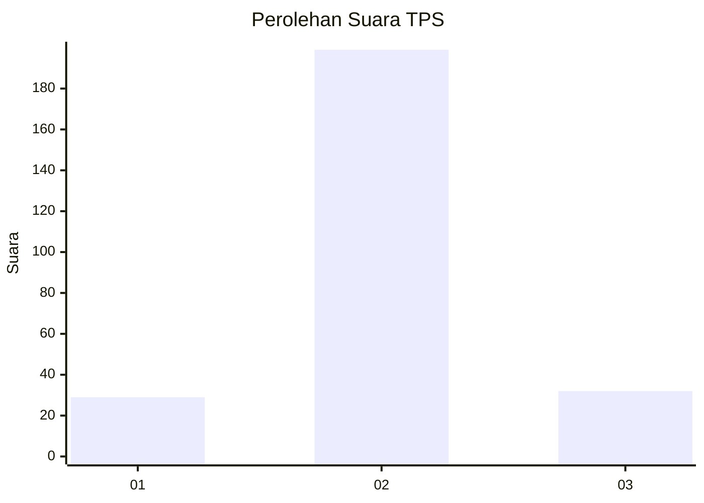
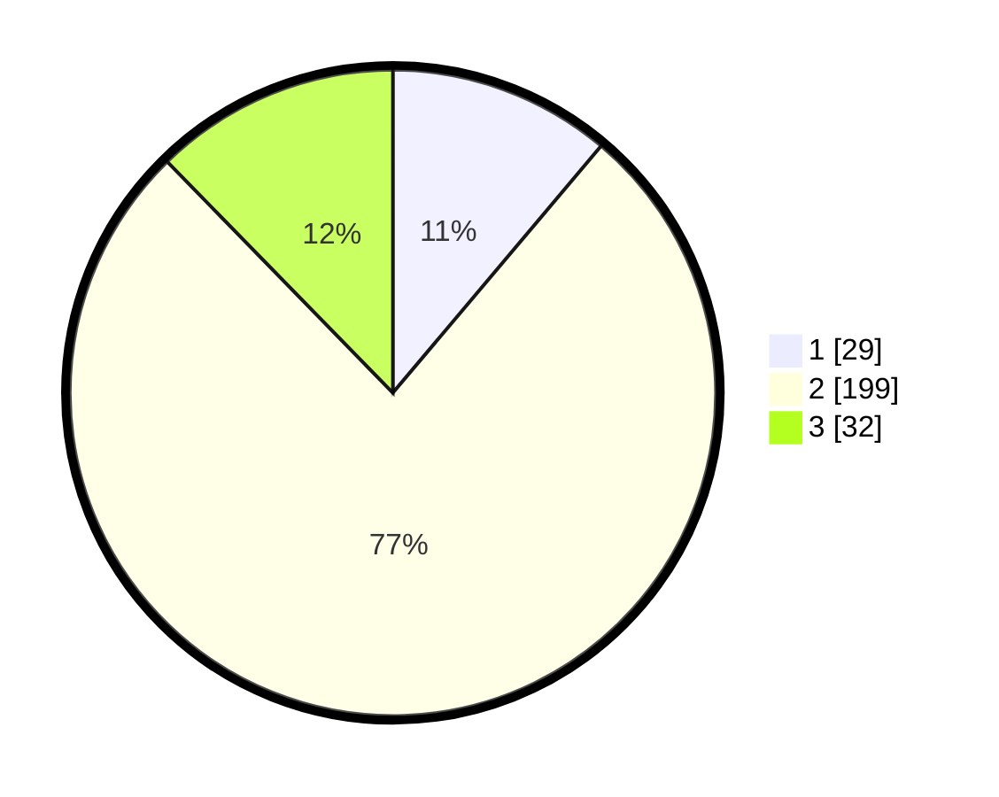

# Hasil

## Grafik

## Tabel

| No. | Nama Paslon    | Suara | Suara (raw) | Persentase |
|:--- |:-------------- | -----:| -----------:| ----------:|
| 1   | ANIES MUHAIMIN | 29    | [29][p-1]   | 11,15      |
| 2   | PRABOWO GIBRAN | 199   | [199][p-2]  | 76,54      |
| 3   | GANJAR MAHFUD  | 32    | [32][p-3]   | 12,31      |

[p-1]: https://github.com/gigit-pemilu/pemilu-2024-35-jawa-timur/blob/main/pilpres/hitung-suara/sub/35-jawa-timur/sub/26-bangkalan/sub/18-galis/sub/2011-paka'an-laok/sub/004-tps/sub/paslon-1.txt
[p-2]: https://github.com/gigit-pemilu/pemilu-2024-35-jawa-timur/blob/main/pilpres/hitung-suara/sub/35-jawa-timur/sub/26-bangkalan/sub/18-galis/sub/2011-paka'an-laok/sub/004-tps/sub/paslon-2.txt
[p-3]: https://github.com/gigit-pemilu/pemilu-2024-35-jawa-timur/blob/main/pilpres/hitung-suara/sub/35-jawa-timur/sub/26-bangkalan/sub/18-galis/sub/2011-paka'an-laok/sub/004-tps/sub/paslon-3.txt

## Foto C Plano

https://sirekap-obj-formc.kpu.go.id/78c9/pemilu/ppwp/35/26/18/20/11/3526182011004-20240214-223212--067d7f9b-ec5b-42b5-8e87-982d0422ffaf.jpg

https://sirekap-obj-formc.kpu.go.id/78c9/pemilu/ppwp/35/26/18/20/11/3526182011004-20240214-223322--0be50c08-9340-4736-88e7-db23f84c9a73.jpg

https://sirekap-obj-formc.kpu.go.id/78c9/pemilu/ppwp/35/26/18/20/11/3526182011004-20240214-223455--18a6f886-5f17-42ee-bd90-88e3e221db9e.jpg

## Metadata

| Key        | Value               |
| ---------- | ------------------- |
| Time Stamp | 2024-02-24 22:31:28 |

