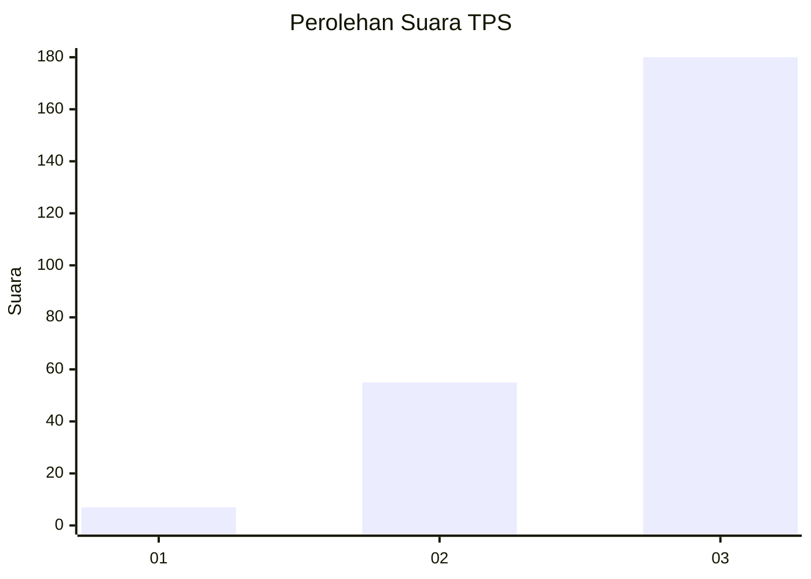
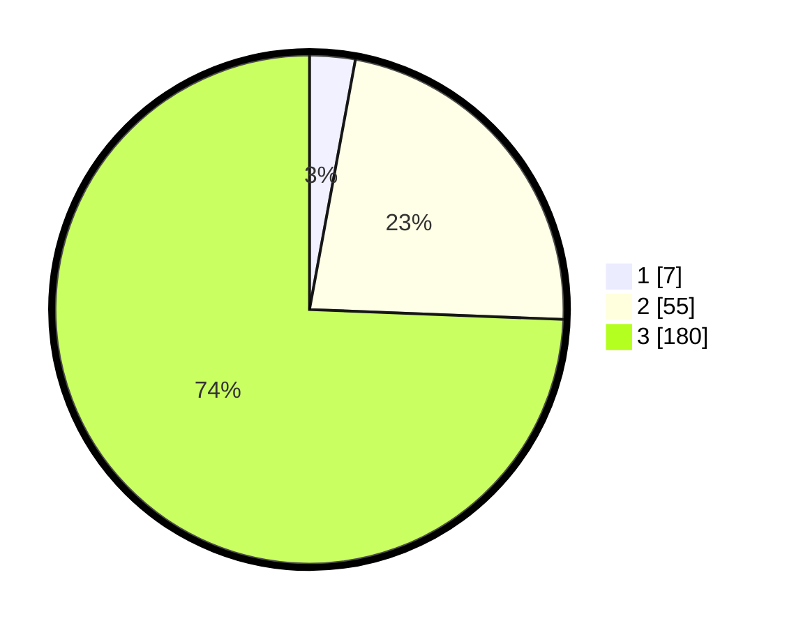

# Hasil

## Grafik

## Tabel

| No. | Nama Paslon    | Suara | Suara (raw) | Persentase |
|:--- |:-------------- | -----:| -----------:| ----------:|
| 1   | ANIES MUHAIMIN | 7     | [7][p-1]    | 2,89       |
| 2   | PRABOWO GIBRAN | 55    | [55][p-2]   | 22,73      |
| 3   | GANJAR MAHFUD  | 180   | [180][p-3]  | 74,38      |

[p-1]: https://github.com/gigit-pemilu/pemilu-2024-35-jawa-timur/blob/main/pilpres/hitung-suara/sub/35-jawa-timur/sub/26-bangkalan/sub/18-galis/sub/2012-kranggan-timur/sub/003-tps/sub/paslon-1.txt
[p-2]: https://github.com/gigit-pemilu/pemilu-2024-35-jawa-timur/blob/main/pilpres/hitung-suara/sub/35-jawa-timur/sub/26-bangkalan/sub/18-galis/sub/2012-kranggan-timur/sub/003-tps/sub/paslon-2.txt
[p-3]: https://github.com/gigit-pemilu/pemilu-2024-35-jawa-timur/blob/main/pilpres/hitung-suara/sub/35-jawa-timur/sub/26-bangkalan/sub/18-galis/sub/2012-kranggan-timur/sub/003-tps/sub/paslon-3.txt

## Foto C Plano

https://sirekap-obj-formc.kpu.go.id/bcf0/pemilu/ppwp/35/26/18/20/12/3526182012003-20240226-120248--57434077-3505-4521-9b65-2f6f6584f147.jpg

https://sirekap-obj-formc.kpu.go.id/bcf0/pemilu/ppwp/35/26/18/20/12/3526182012003-20240226-120651--3a7ff425-8d17-4f25-a46f-9573549cd012.jpg

https://sirekap-obj-formc.kpu.go.id/bcf0/pemilu/ppwp/35/26/18/20/12/3526182012003-20240226-120731--70fe6369-4033-4d08-9467-124066dedebe.jpg

## Metadata

| Key        | Value               |
| ---------- | ------------------- |
| Time Stamp | 2024-02-28 21:00:00 |

