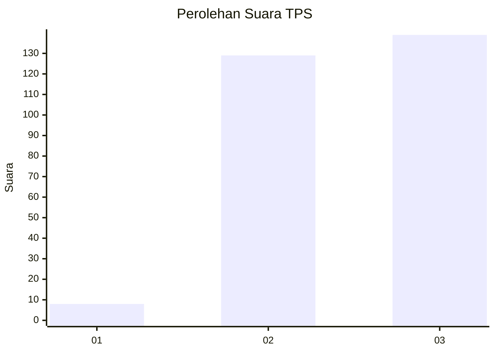
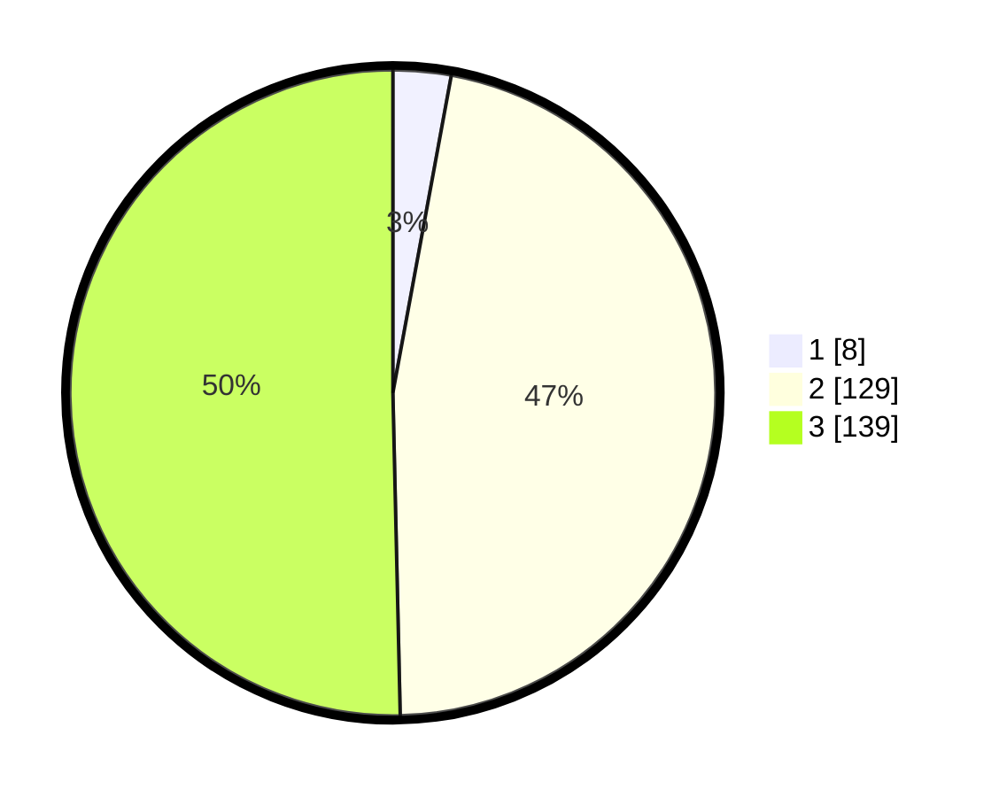

# Hasil

## Grafik

## Tabel

| No. | Nama Paslon    | Suara | Suara (raw) | Persentase |
|:--- |:-------------- | -----:| -----------:| ----------:|
| 1   | ANIES MUHAIMIN | 8     | [8][p-1]    | 2,90       |
| 2   | PRABOWO GIBRAN | 129   | [129][p-2]  | 46,74      |
| 3   | GANJAR MAHFUD  | 139   | [139][p-3]  | 50,36      |

[p-1]: https://github.com/gigit-pemilu/pemilu-2024-35-jawa-timur/blob/main/pilpres/hitung-suara/sub/35-jawa-timur/sub/26-bangkalan/sub/18-galis/sub/2012-kranggan-timur/sub/004-tps/sub/paslon-1.txt
[p-2]: https://github.com/gigit-pemilu/pemilu-2024-35-jawa-timur/blob/main/pilpres/hitung-suara/sub/35-jawa-timur/sub/26-bangkalan/sub/18-galis/sub/2012-kranggan-timur/sub/004-tps/sub/paslon-2.txt
[p-3]: https://github.com/gigit-pemilu/pemilu-2024-35-jawa-timur/blob/main/pilpres/hitung-suara/sub/35-jawa-timur/sub/26-bangkalan/sub/18-galis/sub/2012-kranggan-timur/sub/004-tps/sub/paslon-3.txt

## Foto C Plano

https://sirekap-obj-formc.kpu.go.id/c414/pemilu/ppwp/35/26/18/20/12/3526182012004-20240226-120933--f1bae660-3105-4749-a6c2-ee09ade4bf49.jpg

https://sirekap-obj-formc.kpu.go.id/c414/pemilu/ppwp/35/26/18/20/12/3526182012004-20240226-121013--e103a2e1-f7c9-4e6e-b3af-254c1c071463.jpg

https://sirekap-obj-formc.kpu.go.id/c414/pemilu/ppwp/35/26/18/20/12/3526182012004-20240226-121052--7c60c216-82f0-4dee-b6d2-8f12b7b4afe9.jpg

## Metadata

| Key        | Value               |
| ---------- | ------------------- |
| Time Stamp | 2024-02-28 20:00:00 |

