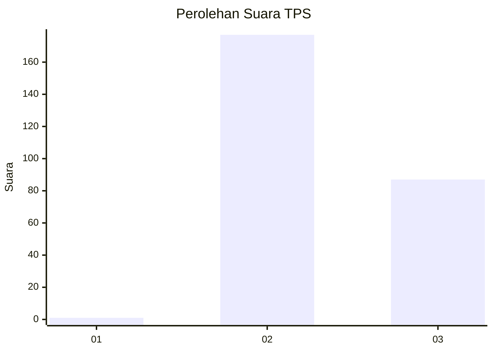
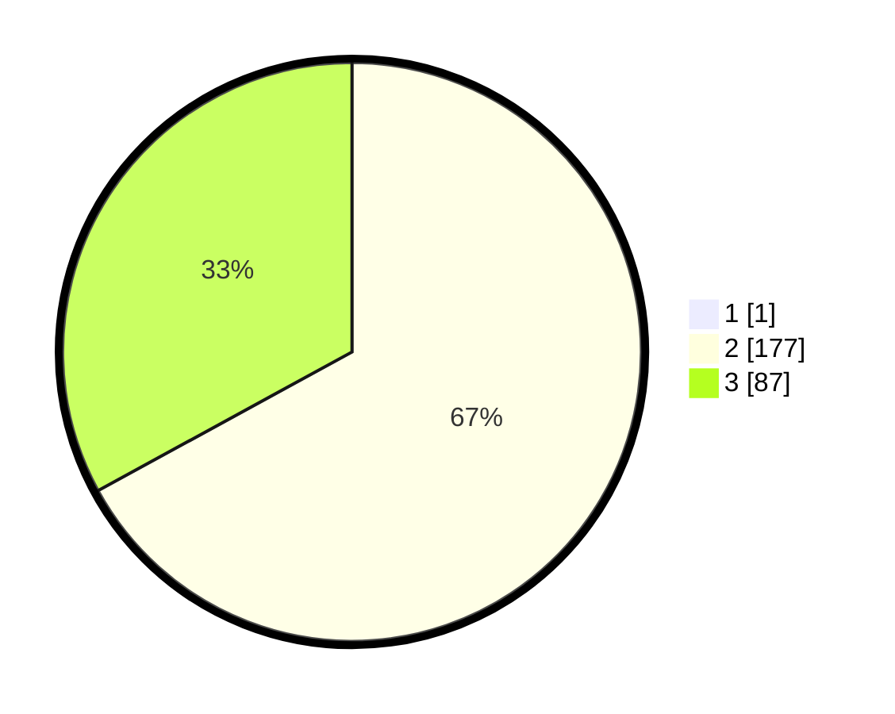

# Hasil

## Grafik

## Tabel

| No. | Nama Paslon    | Suara | Suara (raw) | Persentase |
|:--- |:-------------- | -----:| -----------:| ----------:|
| 1   | ANIES MUHAIMIN | 1     | [1][p-1]    | 0,38       |
| 2   | PRABOWO GIBRAN | 177   | [177][p-2]  | 66,79      |
| 3   | GANJAR MAHFUD  | 87    | [87][p-3]   | 32,83      |

[p-1]: https://github.com/gigit-pemilu/pemilu-2024/blob/main/pilpres/hitung-suara/sub/35-jawa-timur/sub/26-bangkalan/sub/18-galis/sub/2012-kranggan-timur/sub/005-tps/sub/paslon-1.txt
[p-2]: https://github.com/gigit-pemilu/pemilu-2024/blob/main/pilpres/hitung-suara/sub/35-jawa-timur/sub/26-bangkalan/sub/18-galis/sub/2012-kranggan-timur/sub/005-tps/sub/paslon-2.txt
[p-3]: https://github.com/gigit-pemilu/pemilu-2024/blob/main/pilpres/hitung-suara/sub/35-jawa-timur/sub/26-bangkalan/sub/18-galis/sub/2012-kranggan-timur/sub/005-tps/sub/paslon-3.txt

## Foto C Plano

https://sirekap-obj-formc.kpu.go.id/960d/pemilu/ppwp/35/26/18/20/12/3526182012005-20240226-121357--eebfcbbb-de50-4938-9cd4-4263c1bbc484.jpg

https://sirekap-obj-formc.kpu.go.id/960d/pemilu/ppwp/35/26/18/20/12/3526182012005-20240226-121516--46e69f87-93a7-400d-9f42-85e7f5ef98ca.jpg

https://sirekap-obj-formc.kpu.go.id/960d/pemilu/ppwp/35/26/18/20/12/3526182012005-20240226-121549--56aac582-286d-4dce-b36b-588b80e69556.jpg

## Metadata

| Key        | Value               |
| ---------- | ------------------- |
| Time Stamp | 2024-03-02 11:00:00 |

