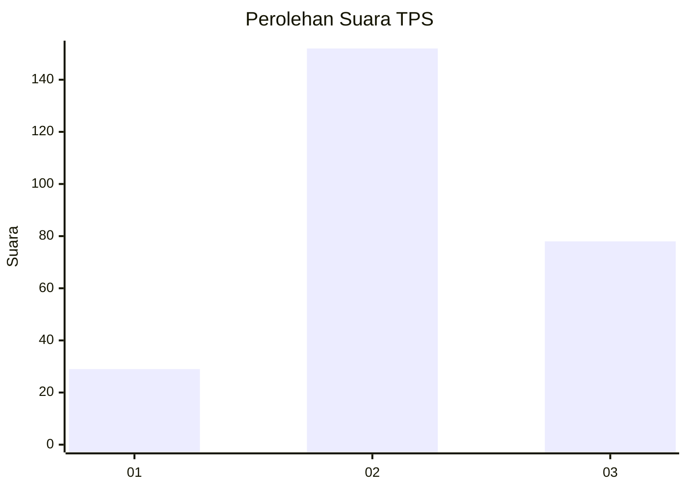
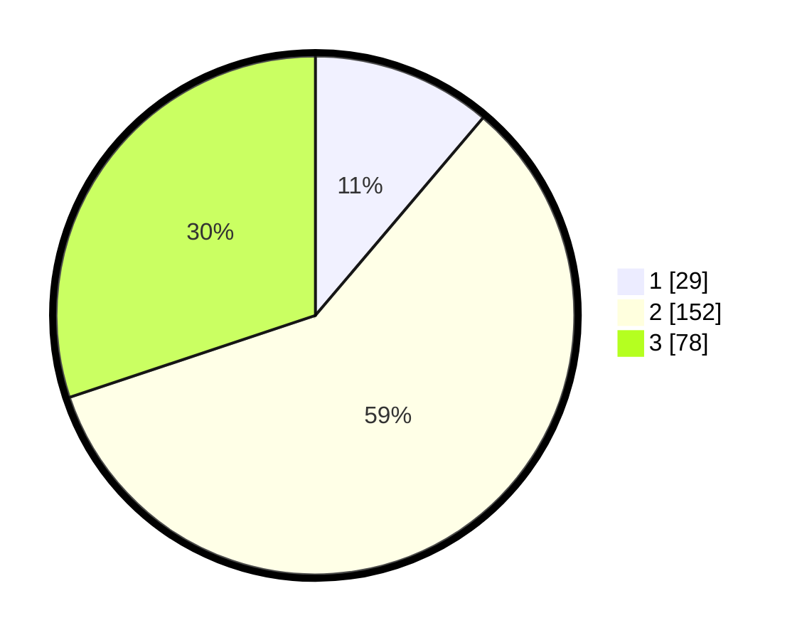

# Hasil

## Grafik

## Tabel

| No. | Nama Paslon    | Suara | Suara (raw) | Persentase |
|:--- |:-------------- | -----:| -----------:| ----------:|
| 1   | ANIES MUHAIMIN | 29    | [29][p-1]   | 11,20      |
| 2   | PRABOWO GIBRAN | 152   | [152][p-2]  | 58,69      |
| 3   | GANJAR MAHFUD  | 78    | [78][p-3]   | 30,12      |

[p-1]: https://github.com/gigit-pemilu/pemilu-2024-35-jawa-timur/blob/main/pilpres/hitung-suara/sub/35-jawa-timur/sub/26-bangkalan/sub/18-galis/sub/2014-banjar/sub/009-tps/sub/paslon-1.txt
[p-2]: https://github.com/gigit-pemilu/pemilu-2024-35-jawa-timur/blob/main/pilpres/hitung-suara/sub/35-jawa-timur/sub/26-bangkalan/sub/18-galis/sub/2014-banjar/sub/009-tps/sub/paslon-2.txt
[p-3]: https://github.com/gigit-pemilu/pemilu-2024-35-jawa-timur/blob/main/pilpres/hitung-suara/sub/35-jawa-timur/sub/26-bangkalan/sub/18-galis/sub/2014-banjar/sub/009-tps/sub/paslon-3.txt

## Foto C Plano

https://sirekap-obj-formc.kpu.go.id/6d99/pemilu/ppwp/35/26/18/20/14/3526182014009-20240226-120446--7fd0bd6c-1610-469a-8deb-c2e7b5500227.jpg

https://sirekap-obj-formc.kpu.go.id/6d99/pemilu/ppwp/35/26/18/20/14/3526182014009-20240226-120618--a8e03b16-13d8-46f6-a9bf-774e9acac7a3.jpg

https://sirekap-obj-formc.kpu.go.id/6d99/pemilu/ppwp/35/26/18/20/14/3526182014009-20240226-121535--4392137d-0770-4d87-afac-6b010c4e0a83.jpg

## Metadata

| Key        | Value               |
| ---------- | ------------------- |
| Time Stamp | 2024-02-28 22:00:00 |

