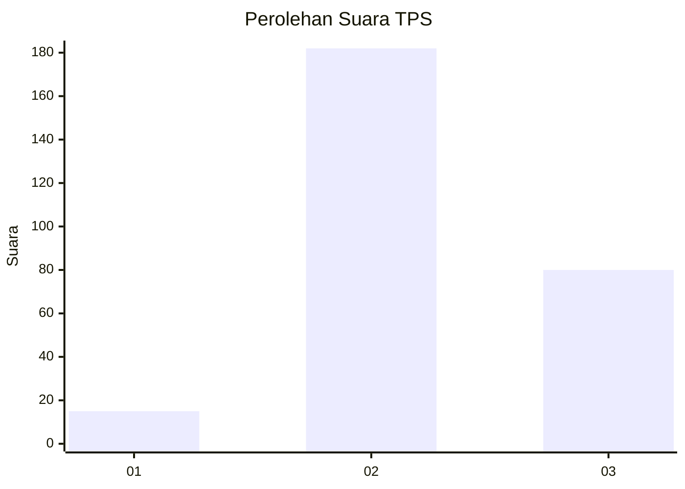
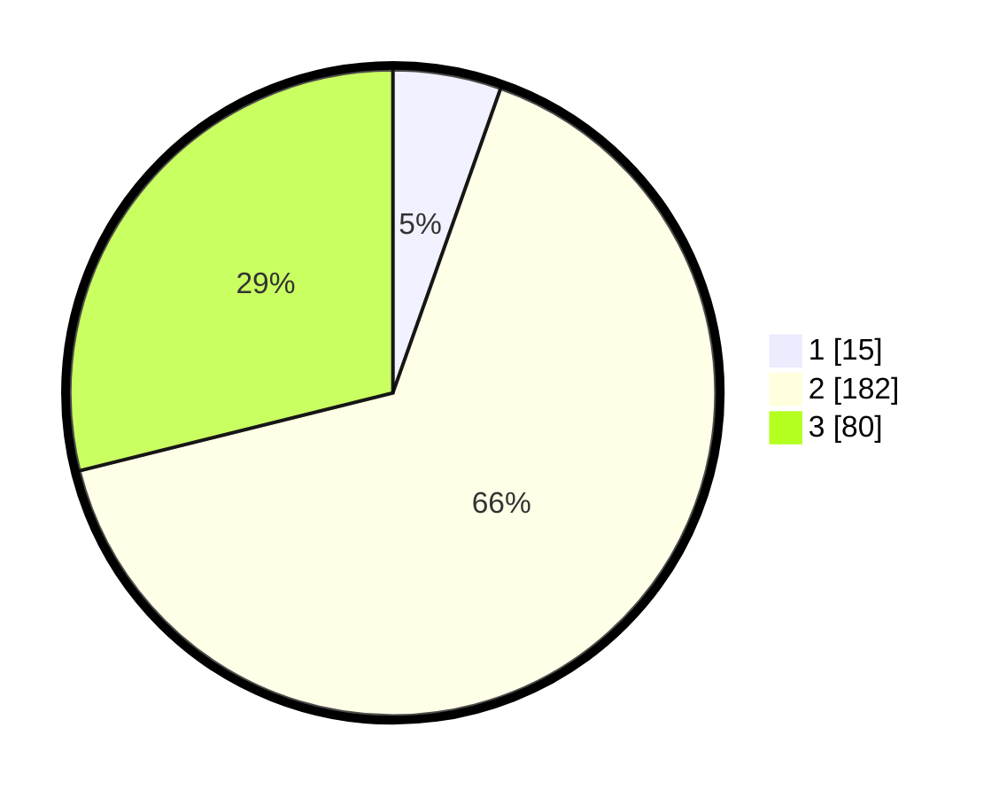

# Hasil

## Grafik

## Tabel

| No. | Nama Paslon    | Suara | Suara (raw) | Persentase |
|:--- |:-------------- | -----:| -----------:| ----------:|
| 1   | ANIES MUHAIMIN | 15    | [15][p-1]   | 5,42       |
| 2   | PRABOWO GIBRAN | 182   | [182][p-2]  | 65,70      |
| 3   | GANJAR MAHFUD  | 80    | [80][p-3]   | 28,88      |

[p-1]: https://github.com/gigit-pemilu/pemilu-2024-35-jawa-timur/blob/main/pilpres/hitung-suara/sub/35-jawa-timur/sub/26-bangkalan/sub/18-galis/sub/2014-banjar/sub/011-tps/sub/paslon-1.txt
[p-2]: https://github.com/gigit-pemilu/pemilu-2024-35-jawa-timur/blob/main/pilpres/hitung-suara/sub/35-jawa-timur/sub/26-bangkalan/sub/18-galis/sub/2014-banjar/sub/011-tps/sub/paslon-2.txt
[p-3]: https://github.com/gigit-pemilu/pemilu-2024-35-jawa-timur/blob/main/pilpres/hitung-suara/sub/35-jawa-timur/sub/26-bangkalan/sub/18-galis/sub/2014-banjar/sub/011-tps/sub/paslon-3.txt

## Foto C Plano

https://sirekap-obj-formc.kpu.go.id/acba/pemilu/ppwp/35/26/18/20/14/3526182014011-20240226-115455--5249ceab-a90b-466a-9c26-bd2da6572a8d.jpg

https://sirekap-obj-formc.kpu.go.id/acba/pemilu/ppwp/35/26/18/20/14/3526182014011-20240226-115614--95a3cadd-a1ba-40b1-a522-daa7a548fafa.jpg

https://sirekap-obj-formc.kpu.go.id/acba/pemilu/ppwp/35/26/18/20/14/3526182014011-20240226-115349--e40a55d8-37b0-4ef3-bfb1-5660077975d2.jpg

## Metadata

| Key        | Value               |
| ---------- | ------------------- |
| Time Stamp | 2024-03-01 18:00:00 |

