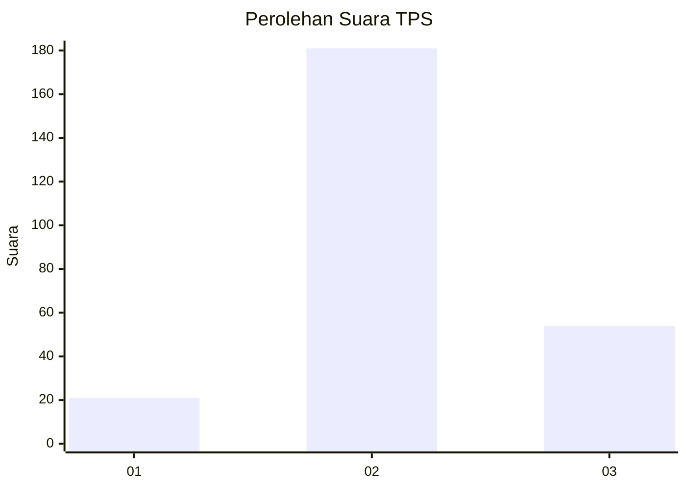
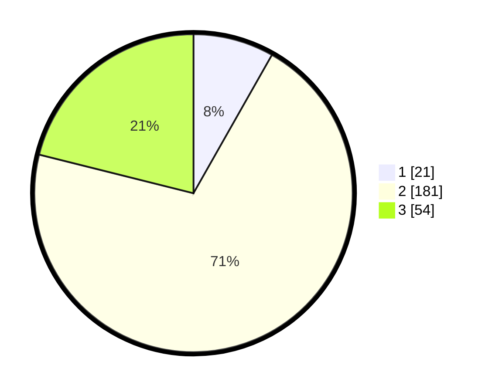

# Hasil

## Grafik

## Tabel

| No. | Nama Paslon    | Suara | Suara (raw) | Persentase |
|:--- |:-------------- | -----:| -----------:| ----------:|
| 1   | ANIES MUHAIMIN | 21    | [21][p-1]   | 8,20       |
| 2   | PRABOWO GIBRAN | 181   | [181][p-2]  | 70,70      |
| 3   | GANJAR MAHFUD  | 54    | [54][p-3]   | 21,09      |

[p-1]: https://github.com/gigit-pemilu/pemilu-2024-35-jawa-timur/blob/main/pilpres/hitung-suara/sub/35-jawa-timur/sub/26-bangkalan/sub/18-galis/sub/2016-lantek-barat/sub/007-tps/sub/paslon-1.txt
[p-2]: https://github.com/gigit-pemilu/pemilu-2024-35-jawa-timur/blob/main/pilpres/hitung-suara/sub/35-jawa-timur/sub/26-bangkalan/sub/18-galis/sub/2016-lantek-barat/sub/007-tps/sub/paslon-2.txt
[p-3]: https://github.com/gigit-pemilu/pemilu-2024-35-jawa-timur/blob/main/pilpres/hitung-suara/sub/35-jawa-timur/sub/26-bangkalan/sub/18-galis/sub/2016-lantek-barat/sub/007-tps/sub/paslon-3.txt

## Foto C Plano

https://sirekap-obj-formc.kpu.go.id/886a/pemilu/ppwp/35/26/18/20/16/3526182016007-20240214-201351--eedda087-c13f-45e3-a2e7-b23e63b5f57c.jpg

https://sirekap-obj-formc.kpu.go.id/886a/pemilu/ppwp/35/26/18/20/16/3526182016007-20240214-201355--7a10c11b-3a7f-4b17-87a0-5deff9534fd5.jpg

https://sirekap-obj-formc.kpu.go.id/886a/pemilu/ppwp/35/26/18/20/16/3526182016007-20240214-201358--6992b24c-22f9-42d9-9086-6bef03438c6b.jpg

## Metadata

| Key        | Value               |
| ---------- | ------------------- |
| Time Stamp | 2024-02-19 06:16:00 |

