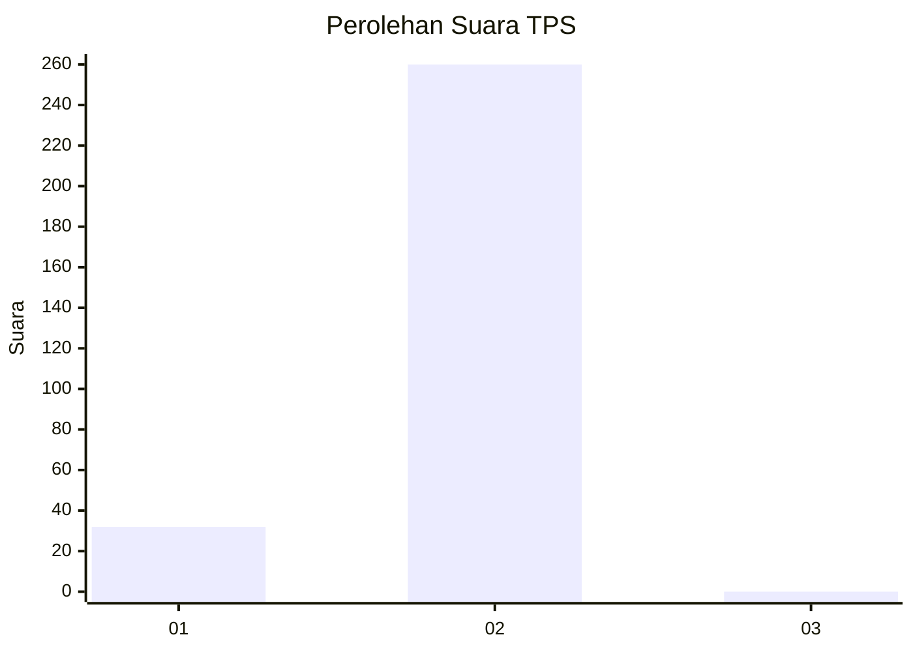
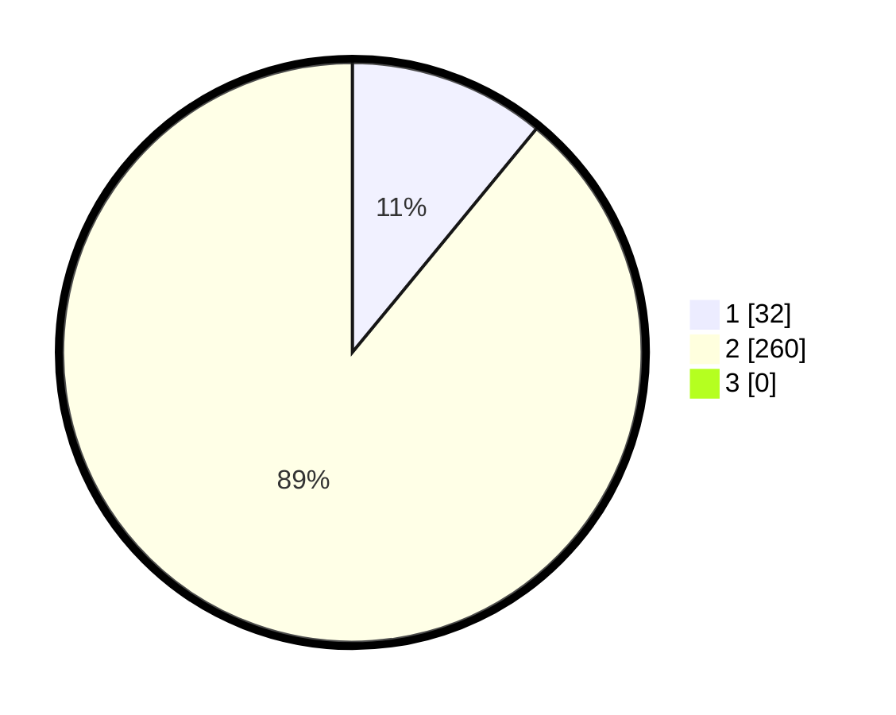

# Hasil

## Grafik

## Tabel

| No. | Nama Paslon    | Suara | Suara (raw) | Persentase |
|:--- |:-------------- | -----:| -----------:| ----------:|
| 1   | ANIES MUHAIMIN | 32    | [32][p-1]   | 10,96      |
| 2   | PRABOWO GIBRAN | 260   | [260][p-2]  | 89,04      |
| 3   | GANJAR MAHFUD  | 0     | [0][p-3]    | 0,00       |

[p-1]: https://github.com/gigit-pemilu/pemilu-2024-35-jawa-timur/blob/main/pilpres/hitung-suara/sub/35-jawa-timur/sub/26-bangkalan/sub/18-galis/sub/2018-kelbung/sub/003-tps/sub/paslon-1.txt
[p-2]: https://github.com/gigit-pemilu/pemilu-2024-35-jawa-timur/blob/main/pilpres/hitung-suara/sub/35-jawa-timur/sub/26-bangkalan/sub/18-galis/sub/2018-kelbung/sub/003-tps/sub/paslon-2.txt
[p-3]: https://github.com/gigit-pemilu/pemilu-2024-35-jawa-timur/blob/main/pilpres/hitung-suara/sub/35-jawa-timur/sub/26-bangkalan/sub/18-galis/sub/2018-kelbung/sub/003-tps/sub/paslon-3.txt

## Foto C Plano

https://sirekap-obj-formc.kpu.go.id/73ea/pemilu/ppwp/35/26/18/20/18/3526182018003-20240215-081849--253a93cf-b260-40a6-b103-e67ef5e40ddc.jpg

https://sirekap-obj-formc.kpu.go.id/73ea/pemilu/ppwp/35/26/18/20/18/3526182018003-20240215-081948--9945a347-e0b7-437f-b3a7-735bcc4a571c.jpg

https://sirekap-obj-formc.kpu.go.id/73ea/pemilu/ppwp/35/26/18/20/18/3526182018003-20240215-082102--40725a04-5007-4556-9f2b-2d85ac11c3aa.jpg

## Metadata

| Key        | Value               |
| ---------- | ------------------- |
| Time Stamp | 2024-02-24 22:31:28 |

