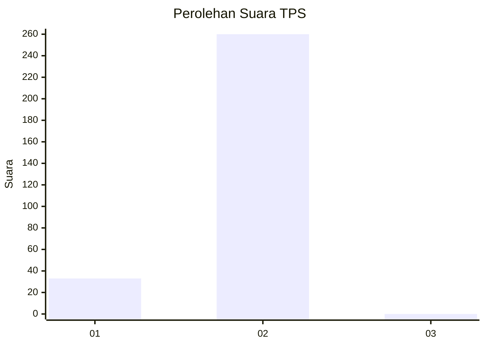
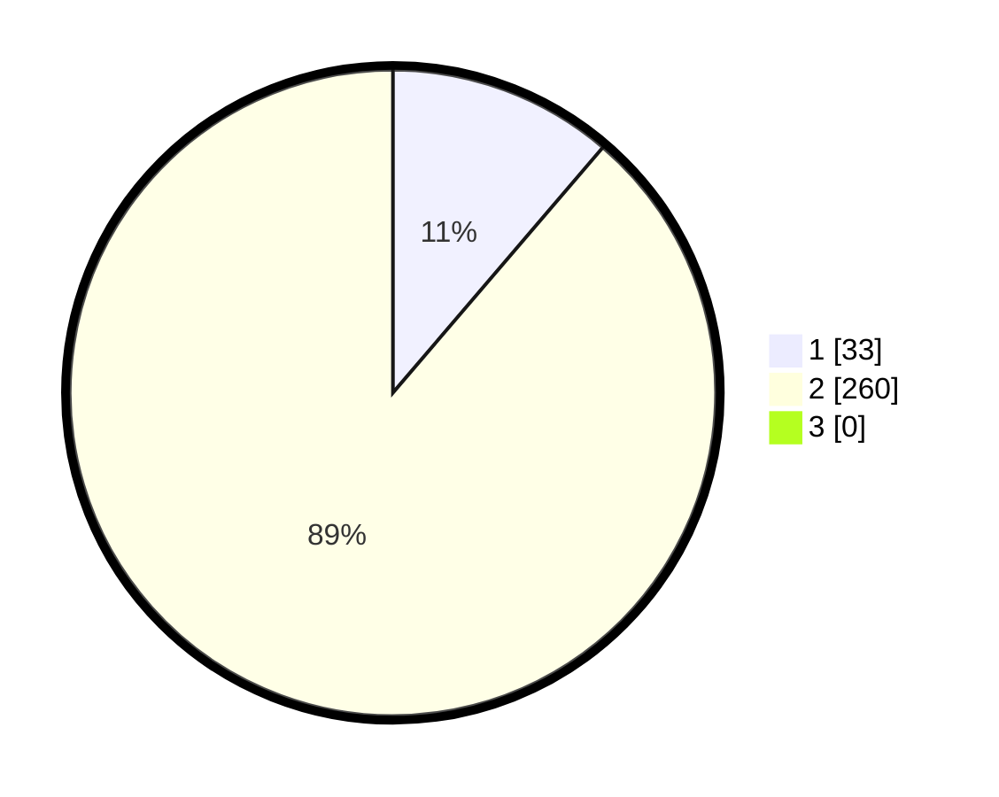

# Hasil

## Grafik

## Tabel

| No. | Nama Paslon    | Suara | Suara (raw) | Persentase |
|:--- |:-------------- | -----:| -----------:| ----------:|
| 1   | ANIES MUHAIMIN | 33    | [33][p-1]   | 11,26      |
| 2   | PRABOWO GIBRAN | 260   | [260][p-2]  | 88,74      |
| 3   | GANJAR MAHFUD  | 0     | [0][p-3]    | 0,00       |

[p-1]: https://github.com/gigit-pemilu/pemilu-2024-35-jawa-timur/blob/main/pilpres/hitung-suara/sub/35-jawa-timur/sub/26-bangkalan/sub/18-galis/sub/2018-kelbung/sub/004-tps/sub/paslon-1.txt
[p-2]: https://github.com/gigit-pemilu/pemilu-2024-35-jawa-timur/blob/main/pilpres/hitung-suara/sub/35-jawa-timur/sub/26-bangkalan/sub/18-galis/sub/2018-kelbung/sub/004-tps/sub/paslon-2.txt
[p-3]: https://github.com/gigit-pemilu/pemilu-2024-35-jawa-timur/blob/main/pilpres/hitung-suara/sub/35-jawa-timur/sub/26-bangkalan/sub/18-galis/sub/2018-kelbung/sub/004-tps/sub/paslon-3.txt

## Foto C Plano

https://sirekap-obj-formc.kpu.go.id/2339/pemilu/ppwp/35/26/18/20/18/3526182018004-20240215-084312--1b98055d-e670-4bf8-9d2f-f902e00c1cbe.jpg

https://sirekap-obj-formc.kpu.go.id/2339/pemilu/ppwp/35/26/18/20/18/3526182018004-20240215-084544--6f6efe84-0345-48eb-8b70-ec04f199c84e.jpg

https://sirekap-obj-formc.kpu.go.id/2339/pemilu/ppwp/35/26/18/20/18/3526182018004-20240215-090644--8e6e3c6b-4964-4c5f-a34c-c2774296908b.jpg

## Metadata

| Key        | Value               |
| ---------- | ------------------- |
| Time Stamp | 2024-02-24 22:31:28 |

