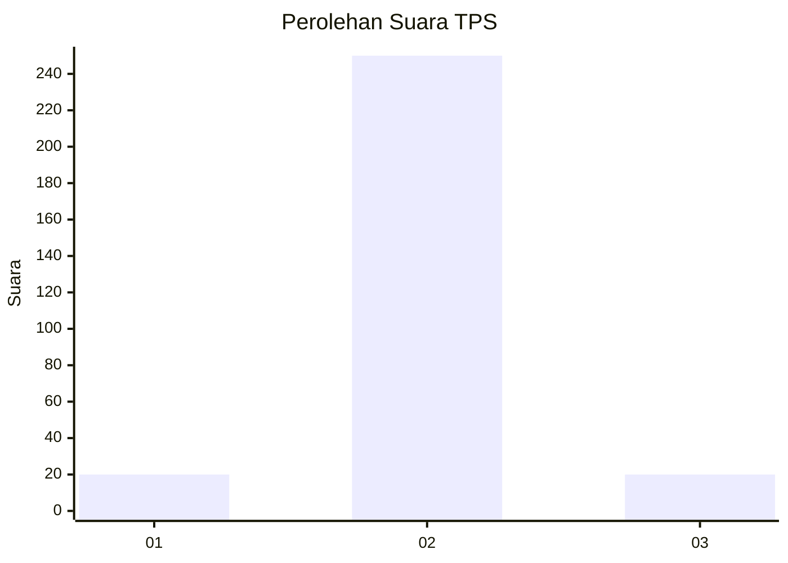
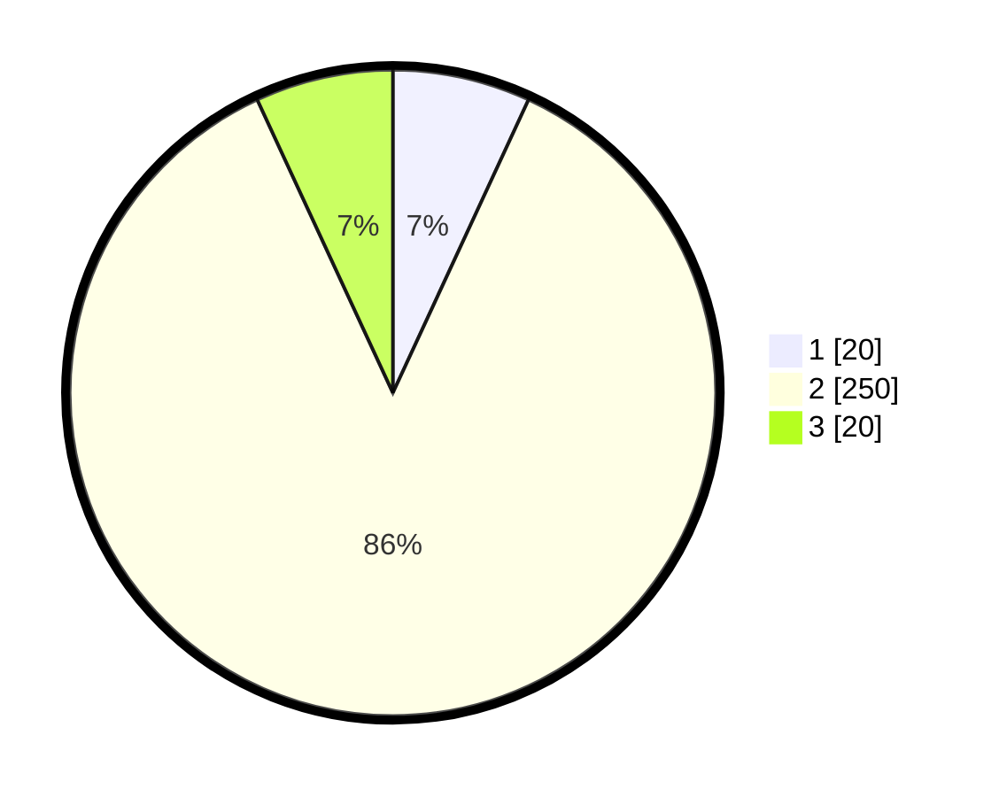

# Hasil

## Grafik

## Tabel

| No. | Nama Paslon    | Suara | Suara (raw) | Persentase |
|:--- |:-------------- | -----:| -----------:| ----------:|
| 1   | ANIES MUHAIMIN | 20    | [20][p-1]   | 6,90       |
| 2   | PRABOWO GIBRAN | 250   | [250][p-2]  | 86,21      |
| 3   | GANJAR MAHFUD  | 20    | [20][p-3]   | 6,90       |

[p-1]: https://github.com/gigit-pemilu/pemilu-2024-35-jawa-timur/blob/main/pilpres/hitung-suara/sub/35-jawa-timur/sub/26-bangkalan/sub/18-galis/sub/2018-kelbung/sub/005-tps/sub/paslon-1.txt
[p-2]: https://github.com/gigit-pemilu/pemilu-2024-35-jawa-timur/blob/main/pilpres/hitung-suara/sub/35-jawa-timur/sub/26-bangkalan/sub/18-galis/sub/2018-kelbung/sub/005-tps/sub/paslon-2.txt
[p-3]: https://github.com/gigit-pemilu/pemilu-2024-35-jawa-timur/blob/main/pilpres/hitung-suara/sub/35-jawa-timur/sub/26-bangkalan/sub/18-galis/sub/2018-kelbung/sub/005-tps/sub/paslon-3.txt

## Foto C Plano

https://sirekap-obj-formc.kpu.go.id/1272/pemilu/ppwp/35/26/18/20/18/3526182018005-20240215-101422--047fb431-a7ae-4333-872d-26bf31b57de1.jpg

https://sirekap-obj-formc.kpu.go.id/1272/pemilu/ppwp/35/26/18/20/18/3526182018005-20240215-101538--e44a5653-0d8e-4abd-931e-350a3ea83ef1.jpg

https://sirekap-obj-formc.kpu.go.id/1272/pemilu/ppwp/35/26/18/20/18/3526182018005-20240215-101651--31ae5432-8de4-46a4-a082-3bf2860a4051.jpg

## Metadata

| Key        | Value               |
| ---------- | ------------------- |
| Time Stamp | 2024-02-24 22:31:28 |

