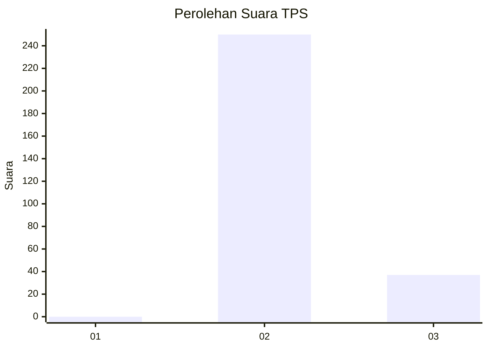
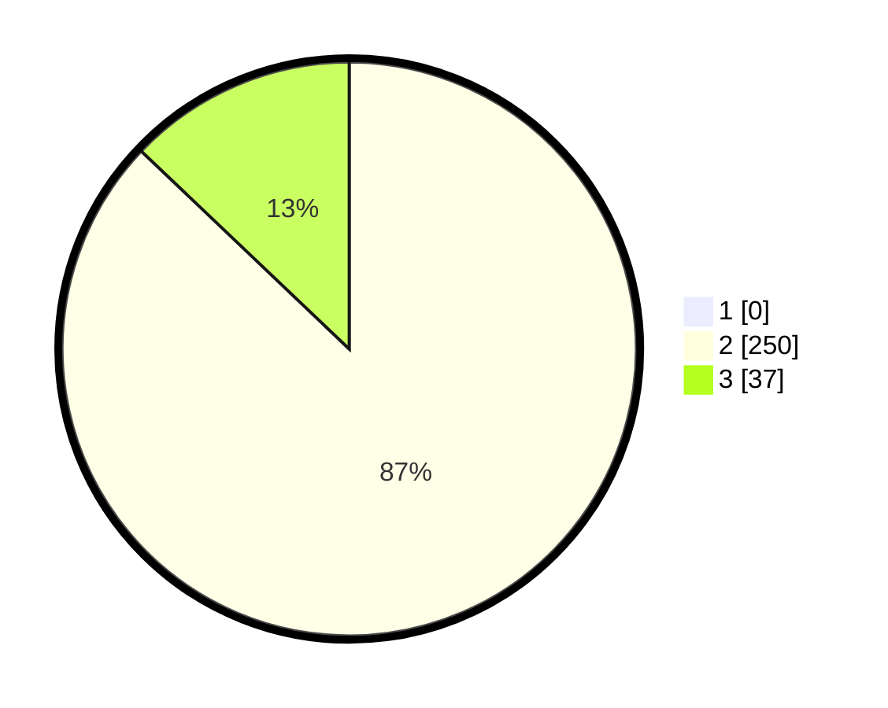

# Hasil

## Grafik

## Tabel

| No. | Nama Paslon    | Suara | Suara (raw) | Persentase |
|:--- |:-------------- | -----:| -----------:| ----------:|
| 1   | ANIES MUHAIMIN | 0     | [0][p-1]    | 0,00       |
| 2   | PRABOWO GIBRAN | 250   | [250][p-2]  | 87,11      |
| 3   | GANJAR MAHFUD  | 37    | [37][p-3]   | 12,89      |

[p-1]: https://github.com/gigit-pemilu/pemilu-2024-35-jawa-timur/blob/main/pilpres/hitung-suara/sub/35-jawa-timur/sub/26-bangkalan/sub/18-galis/sub/2018-kelbung/sub/010-tps/sub/paslon-1.txt
[p-2]: https://github.com/gigit-pemilu/pemilu-2024-35-jawa-timur/blob/main/pilpres/hitung-suara/sub/35-jawa-timur/sub/26-bangkalan/sub/18-galis/sub/2018-kelbung/sub/010-tps/sub/paslon-2.txt
[p-3]: https://github.com/gigit-pemilu/pemilu-2024-35-jawa-timur/blob/main/pilpres/hitung-suara/sub/35-jawa-timur/sub/26-bangkalan/sub/18-galis/sub/2018-kelbung/sub/010-tps/sub/paslon-3.txt

## Foto C Plano

https://sirekap-obj-formc.kpu.go.id/9a00/pemilu/ppwp/35/26/18/20/18/3526182018010-20240215-104621--bc382ee5-975b-43af-94f6-02b28859a613.jpg

https://sirekap-obj-formc.kpu.go.id/9a00/pemilu/ppwp/35/26/18/20/18/3526182018010-20240215-104342--d79cbeb1-ae20-4d8c-9946-31165cbb62e6.jpg

https://sirekap-obj-formc.kpu.go.id/9a00/pemilu/ppwp/35/26/18/20/18/3526182018010-20240215-104840--9618e8d5-47b3-4ade-93a9-13f096decfad.jpg

## Metadata

| Key        | Value               |
| ---------- | ------------------- |
| Time Stamp | 2024-02-24 22:31:28 |

