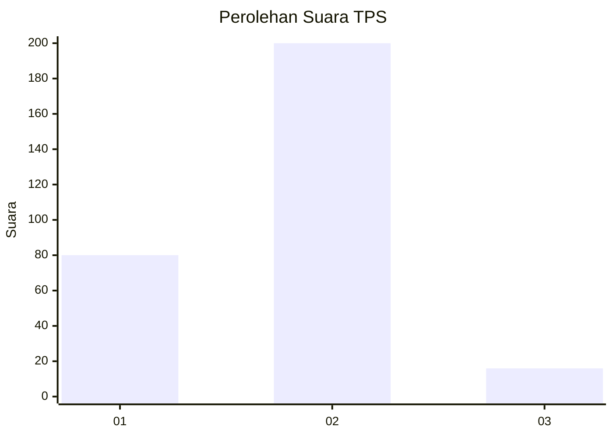
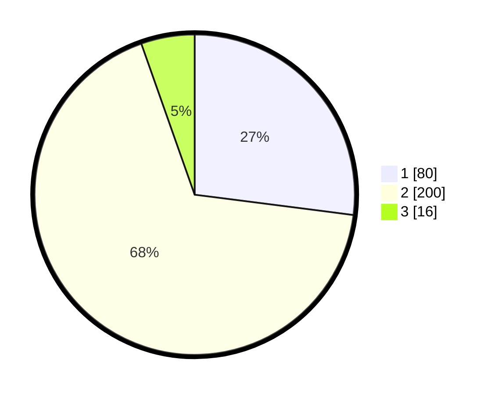

# Hasil

## Grafik

## Tabel

| No. | Nama Paslon    | Suara | Suara (raw) | Persentase |
|:--- |:-------------- | -----:| -----------:| ----------:|
| 1   | ANIES MUHAIMIN | 80    | [80][p-1]   | 27,03      |
| 2   | PRABOWO GIBRAN | 200   | [200][p-2]  | 67,57      |
| 3   | GANJAR MAHFUD  | 16    | [16][p-3]   | 5,41       |

[p-1]: https://github.com/gigit-pemilu/pemilu-2024/blob/main/pilpres/hitung-suara/sub/35-jawa-timur/sub/26-bangkalan/sub/18-galis/sub/2018-kelbung/sub/011-tps/sub/paslon-1.txt
[p-2]: https://github.com/gigit-pemilu/pemilu-2024/blob/main/pilpres/hitung-suara/sub/35-jawa-timur/sub/26-bangkalan/sub/18-galis/sub/2018-kelbung/sub/011-tps/sub/paslon-2.txt
[p-3]: https://github.com/gigit-pemilu/pemilu-2024/blob/main/pilpres/hitung-suara/sub/35-jawa-timur/sub/26-bangkalan/sub/18-galis/sub/2018-kelbung/sub/011-tps/sub/paslon-3.txt

## Foto C Plano

https://sirekap-obj-formc.kpu.go.id/9fcb/pemilu/ppwp/35/26/18/20/18/3526182018011-20240215-093400--0b50ee68-3773-4b5a-824a-447e050373b8.jpg

https://sirekap-obj-formc.kpu.go.id/9fcb/pemilu/ppwp/35/26/18/20/18/3526182018011-20240215-093512--0bc3447f-1267-40f9-a650-08590cc4727a.jpg

https://sirekap-obj-formc.kpu.go.id/9fcb/pemilu/ppwp/35/26/18/20/18/3526182018011-20240215-093614--bc12ba78-b93b-4d55-9c38-ae1731bf0ca0.jpg

## Metadata

| Key        | Value               |
| ---------- | ------------------- |
| Time Stamp | 2024-02-19 06:16:00 |

