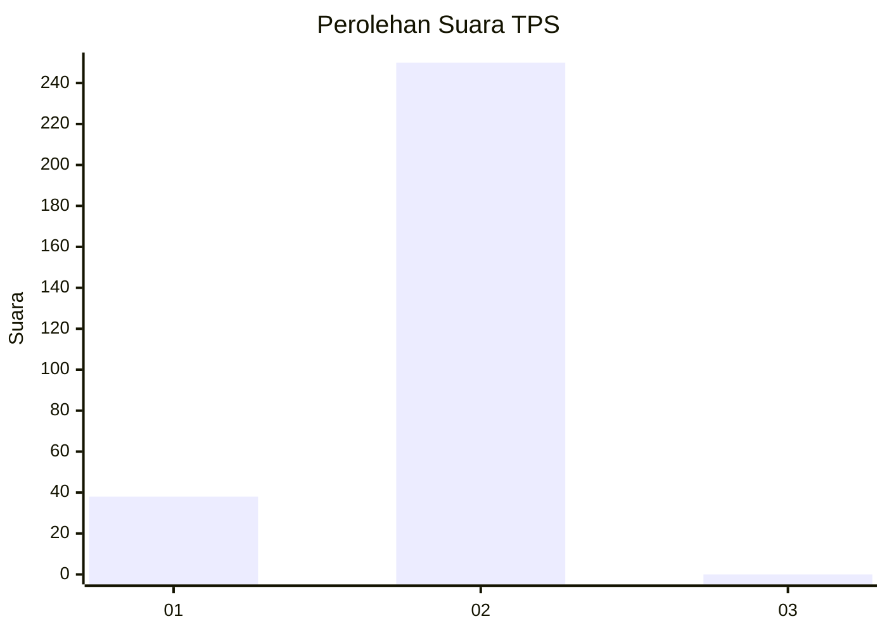
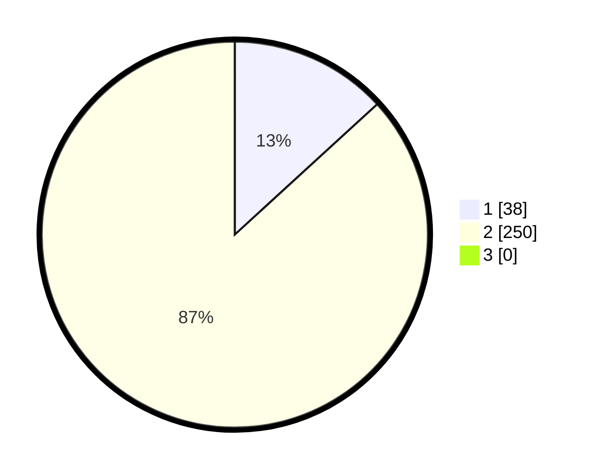

# Hasil

## Grafik

## Tabel

| No. | Nama Paslon    | Suara | Suara (raw) | Persentase |
|:--- |:-------------- | -----:| -----------:| ----------:|
| 1   | ANIES MUHAIMIN | 38    | [38][p-1]   | 13,19      |
| 2   | PRABOWO GIBRAN | 250   | [250][p-2]  | 86,81      |
| 3   | GANJAR MAHFUD  | 0     | [0][p-3]    | 0,00       |

[p-1]: https://github.com/gigit-pemilu/pemilu-2024/blob/main/pilpres/hitung-suara/sub/35-jawa-timur/sub/26-bangkalan/sub/18-galis/sub/2018-kelbung/sub/012-tps/sub/paslon-1.txt
[p-2]: https://github.com/gigit-pemilu/pemilu-2024/blob/main/pilpres/hitung-suara/sub/35-jawa-timur/sub/26-bangkalan/sub/18-galis/sub/2018-kelbung/sub/012-tps/sub/paslon-2.txt
[p-3]: https://github.com/gigit-pemilu/pemilu-2024/blob/main/pilpres/hitung-suara/sub/35-jawa-timur/sub/26-bangkalan/sub/18-galis/sub/2018-kelbung/sub/012-tps/sub/paslon-3.txt

## Foto C Plano

https://sirekap-obj-formc.kpu.go.id/1c01/pemilu/ppwp/35/26/18/20/18/3526182018012-20240215-105119--0bbe6e5a-d0ed-41f0-8663-ea16836d880d.jpg

https://sirekap-obj-formc.kpu.go.id/1c01/pemilu/ppwp/35/26/18/20/18/3526182018012-20240215-105218--9e753c9a-b359-4c34-b3d0-4c23df3ae2fb.jpg

https://sirekap-obj-formc.kpu.go.id/1c01/pemilu/ppwp/35/26/18/20/18/3526182018012-20240215-105304--9fbcd50f-b5b1-4c77-b31e-143134f3aefd.jpg

## Metadata

| Key        | Value               |
| ---------- | ------------------- |
| Time Stamp | 2024-02-24 22:31:28 |

