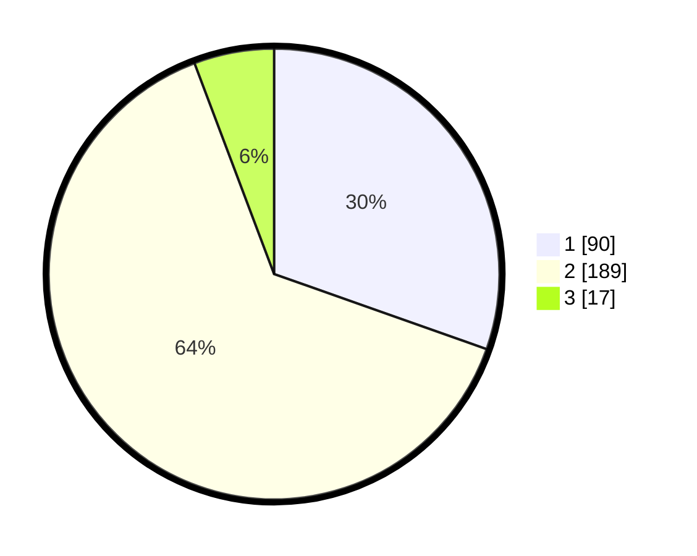

# Hasil

## Grafik

## Tabel

| No. | Nama Paslon    | Suara | Suara (raw) | Persentase |
|:--- |:-------------- | -----:| -----------:| ----------:|
| 1   | ANIES MUHAIMIN | 90    | [90][p-1]   | 30,41      |
| 2   | PRABOWO GIBRAN | 189   | [189][p-2]  | 63,85      |
| 3   | GANJAR MAHFUD  | 17    | [17][p-3]   | 5,74       |

[p-1]: https://github.com/gigit-pemilu/pemilu-2024/blob/main/pilpres/hitung-suara/sub/35-jawa-timur/sub/26-bangkalan/sub/18-galis/sub/2018-kelbung/sub/014-tps/sub/paslon-1.txt
[p-2]: https://github.com/gigit-pemilu/pemilu-2024/blob/main/pilpres/hitung-suara/sub/35-jawa-timur/sub/26-bangkalan/sub/18-galis/sub/2018-kelbung/sub/014-tps/sub/paslon-2.txt
[p-3]: https://github.com/gigit-pemilu/pemilu-2024/blob/main/pilpres/hitung-suara/sub/35-jawa-timur/sub/26-bangkalan/sub/18-galis/sub/2018-kelbung/sub/014-tps/sub/paslon-3.txt

## Foto C Plano

https://sirekap-obj-formc.kpu.go.id/c352/pemilu/ppwp/35/26/18/20/18/3526182018014-20240215-101834--7a27c4f5-388d-438b-be4d-339caf9f15cf.jpg

https://sirekap-obj-formc.kpu.go.id/c352/pemilu/ppwp/35/26/18/20/18/3526182018014-20240215-102000--1dfbe591-ff44-4dda-9af7-0707ec9ebe3a.jpg

https://sirekap-obj-formc.kpu.go.id/c352/pemilu/ppwp/35/26/18/20/18/3526182018014-20240215-102123--6b8c92cf-5969-4295-a912-75a8537d0e5f.jpg

## Metadata

| Key        | Value               |
| ---------- | ------------------- |
| Time Stamp | 2024-02-24 22:31:28 |

