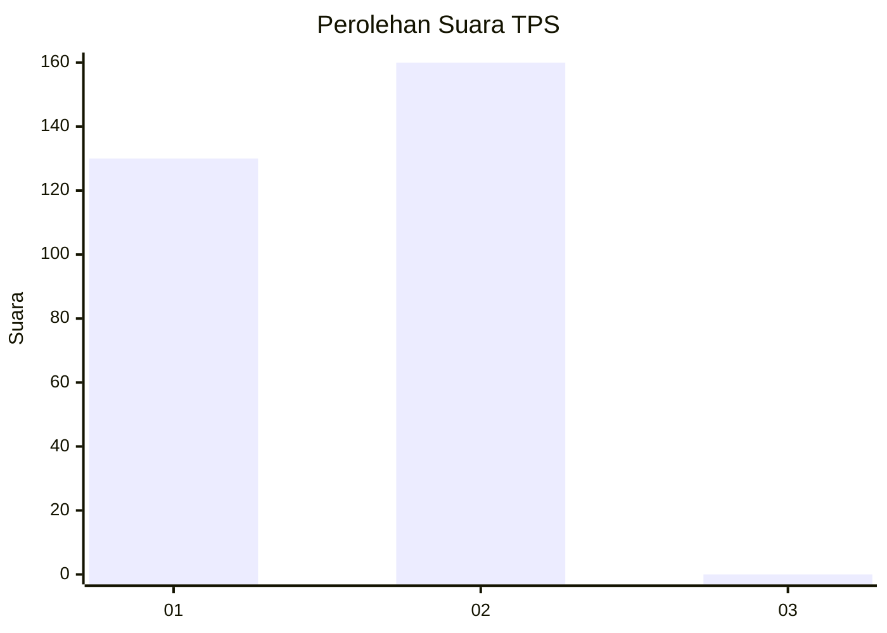
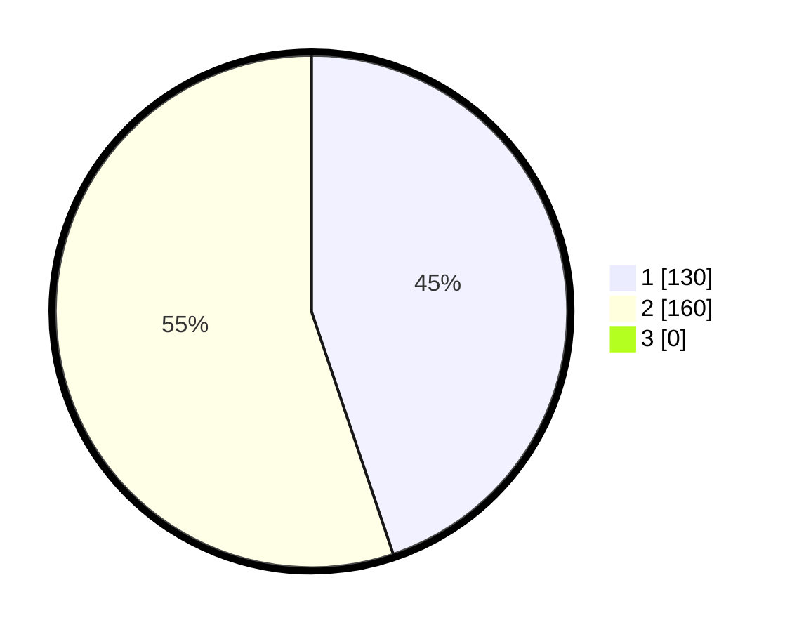

# Hasil

## Grafik

## Tabel

| No. | Nama Paslon    | Suara | Suara (raw) | Persentase |
|:--- |:-------------- | -----:| -----------:| ----------:|
| 1   | ANIES MUHAIMIN | 130   | [130][p-1]  | 44,83      |
| 2   | PRABOWO GIBRAN | 160   | [160][p-2]  | 55,17      |
| 3   | GANJAR MAHFUD  | 0     | [0][p-3]    | 0,00       |

[p-1]: https://github.com/gigit-pemilu/pemilu-2024/blob/main/pilpres/hitung-suara/sub/35-jawa-timur/sub/26-bangkalan/sub/18-galis/sub/2018-kelbung/sub/016-tps/sub/paslon-1.txt
[p-2]: https://github.com/gigit-pemilu/pemilu-2024/blob/main/pilpres/hitung-suara/sub/35-jawa-timur/sub/26-bangkalan/sub/18-galis/sub/2018-kelbung/sub/016-tps/sub/paslon-2.txt
[p-3]: https://github.com/gigit-pemilu/pemilu-2024/blob/main/pilpres/hitung-suara/sub/35-jawa-timur/sub/26-bangkalan/sub/18-galis/sub/2018-kelbung/sub/016-tps/sub/paslon-3.txt

## Foto C Plano

https://sirekap-obj-formc.kpu.go.id/b550/pemilu/ppwp/35/26/18/20/18/3526182018016-20240215-104249--24281a7f-5b1a-4d12-96f9-04179bb9b50f.jpg

https://sirekap-obj-formc.kpu.go.id/b550/pemilu/ppwp/35/26/18/20/18/3526182018016-20240215-104419--6c5fbe55-b6d0-4925-987a-1d7dabac891c.jpg

https://sirekap-obj-formc.kpu.go.id/b550/pemilu/ppwp/35/26/18/20/18/3526182018016-20240215-104536--f0d2d2ee-1a86-4546-9595-deee361c3097.jpg

## Metadata

| Key        | Value               |
| ---------- | ------------------- |
| Time Stamp | 2024-02-19 06:16:00 |

