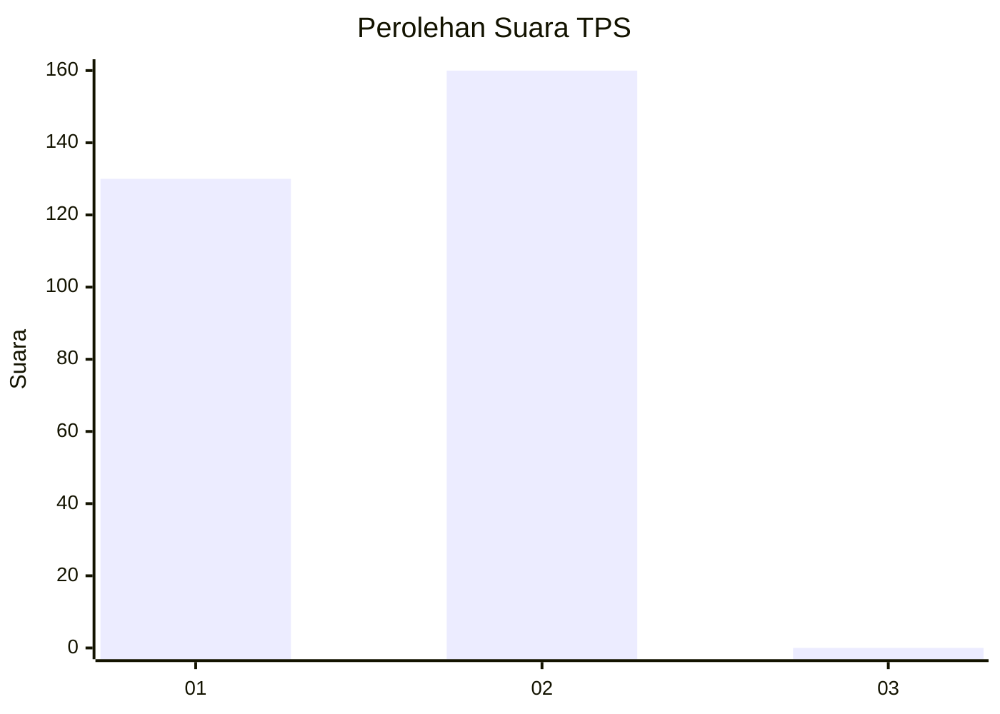
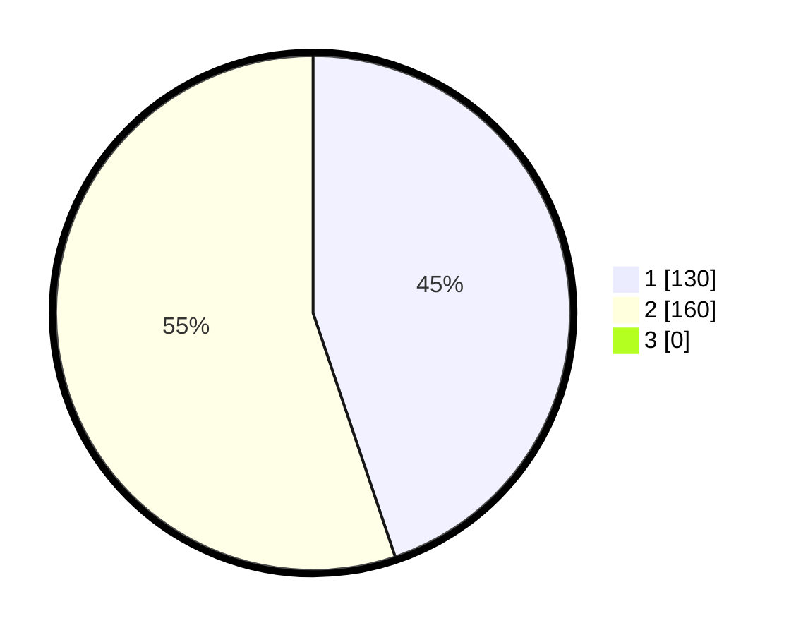

# Hasil

## Grafik

## Tabel

| No. | Nama Paslon    | Suara | Suara (raw) | Persentase |
|:--- |:-------------- | -----:| -----------:| ----------:|
| 1   | ANIES MUHAIMIN | 130   | [130][p-1]  | 44,83      |
| 2   | PRABOWO GIBRAN | 160   | [160][p-2]  | 55,17      |
| 3   | GANJAR MAHFUD  | 0     | [0][p-3]    | 0,00       |

[p-1]: https://github.com/gigit-pemilu/pemilu-2024-35-jawa-timur/blob/main/pilpres/hitung-suara/sub/35-jawa-timur/sub/26-bangkalan/sub/18-galis/sub/2018-kelbung/sub/017-tps/sub/paslon-1.txt
[p-2]: https://github.com/gigit-pemilu/pemilu-2024-35-jawa-timur/blob/main/pilpres/hitung-suara/sub/35-jawa-timur/sub/26-bangkalan/sub/18-galis/sub/2018-kelbung/sub/017-tps/sub/paslon-2.txt
[p-3]: https://github.com/gigit-pemilu/pemilu-2024-35-jawa-timur/blob/main/pilpres/hitung-suara/sub/35-jawa-timur/sub/26-bangkalan/sub/18-galis/sub/2018-kelbung/sub/017-tps/sub/paslon-3.txt

## Foto C Plano

https://sirekap-obj-formc.kpu.go.id/aa56/pemilu/ppwp/35/26/18/20/18/3526182018017-20240215-103627--63a7604f-4311-4c1b-85e0-ce69f9d5ad8c.jpg

https://sirekap-obj-formc.kpu.go.id/aa56/pemilu/ppwp/35/26/18/20/18/3526182018017-20240215-103759--8ec0f1b1-7c90-4c7a-a4f0-1a214737a86a.jpg

https://sirekap-obj-formc.kpu.go.id/aa56/pemilu/ppwp/35/26/18/20/18/3526182018017-20240215-103850--1fc61de0-3a23-499e-95a4-c0678846c667.jpg

## Metadata

| Key        | Value               |
| ---------- | ------------------- |
| Time Stamp | 2024-02-19 06:16:00 |

