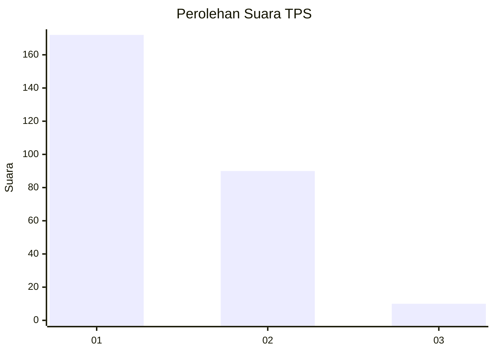
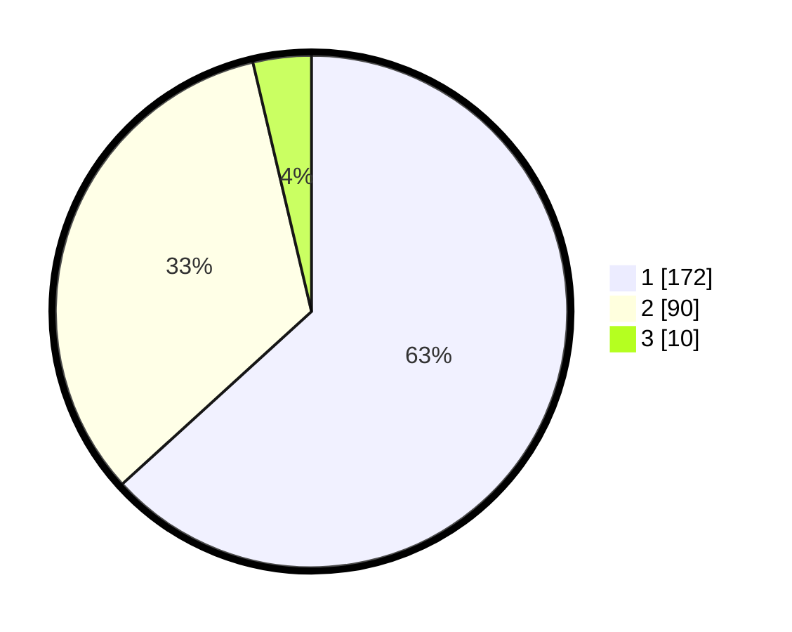

# Hasil

## Grafik

## Tabel

| No. | Nama Paslon    | Suara | Suara (raw) | Persentase |
|:--- |:-------------- | -----:| -----------:| ----------:|
| 1   | ANIES MUHAIMIN | 172   | [172][p-1]  | 63,24      |
| 2   | PRABOWO GIBRAN | 90    | [90][p-2]   | 33,09      |
| 3   | GANJAR MAHFUD  | 10    | [10][p-3]   | 3,68       |

[p-1]: https://github.com/gigit-pemilu/pemilu-2024/blob/main/pilpres/hitung-suara/sub/35-jawa-timur/sub/26-bangkalan/sub/18-galis/sub/2019-banyu-bunih/sub/010-tps/sub/paslon-1.txt
[p-2]: https://github.com/gigit-pemilu/pemilu-2024/blob/main/pilpres/hitung-suara/sub/35-jawa-timur/sub/26-bangkalan/sub/18-galis/sub/2019-banyu-bunih/sub/010-tps/sub/paslon-2.txt
[p-3]: https://github.com/gigit-pemilu/pemilu-2024/blob/main/pilpres/hitung-suara/sub/35-jawa-timur/sub/26-bangkalan/sub/18-galis/sub/2019-banyu-bunih/sub/010-tps/sub/paslon-3.txt

## Foto C Plano

https://sirekap-obj-formc.kpu.go.id/406a/pemilu/ppwp/35/26/18/20/19/3526182019010-20240214-222014--efa1a987-c7ec-4b96-8935-c92ef43fd3c5.jpg

https://sirekap-obj-formc.kpu.go.id/406a/pemilu/ppwp/35/26/18/20/19/3526182019010-20240214-230814--2bd3026c-8a3f-44be-922a-74b5f83f7ce5.jpg

https://sirekap-obj-formc.kpu.go.id/406a/pemilu/ppwp/35/26/18/20/19/3526182019010-20240214-230901--294c71fb-ea7c-4a57-a739-749b830acd09.jpg

## Metadata

| Key        | Value               |
| ---------- | ------------------- |
| Time Stamp | 2024-02-19 06:16:00 |

