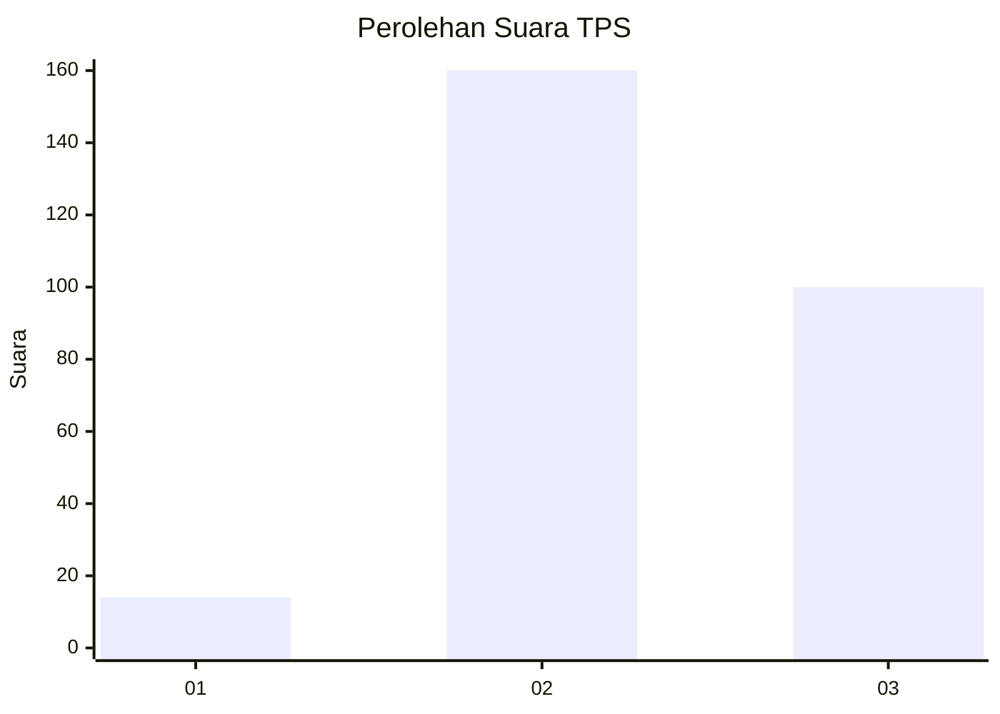
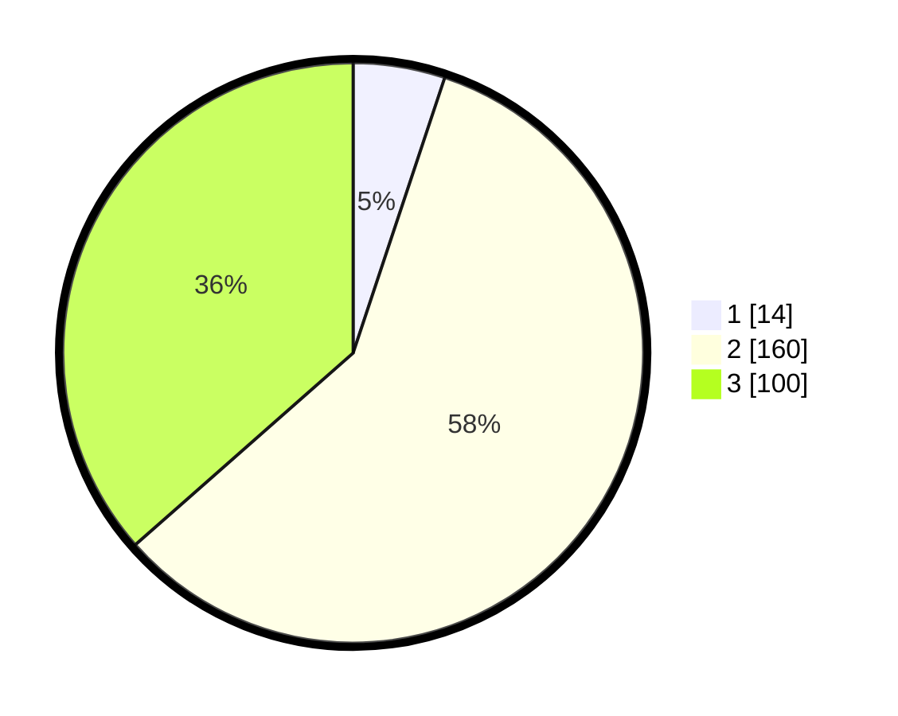

# Hasil

## Grafik

## Tabel

| No. | Nama Paslon    | Suara | Suara (raw) | Persentase |
|:--- |:-------------- | -----:| -----------:| ----------:|
| 1   | ANIES MUHAIMIN | 14    | [14][p-1]   | 5,11       |
| 2   | PRABOWO GIBRAN | 160   | [160][p-2]  | 58,39      |
| 3   | GANJAR MAHFUD  | 100   | [100][p-3]  | 36,50      |

[p-1]: https://github.com/gigit-pemilu/pemilu-2024/blob/main/pilpres/hitung-suara/sub/35-jawa-timur/sub/26-bangkalan/sub/18-galis/sub/2019-banyu-bunih/sub/011-tps/sub/paslon-1.txt
[p-2]: https://github.com/gigit-pemilu/pemilu-2024/blob/main/pilpres/hitung-suara/sub/35-jawa-timur/sub/26-bangkalan/sub/18-galis/sub/2019-banyu-bunih/sub/011-tps/sub/paslon-2.txt
[p-3]: https://github.com/gigit-pemilu/pemilu-2024/blob/main/pilpres/hitung-suara/sub/35-jawa-timur/sub/26-bangkalan/sub/18-galis/sub/2019-banyu-bunih/sub/011-tps/sub/paslon-3.txt

## Foto C Plano

https://sirekap-obj-formc.kpu.go.id/5310/pemilu/ppwp/35/26/18/20/19/3526182019011-20240226-114851--dfc10452-c835-4420-891f-3f382dac1cfb.jpg

https://sirekap-obj-formc.kpu.go.id/5310/pemilu/ppwp/35/26/18/20/19/3526182019011-20240226-114933--c83d0d8a-203e-4bbe-ac26-28ade1d67772.jpg

https://sirekap-obj-formc.kpu.go.id/5310/pemilu/ppwp/35/26/18/20/19/3526182019011-20240226-115027--0aacd248-6f4e-42a9-b384-52b7b146fad0.jpg

## Metadata

| Key        | Value               |
| ---------- | ------------------- |
| Time Stamp | 2024-02-29 15:00:00 |

