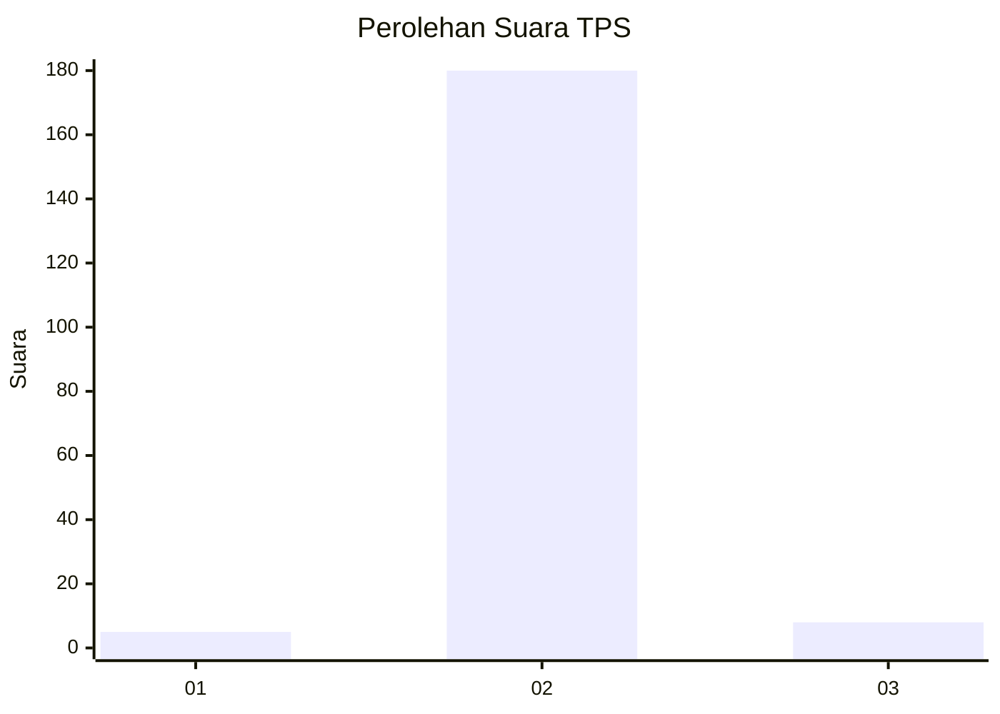
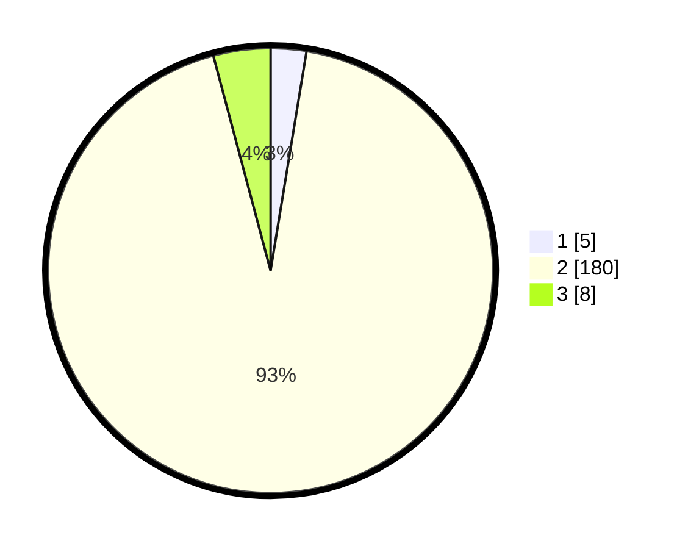

# Hasil

## Grafik

## Tabel

| No. | Nama Paslon    | Suara | Suara (raw) | Persentase |
|:--- |:-------------- | -----:| -----------:| ----------:|
| 1   | ANIES MUHAIMIN | 5     | [5][p-1]    | 2,59       |
| 2   | PRABOWO GIBRAN | 180   | [180][p-2]  | 93,26      |
| 3   | GANJAR MAHFUD  | 8     | [8][p-3]    | 4,15       |

[p-1]: https://github.com/gigit-pemilu/pemilu-2024-35-jawa-timur/blob/main/pilpres/hitung-suara/sub/35-jawa-timur/sub/26-bangkalan/sub/18-galis/sub/2019-banyu-bunih/sub/019-tps/sub/paslon-1.txt
[p-2]: https://github.com/gigit-pemilu/pemilu-2024-35-jawa-timur/blob/main/pilpres/hitung-suara/sub/35-jawa-timur/sub/26-bangkalan/sub/18-galis/sub/2019-banyu-bunih/sub/019-tps/sub/paslon-2.txt
[p-3]: https://github.com/gigit-pemilu/pemilu-2024-35-jawa-timur/blob/main/pilpres/hitung-suara/sub/35-jawa-timur/sub/26-bangkalan/sub/18-galis/sub/2019-banyu-bunih/sub/019-tps/sub/paslon-3.txt

## Foto C Plano

https://sirekap-obj-formc.kpu.go.id/4d0a/pemilu/ppwp/35/26/18/20/19/3526182019019-20240214-205209--67153ded-6814-443d-98d5-f3b0e719b014.jpg

https://sirekap-obj-formc.kpu.go.id/4d0a/pemilu/ppwp/35/26/18/20/19/3526182019019-20240214-205559--20199c00-7d61-4eb5-a1fc-d45bb55a23f3.jpg

https://sirekap-obj-formc.kpu.go.id/4d0a/pemilu/ppwp/35/26/18/20/19/3526182019019-20240214-205958--6fb0c244-27ad-4428-b2de-85f680510b9d.jpg

## Metadata

| Key        | Value               |
| ---------- | ------------------- |
| Time Stamp | 2024-02-24 22:31:28 |

