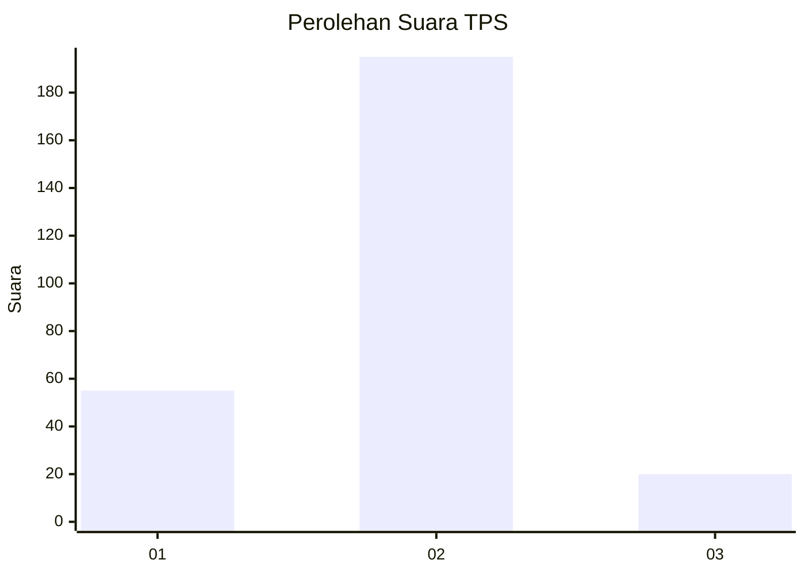
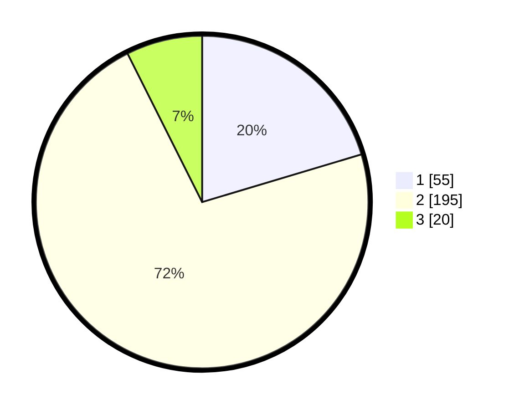

# Hasil

## Grafik

## Tabel

| No. | Nama Paslon    | Suara | Suara (raw) | Persentase |
|:--- |:-------------- | -----:| -----------:| ----------:|
| 1   | ANIES MUHAIMIN | 55    | [55][p-1]   | 20,37      |
| 2   | PRABOWO GIBRAN | 195   | [195][p-2]  | 72,22      |
| 3   | GANJAR MAHFUD  | 20    | [20][p-3]   | 7,41       |

[p-1]: https://github.com/gigit-pemilu/pemilu-2024/blob/main/pilpres/hitung-suara/sub/35-jawa-timur/sub/26-bangkalan/sub/18-galis/sub/2019-banyu-bunih/sub/021-tps/sub/paslon-1.txt
[p-2]: https://github.com/gigit-pemilu/pemilu-2024/blob/main/pilpres/hitung-suara/sub/35-jawa-timur/sub/26-bangkalan/sub/18-galis/sub/2019-banyu-bunih/sub/021-tps/sub/paslon-2.txt
[p-3]: https://github.com/gigit-pemilu/pemilu-2024/blob/main/pilpres/hitung-suara/sub/35-jawa-timur/sub/26-bangkalan/sub/18-galis/sub/2019-banyu-bunih/sub/021-tps/sub/paslon-3.txt

## Foto C Plano

https://sirekap-obj-formc.kpu.go.id/20f5/pemilu/ppwp/35/26/18/20/19/3526182019021-20240214-223836--785fec3d-8523-45e4-b3de-aa2fd733e0f3.jpg

https://sirekap-obj-formc.kpu.go.id/20f5/pemilu/ppwp/35/26/18/20/19/3526182019021-20240214-222837--b47e50d0-f3ce-4e61-819c-ac09fdca0252.jpg

## Metadata

| Key        | Value               |
| ---------- | ------------------- |
| Time Stamp | 2024-02-24 22:31:28 |

