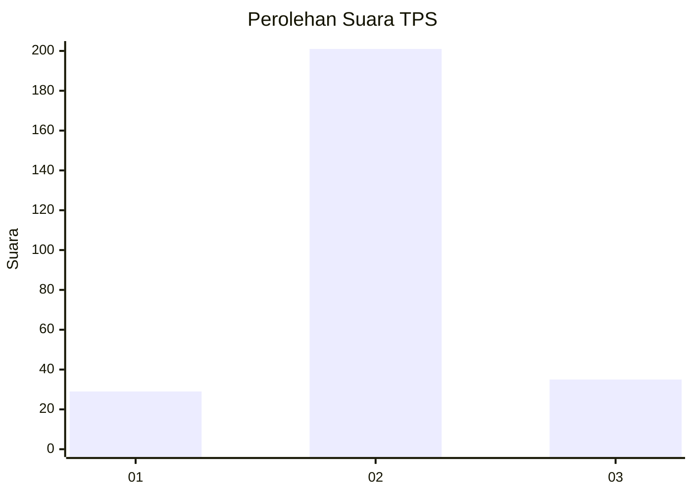
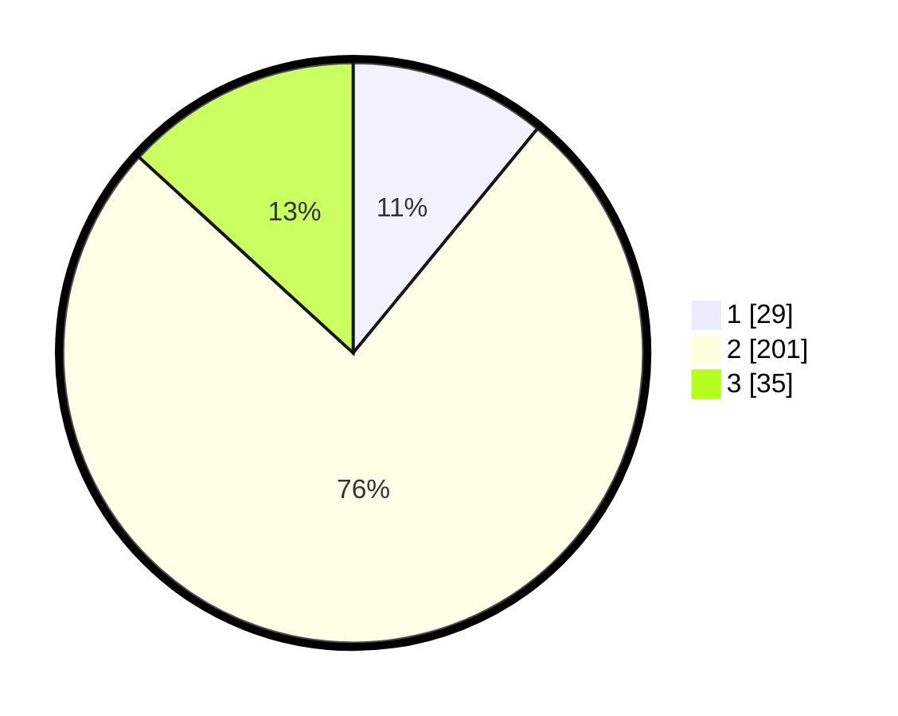

# Hasil

## Grafik

## Tabel

| No. | Nama Paslon    | Suara | Suara (raw) | Persentase |
|:--- |:-------------- | -----:| -----------:| ----------:|
| 1   | ANIES MUHAIMIN | 29    | [29][p-1]   | 10,94      |
| 2   | PRABOWO GIBRAN | 201   | [201][p-2]  | 75,85      |
| 3   | GANJAR MAHFUD  | 35    | [35][p-3]   | 13,21      |

[p-1]: https://github.com/gigit-pemilu/pemilu-2024/blob/main/pilpres/hitung-suara/sub/35-jawa-timur/sub/26-bangkalan/sub/18-galis/sub/2021-sorpa/sub/003-tps/sub/paslon-1.txt
[p-2]: https://github.com/gigit-pemilu/pemilu-2024/blob/main/pilpres/hitung-suara/sub/35-jawa-timur/sub/26-bangkalan/sub/18-galis/sub/2021-sorpa/sub/003-tps/sub/paslon-2.txt
[p-3]: https://github.com/gigit-pemilu/pemilu-2024/blob/main/pilpres/hitung-suara/sub/35-jawa-timur/sub/26-bangkalan/sub/18-galis/sub/2021-sorpa/sub/003-tps/sub/paslon-3.txt

## Foto C Plano

https://sirekap-obj-formc.kpu.go.id/70fc/pemilu/ppwp/35/26/18/20/21/3526182021003-20240226-121211--b4ec4281-25d7-42c3-9444-6ca07342b9db.jpg

https://sirekap-obj-formc.kpu.go.id/70fc/pemilu/ppwp/35/26/18/20/21/3526182021003-20240226-121425--5ba7898b-06da-4a07-a1d3-a0ecd4894906.jpg

https://sirekap-obj-formc.kpu.go.id/70fc/pemilu/ppwp/35/26/18/20/21/3526182021003-20240226-121521--7d2e59b8-ce05-44d7-9b01-6028ce6fad05.jpg

## Metadata

| Key        | Value               |
| ---------- | ------------------- |
| Time Stamp | 2024-02-29 15:00:00 |

