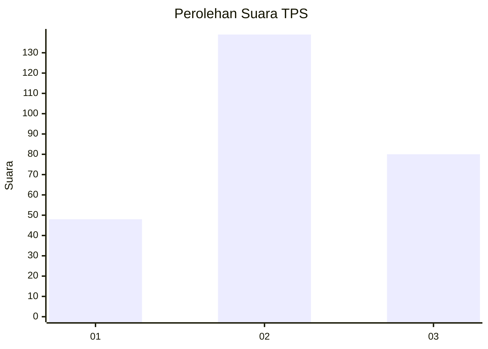
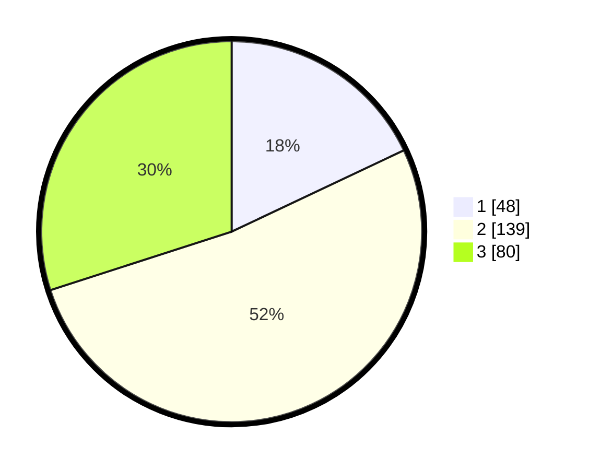

# Hasil

## Grafik

## Tabel

| No. | Nama Paslon    | Suara | Suara (raw) | Persentase |
|:--- |:-------------- | -----:| -----------:| ----------:|
| 1   | ANIES MUHAIMIN | 48    | [48][p-1]   | 17,98      |
| 2   | PRABOWO GIBRAN | 139   | [139][p-2]  | 52,06      |
| 3   | GANJAR MAHFUD  | 80    | [80][p-3]   | 29,96      |

[p-1]: https://github.com/gigit-pemilu/pemilu-2024/blob/main/pilpres/hitung-suara/sub/35-jawa-timur/sub/27-sampang/sub/01-sreseh/sub/2001-noreh/sub/001-tps/sub/paslon-1.txt
[p-2]: https://github.com/gigit-pemilu/pemilu-2024/blob/main/pilpres/hitung-suara/sub/35-jawa-timur/sub/27-sampang/sub/01-sreseh/sub/2001-noreh/sub/001-tps/sub/paslon-2.txt
[p-3]: https://github.com/gigit-pemilu/pemilu-2024/blob/main/pilpres/hitung-suara/sub/35-jawa-timur/sub/27-sampang/sub/01-sreseh/sub/2001-noreh/sub/001-tps/sub/paslon-3.txt

## Foto C Plano

https://sirekap-obj-formc.kpu.go.id/61c0/pemilu/ppwp/35/27/01/20/01/3527012001001-20240218-110914--45c857d7-e4e0-47de-a973-b79e72fa5343.jpg

https://sirekap-obj-formc.kpu.go.id/61c0/pemilu/ppwp/35/27/01/20/01/3527012001001-20240218-111009--b2ccbebd-9b12-4cd2-aa0b-fe4f7bef7bf3.jpg

https://sirekap-obj-formc.kpu.go.id/61c0/pemilu/ppwp/35/27/01/20/01/3527012001001-20240218-111045--0309f947-40a0-43de-b95f-59024b1a0e99.jpg

## Metadata

| Key        | Value               |
| ---------- | ------------------- |
| Time Stamp | 2024-02-21 21:00:04 |

## DATA PEMILIH TETAP

Jumlah pemilih dalam DPT: **294**.
 * L: **142**.
 * P: **152**.

## DATA PENGGUNA HAK PILIH

Jumlah pengguna hak pilih dalam DPT: **281**.
 * L: **134**.
 * P: **147**.

Jumlah pengguna hak pilih dalam DPTb: **0**.
 * L: **0**.
 * P: **0**.

Jumlah pengguna hak pilih dalam DPK: **0**.
 * L: **0**.
 * P: **0**.

Jumlah pengguna hak pilih: **281**.
 * L: **134**.
 * P: **147**.

## JUMLAH SUARA SAH DAN TIDAK SAH

JUMLAH SELURUH SUARA SAH: **267**.

JUMLAH SUARA TIDAK SAH: **14**.

JUMLAH SELURUH SUARA SAH DAN SUARA TIDAK SAH: **281**.

