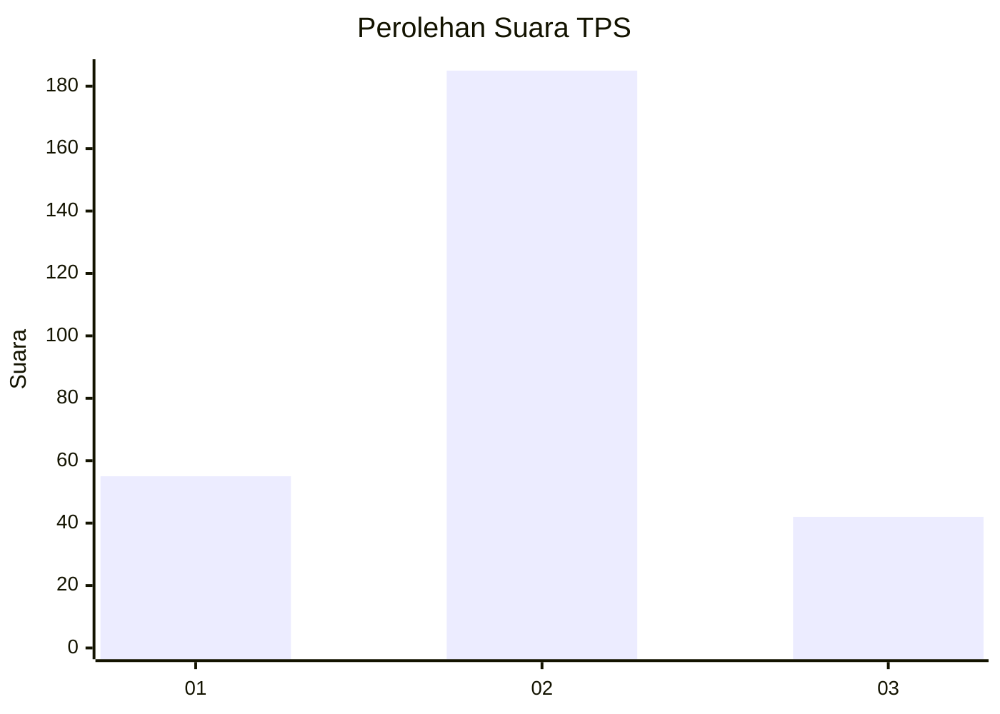
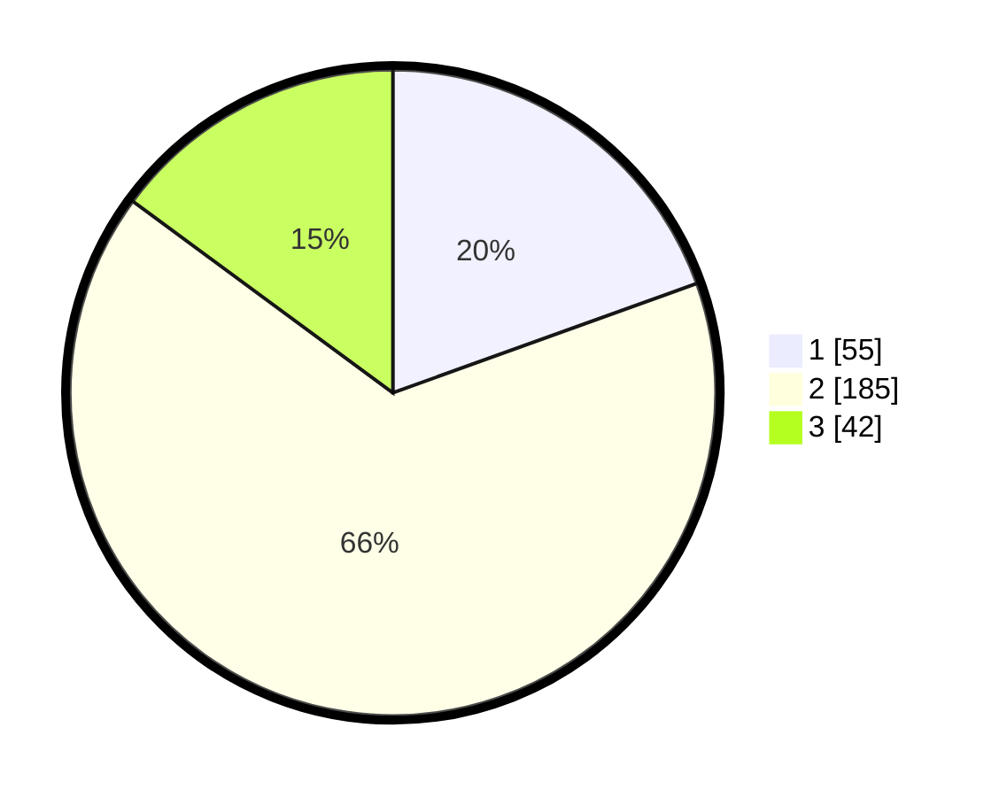

# Hasil

## Grafik

## Tabel

| No. | Nama Paslon    | Suara | Suara (raw) | Persentase |
|:--- |:-------------- | -----:| -----------:| ----------:|
| 1   | ANIES MUHAIMIN | 55    | [55][p-1]   | 19,50      |
| 2   | PRABOWO GIBRAN | 185   | [185][p-2]  | 65,60      |
| 3   | GANJAR MAHFUD  | 42    | [42][p-3]   | 14,89      |

[p-1]: https://github.com/gigit-pemilu/pemilu-2024-35-jawa-timur/blob/main/pilpres/hitung-suara/sub/35-jawa-timur/sub/27-sampang/sub/01-sreseh/sub/2001-noreh/sub/002-tps/sub/paslon-1.txt
[p-2]: https://github.com/gigit-pemilu/pemilu-2024-35-jawa-timur/blob/main/pilpres/hitung-suara/sub/35-jawa-timur/sub/27-sampang/sub/01-sreseh/sub/2001-noreh/sub/002-tps/sub/paslon-2.txt
[p-3]: https://github.com/gigit-pemilu/pemilu-2024-35-jawa-timur/blob/main/pilpres/hitung-suara/sub/35-jawa-timur/sub/27-sampang/sub/01-sreseh/sub/2001-noreh/sub/002-tps/sub/paslon-3.txt

## Foto C Plano

https://sirekap-obj-formc.kpu.go.id/5248/pemilu/ppwp/35/27/01/20/01/3527012001002-20240216-203306--af0159e4-a044-4036-a107-aad60107af7e.jpg

https://sirekap-obj-formc.kpu.go.id/5248/pemilu/ppwp/35/27/01/20/01/3527012001002-20240216-203358--502cff2c-6f36-4cef-868d-c586cde82dcf.jpg

https://sirekap-obj-formc.kpu.go.id/5248/pemilu/ppwp/35/27/01/20/01/3527012001002-20240216-203506--90e9e980-11e1-4f75-86c7-007c950fd274.jpg

## Metadata

| Key        | Value               |
| ---------- | ------------------- |
| Time Stamp | 2024-02-16 22:01:00 |

## DATA PEMILIH TETAP

Jumlah pemilih dalam DPT: **298**.
 * L: **129**.
 * P: **169**.

## DATA PENGGUNA HAK PILIH

Jumlah pengguna hak pilih dalam DPT: **293**.
 * L: **129**.
 * P: **164**.

Jumlah pengguna hak pilih dalam DPTb: **0**.
 * L: **0**.
 * P: **0**.

Jumlah pengguna hak pilih dalam DPK: **0**.
 * L: **0**.
 * P: **0**.

Jumlah pengguna hak pilih: **293**.
 * L: **129**.
 * P: **164**.

## JUMLAH SUARA SAH DAN TIDAK SAH

JUMLAH SELURUH SUARA SAH: **282**.

JUMLAH SUARA TIDAK SAH: **11**.

JUMLAH SELURUH SUARA SAH DAN SUARA TIDAK SAH: **293**.

