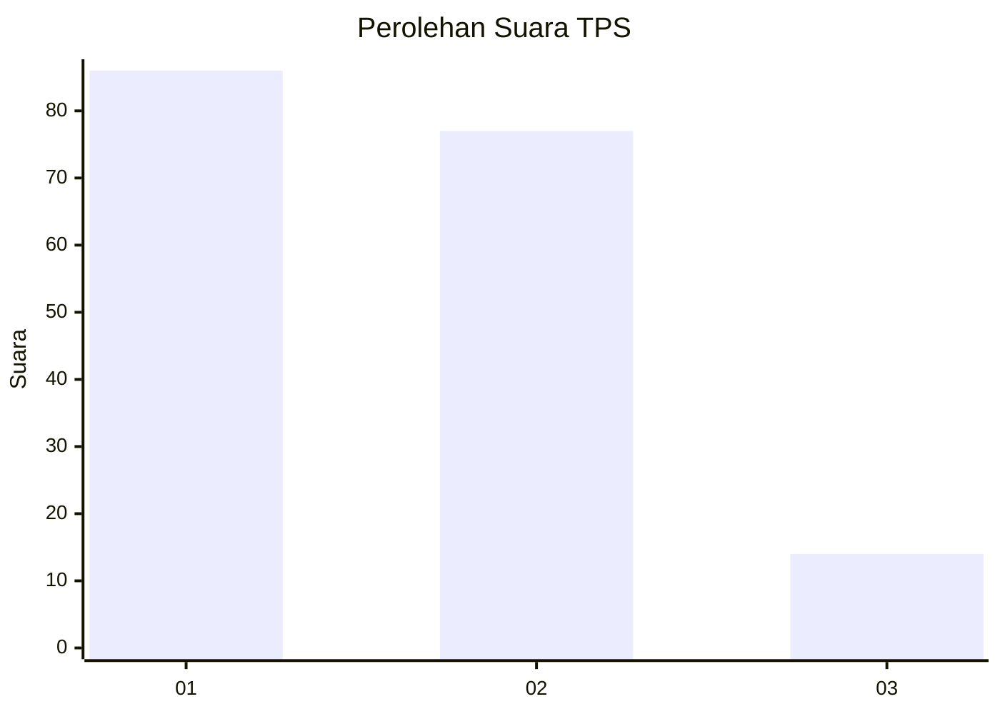
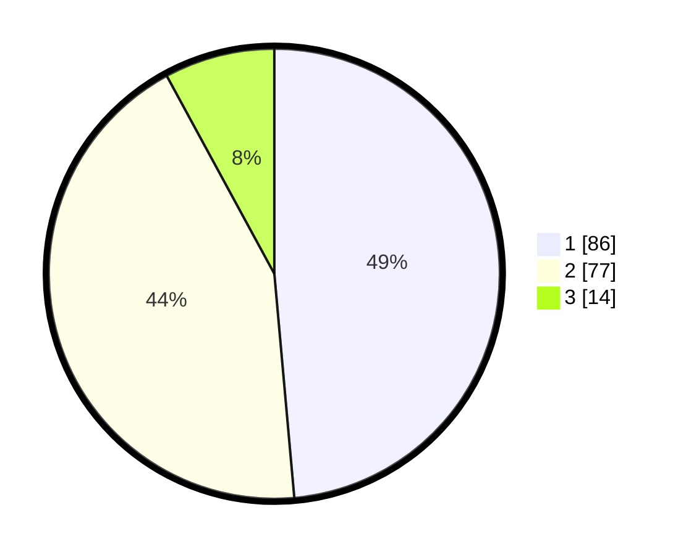

# Hasil

## Grafik

## Tabel

| No. | Nama Paslon    | Suara | Suara (raw) | Persentase |
|:--- |:-------------- | -----:| -----------:| ----------:|
| 1   | ANIES MUHAIMIN | 86    | [86][p-1]   | 48,59      |
| 2   | PRABOWO GIBRAN | 77    | [77][p-2]   | 43,50      |
| 3   | GANJAR MAHFUD  | 14    | [14][p-3]   | 7,91       |

[p-1]: https://github.com/gigit-pemilu/pemilu-2024-35-jawa-timur/blob/main/pilpres/hitung-suara/sub/35-jawa-timur/sub/27-sampang/sub/01-sreseh/sub/2004-sreseh/sub/001-tps/sub/paslon-1.txt
[p-2]: https://github.com/gigit-pemilu/pemilu-2024-35-jawa-timur/blob/main/pilpres/hitung-suara/sub/35-jawa-timur/sub/27-sampang/sub/01-sreseh/sub/2004-sreseh/sub/001-tps/sub/paslon-2.txt
[p-3]: https://github.com/gigit-pemilu/pemilu-2024-35-jawa-timur/blob/main/pilpres/hitung-suara/sub/35-jawa-timur/sub/27-sampang/sub/01-sreseh/sub/2004-sreseh/sub/001-tps/sub/paslon-3.txt

## Foto C Plano

https://sirekap-obj-formc.kpu.go.id/ce9a/pemilu/ppwp/35/27/01/20/04/3527012004001-20240219-135148--838de7a7-dd2d-447e-804f-ae4e70d48c1e.jpg

https://sirekap-obj-formc.kpu.go.id/ce9a/pemilu/ppwp/35/27/01/20/04/3527012004001-20240219-135253--f1069661-ad65-485a-a42a-bc8838b9558f.jpg

https://sirekap-obj-formc.kpu.go.id/ce9a/pemilu/ppwp/35/27/01/20/04/3527012004001-20240219-135346--17a6a1c3-6ac5-45d7-a22f-83e2920209f0.jpg

## Metadata

| Key        | Value               |
| ---------- | ------------------- |
| Time Stamp | 2024-02-24 22:31:28 |

