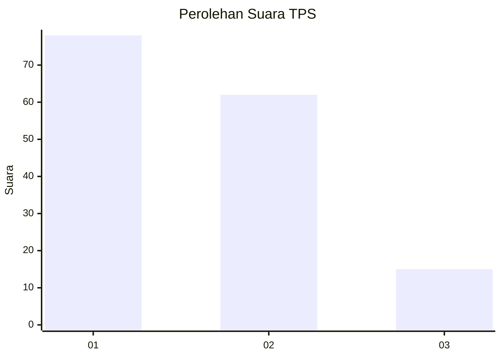
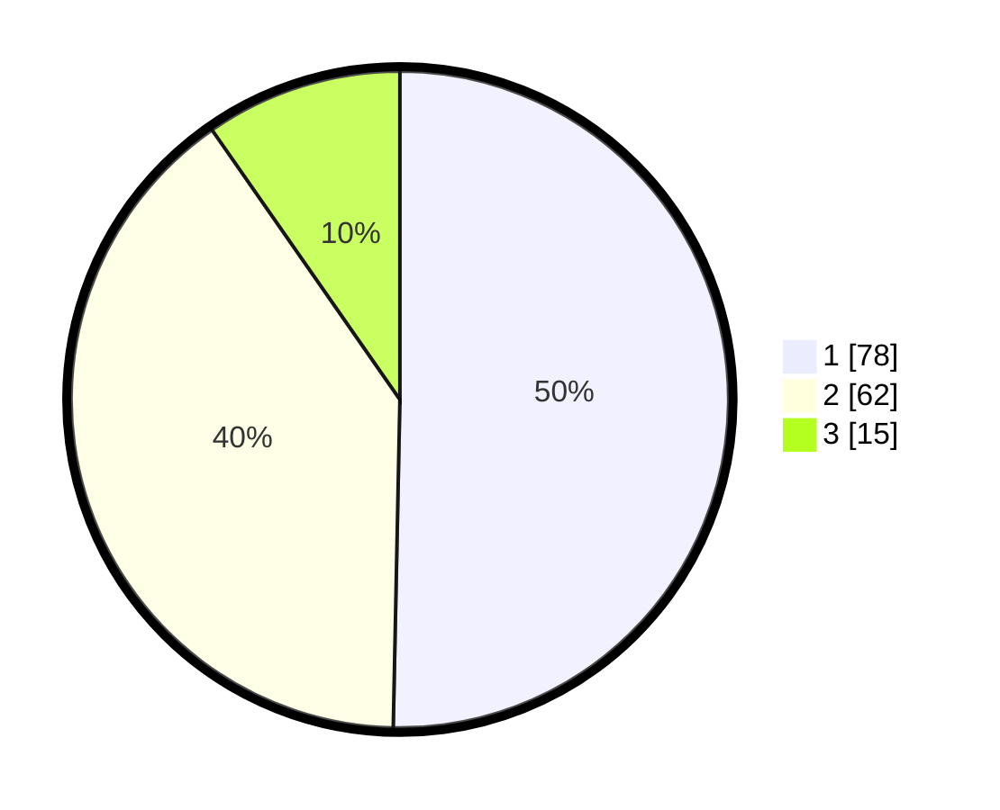

# Hasil

## Grafik

## Tabel

| No. | Nama Paslon    | Suara | Suara (raw) | Persentase |
|:--- |:-------------- | -----:| -----------:| ----------:|
| 1   | ANIES MUHAIMIN | 78    | [78][p-1]   | 50,32      |
| 2   | PRABOWO GIBRAN | 62    | [62][p-2]   | 40,00      |
| 3   | GANJAR MAHFUD  | 15    | [15][p-3]   | 9,68       |

[p-1]: https://github.com/gigit-pemilu/pemilu-2024-35-jawa-timur/blob/main/pilpres/hitung-suara/sub/35-jawa-timur/sub/27-sampang/sub/01-sreseh/sub/2004-sreseh/sub/008-tps/sub/paslon-1.txt
[p-2]: https://github.com/gigit-pemilu/pemilu-2024-35-jawa-timur/blob/main/pilpres/hitung-suara/sub/35-jawa-timur/sub/27-sampang/sub/01-sreseh/sub/2004-sreseh/sub/008-tps/sub/paslon-2.txt
[p-3]: https://github.com/gigit-pemilu/pemilu-2024-35-jawa-timur/blob/main/pilpres/hitung-suara/sub/35-jawa-timur/sub/27-sampang/sub/01-sreseh/sub/2004-sreseh/sub/008-tps/sub/paslon-3.txt

## Foto C Plano

https://sirekap-obj-formc.kpu.go.id/72ca/pemilu/ppwp/35/27/01/20/04/3527012004008-20240215-112942--97861996-6218-4444-82c9-d229893e6edb.jpg

https://sirekap-obj-formc.kpu.go.id/72ca/pemilu/ppwp/35/27/01/20/04/3527012004008-20240218-185305--3b003594-9384-4b18-9ef2-ddea9614e02f.jpg

https://sirekap-obj-formc.kpu.go.id/72ca/pemilu/ppwp/35/27/01/20/04/3527012004008-20240218-190634--926f8e15-c3d0-4cc5-a191-a8410a6a435d.jpg

## Metadata

| Key        | Value               |
| ---------- | ------------------- |
| Time Stamp | 2024-02-21 09:00:00 |

