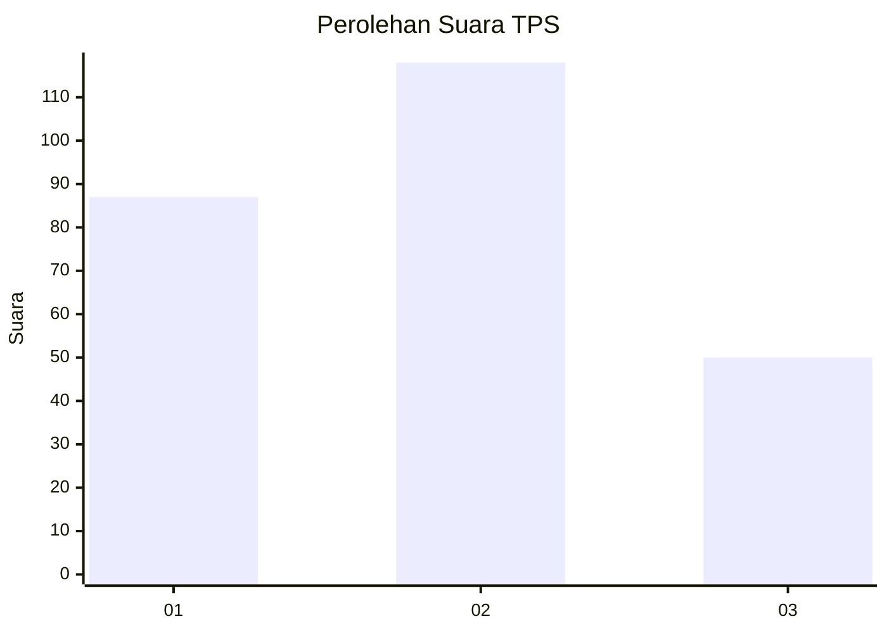
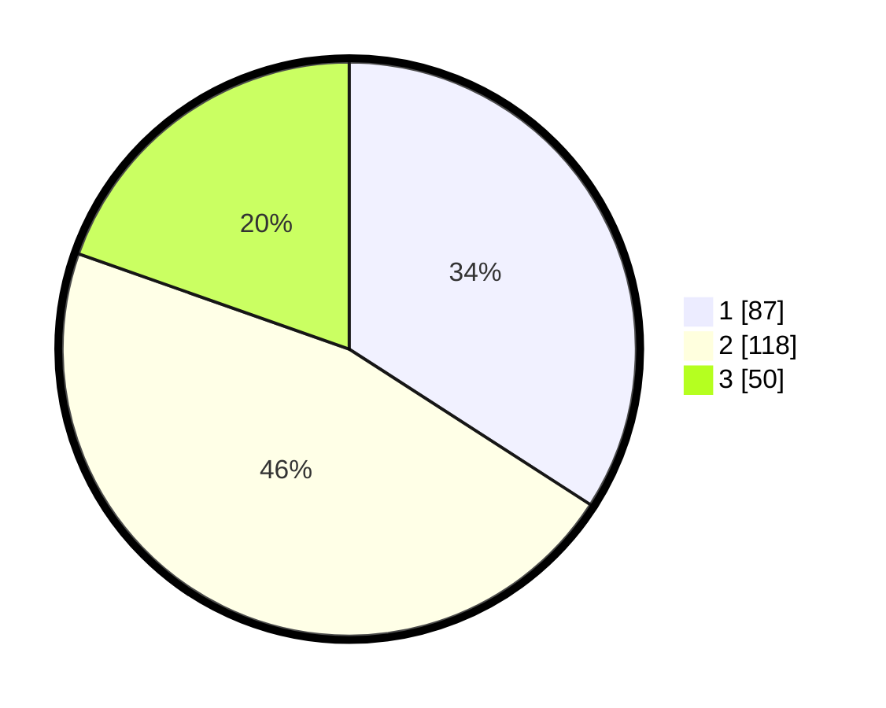

# Hasil

## Grafik

## Tabel

| No. | Nama Paslon    | Suara | Suara (raw) | Persentase |
|:--- |:-------------- | -----:| -----------:| ----------:|
| 1   | ANIES MUHAIMIN | 87    | [87][p-1]   | 34,12      |
| 2   | PRABOWO GIBRAN | 118   | [118][p-2]  | 46,27      |
| 3   | GANJAR MAHFUD  | 50    | [50][p-3]   | 19,61      |

[p-1]: https://github.com/gigit-pemilu/pemilu-2024/blob/main/pilpres/hitung-suara/sub/35-jawa-timur/sub/27-sampang/sub/01-sreseh/sub/2005-disanah/sub/001-tps/sub/paslon-1.txt
[p-2]: https://github.com/gigit-pemilu/pemilu-2024/blob/main/pilpres/hitung-suara/sub/35-jawa-timur/sub/27-sampang/sub/01-sreseh/sub/2005-disanah/sub/001-tps/sub/paslon-2.txt
[p-3]: https://github.com/gigit-pemilu/pemilu-2024/blob/main/pilpres/hitung-suara/sub/35-jawa-timur/sub/27-sampang/sub/01-sreseh/sub/2005-disanah/sub/001-tps/sub/paslon-3.txt

## Foto C Plano

https://sirekap-obj-formc.kpu.go.id/9526/pemilu/ppwp/35/27/01/20/05/3527012005001-20240215-075014--5db9fa03-0bd0-4800-8e9a-ade104a24198.jpg

https://sirekap-obj-formc.kpu.go.id/9526/pemilu/ppwp/35/27/01/20/05/3527012005001-20240215-075317--d7e7a45a-4244-4b79-ae32-ee8ab2a557cf.jpg

https://sirekap-obj-formc.kpu.go.id/9526/pemilu/ppwp/35/27/01/20/05/3527012005001-20240215-075431--70f0d3f8-148b-48ab-8891-c42258d6b282.jpg

## Metadata

| Key        | Value               |
| ---------- | ------------------- |
| Time Stamp | 2024-02-16 09:30:28 |

