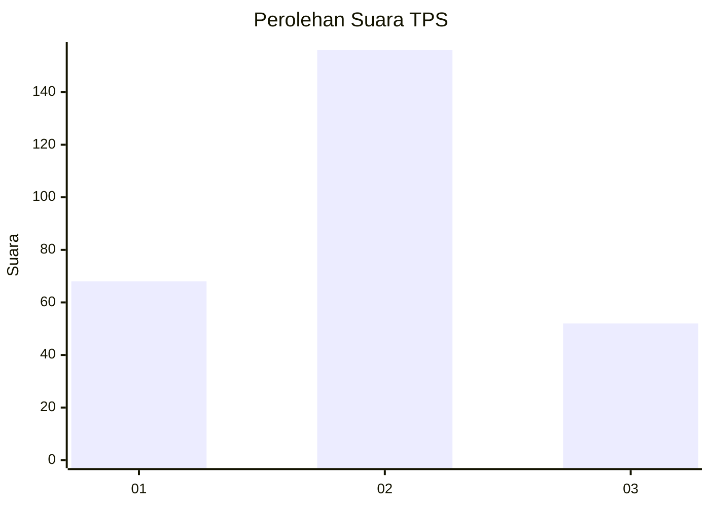
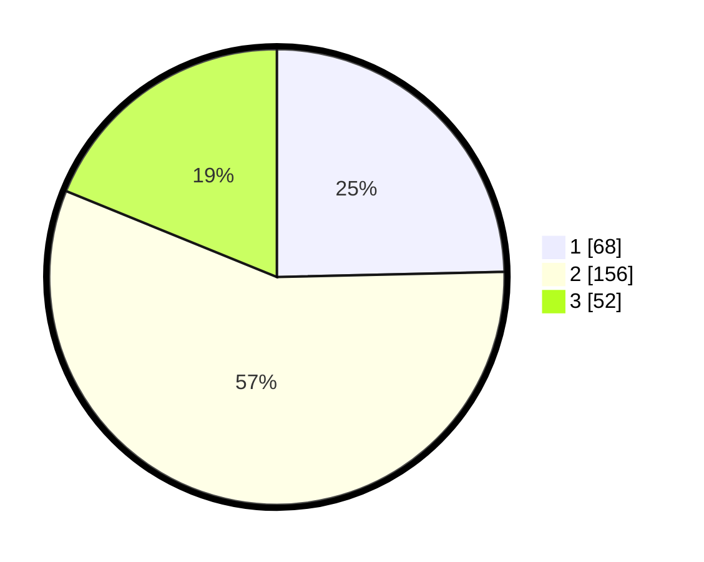

# Hasil

## Grafik

## Tabel

| No. | Nama Paslon    | Suara | Suara (raw) | Persentase |
|:--- |:-------------- | -----:| -----------:| ----------:|
| 1   | ANIES MUHAIMIN | 68    | [68][p-1]   | 24,64      |
| 2   | PRABOWO GIBRAN | 156   | [156][p-2]  | 56,52      |
| 3   | GANJAR MAHFUD  | 52    | [52][p-3]   | 18,84      |

[p-1]: https://github.com/gigit-pemilu/pemilu-2024-35-jawa-timur/blob/main/pilpres/hitung-suara/sub/35-jawa-timur/sub/27-sampang/sub/01-sreseh/sub/2007-klobur/sub/003-tps/sub/paslon-1.txt
[p-2]: https://github.com/gigit-pemilu/pemilu-2024-35-jawa-timur/blob/main/pilpres/hitung-suara/sub/35-jawa-timur/sub/27-sampang/sub/01-sreseh/sub/2007-klobur/sub/003-tps/sub/paslon-2.txt
[p-3]: https://github.com/gigit-pemilu/pemilu-2024-35-jawa-timur/blob/main/pilpres/hitung-suara/sub/35-jawa-timur/sub/27-sampang/sub/01-sreseh/sub/2007-klobur/sub/003-tps/sub/paslon-3.txt

## Foto C Plano

https://sirekap-obj-formc.kpu.go.id/6bd7/pemilu/ppwp/35/27/01/20/07/3527012007003-20240214-220254--02e6f0ff-ec0f-4b1b-9267-f2fe90b27658.jpg

https://sirekap-obj-formc.kpu.go.id/6bd7/pemilu/ppwp/35/27/01/20/07/3527012007003-20240214-201445--3240e786-cc41-45f4-935f-383a4bebc2d1.jpg

https://sirekap-obj-formc.kpu.go.id/6bd7/pemilu/ppwp/35/27/01/20/07/3527012007003-20240214-220627--90ad2505-77ee-4b9a-baf7-2574d4949c9b.jpg

## Metadata

| Key        | Value               |
| ---------- | ------------------- |
| Time Stamp | 2024-02-16 10:00:28 |

