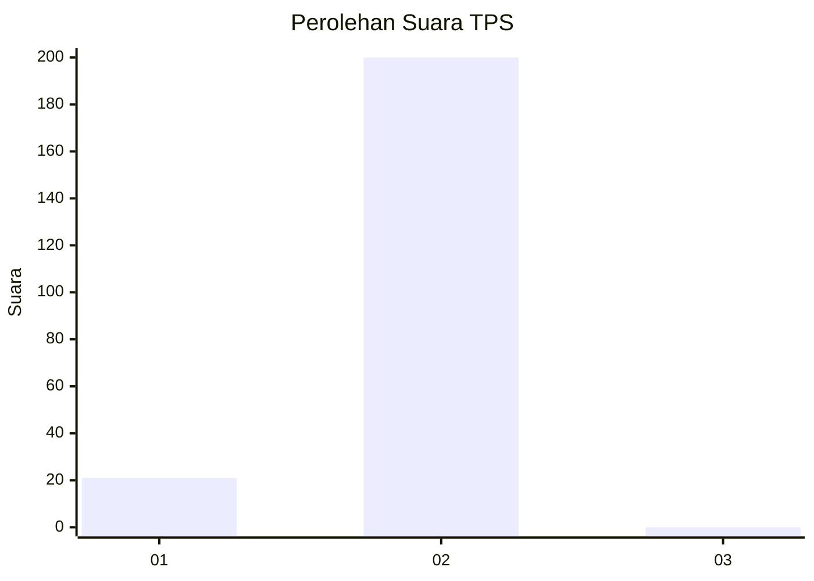
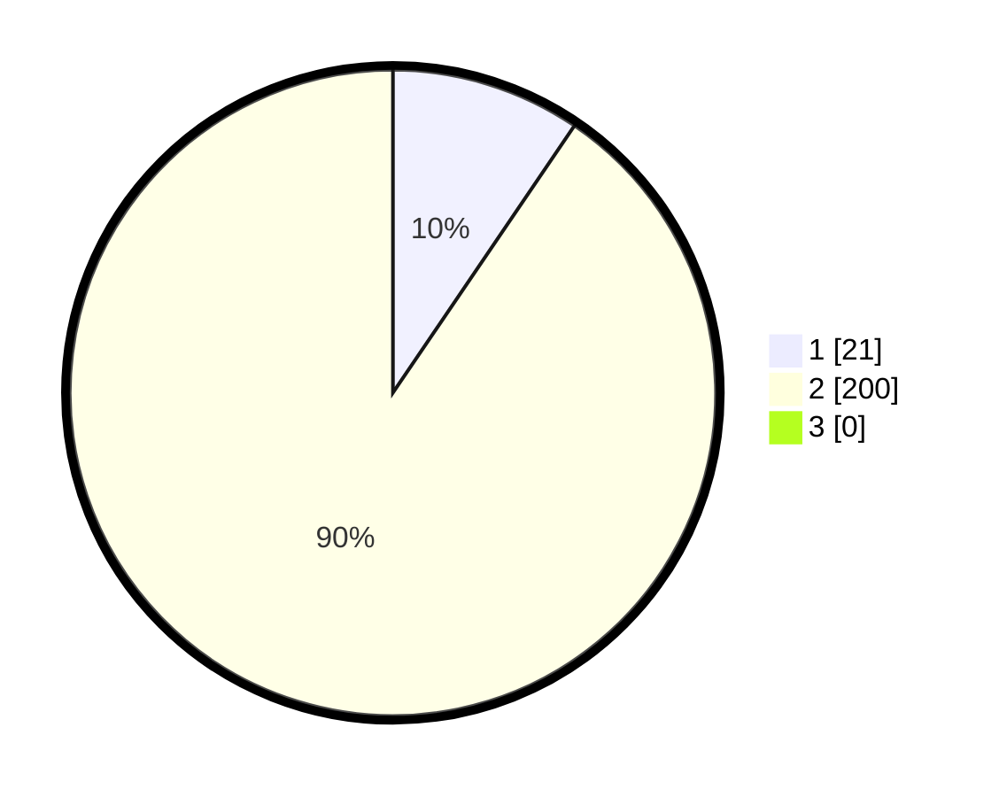

# Hasil

## Grafik

## Tabel

| No. | Nama Paslon    | Suara | Suara (raw) | Persentase |
|:--- |:-------------- | -----:| -----------:| ----------:|
| 1   | ANIES MUHAIMIN | 21    | [21][p-1]   | 9,50       |
| 2   | PRABOWO GIBRAN | 200   | [200][p-2]  | 90,50      |
| 3   | GANJAR MAHFUD  | 0     | [0][p-3]    | 0,00       |

[p-1]: https://github.com/gigit-pemilu/pemilu-2024-35-jawa-timur/blob/main/pilpres/hitung-suara/sub/35-jawa-timur/sub/27-sampang/sub/01-sreseh/sub/2008-labang/sub/002-tps/sub/paslon-1.txt
[p-2]: https://github.com/gigit-pemilu/pemilu-2024-35-jawa-timur/blob/main/pilpres/hitung-suara/sub/35-jawa-timur/sub/27-sampang/sub/01-sreseh/sub/2008-labang/sub/002-tps/sub/paslon-2.txt
[p-3]: https://github.com/gigit-pemilu/pemilu-2024-35-jawa-timur/blob/main/pilpres/hitung-suara/sub/35-jawa-timur/sub/27-sampang/sub/01-sreseh/sub/2008-labang/sub/002-tps/sub/paslon-3.txt

## Foto C Plano

https://sirekap-obj-formc.kpu.go.id/deeb/pemilu/ppwp/35/27/01/20/08/3527012008002-20240215-053621--076e0dff-1dff-4cc1-9884-ea797d714a71.jpg

https://sirekap-obj-formc.kpu.go.id/deeb/pemilu/ppwp/35/27/01/20/08/3527012008002-20240215-045951--65773cb3-fb45-491b-84aa-2fec1d565fcc.jpg

https://sirekap-obj-formc.kpu.go.id/deeb/pemilu/ppwp/35/27/01/20/08/3527012008002-20240215-050325--4b4621c7-d1bd-43c9-9f45-7804e3600af0.jpg

## Metadata

| Key        | Value               |
| ---------- | ------------------- |
| Time Stamp | 2024-02-25 13:00:00 |

