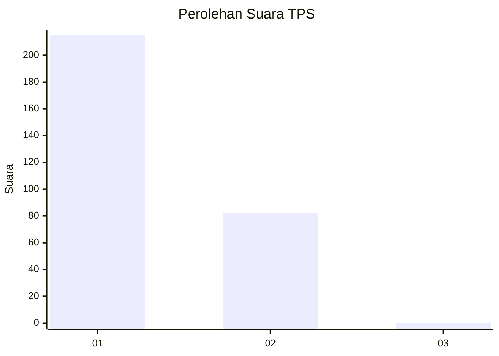
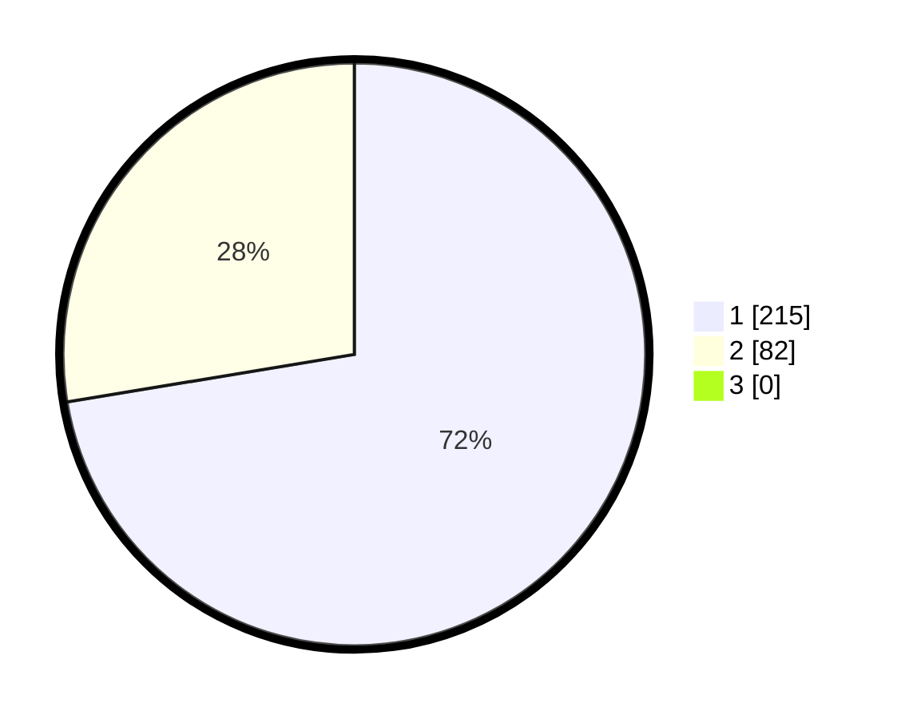

# Hasil

## Grafik

## Tabel

| No. | Nama Paslon    | Suara | Suara (raw) | Persentase |
|:--- |:-------------- | -----:| -----------:| ----------:|
| 1   | ANIES MUHAIMIN | 215   | [215][p-1]  | 72,39      |
| 2   | PRABOWO GIBRAN | 82    | [82][p-2]   | 27,61      |
| 3   | GANJAR MAHFUD  | 0     | [0][p-3]    | 0,00       |

[p-1]: https://github.com/gigit-pemilu/pemilu-2024/blob/main/pilpres/hitung-suara/sub/35-jawa-timur/sub/27-sampang/sub/01-sreseh/sub/2009-bundah/sub/004-tps/sub/paslon-1.txt
[p-2]: https://github.com/gigit-pemilu/pemilu-2024/blob/main/pilpres/hitung-suara/sub/35-jawa-timur/sub/27-sampang/sub/01-sreseh/sub/2009-bundah/sub/004-tps/sub/paslon-2.txt
[p-3]: https://github.com/gigit-pemilu/pemilu-2024/blob/main/pilpres/hitung-suara/sub/35-jawa-timur/sub/27-sampang/sub/01-sreseh/sub/2009-bundah/sub/004-tps/sub/paslon-3.txt

## Foto C Plano

https://sirekap-obj-formc.kpu.go.id/0263/pemilu/ppwp/35/27/01/20/09/3527012009004-20240216-201226--aa668c02-89df-4ae8-a820-a67c2b0f44f0.jpg

https://sirekap-obj-formc.kpu.go.id/0263/pemilu/ppwp/35/27/01/20/09/3527012009004-20240216-201343--fa4c38dd-eab7-4f83-bf1a-027a6607d01b.jpg

https://sirekap-obj-formc.kpu.go.id/0263/pemilu/ppwp/35/27/01/20/09/3527012009004-20240214-220232--c4d3e33e-d7c7-447e-ba9e-3d7d802dc151.jpg

## Metadata

| Key        | Value               |
| ---------- | ------------------- |
| Time Stamp | 2024-02-25 16:00:00 |

