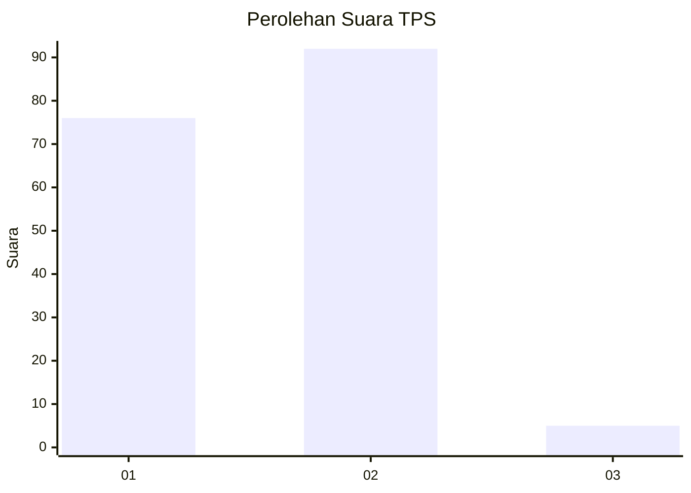
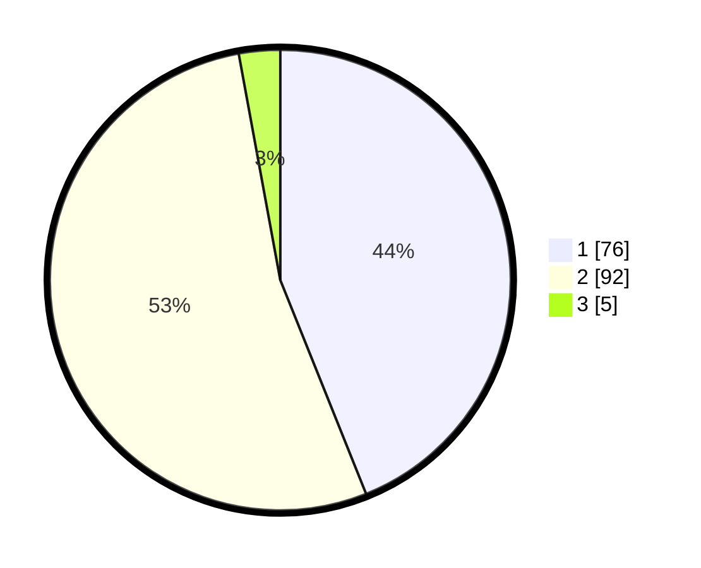

# Hasil

## Grafik

## Tabel

| No. | Nama Paslon    | Suara | Suara (raw) | Persentase |
|:--- |:-------------- | -----:| -----------:| ----------:|
| 1   | ANIES MUHAIMIN | 76    | [76][p-1]   | 43,93      |
| 2   | PRABOWO GIBRAN | 92    | [92][p-2]   | 53,18      |
| 3   | GANJAR MAHFUD  | 5     | [5][p-3]    | 2,89       |

[p-1]: https://github.com/gigit-pemilu/pemilu-2024-35-jawa-timur/blob/main/pilpres/hitung-suara/sub/35-jawa-timur/sub/27-sampang/sub/02-torjun/sub/2007-dulang/sub/002-tps/sub/paslon-1.txt
[p-2]: https://github.com/gigit-pemilu/pemilu-2024-35-jawa-timur/blob/main/pilpres/hitung-suara/sub/35-jawa-timur/sub/27-sampang/sub/02-torjun/sub/2007-dulang/sub/002-tps/sub/paslon-2.txt
[p-3]: https://github.com/gigit-pemilu/pemilu-2024-35-jawa-timur/blob/main/pilpres/hitung-suara/sub/35-jawa-timur/sub/27-sampang/sub/02-torjun/sub/2007-dulang/sub/002-tps/sub/paslon-3.txt

## Foto C Plano

https://sirekap-obj-formc.kpu.go.id/27b6/pemilu/ppwp/35/27/02/20/07/3527022007002-20240215-003254--e59b7db7-fd8e-4240-82da-472fe8e54546.jpg

https://sirekap-obj-formc.kpu.go.id/27b6/pemilu/ppwp/35/27/02/20/07/3527022007002-20240214-205036--20f81c3a-1379-488d-b256-487142ce90fe.jpg

https://sirekap-obj-formc.kpu.go.id/27b6/pemilu/ppwp/35/27/02/20/07/3527022007002-20240214-205343--52a8fb14-e2b1-4ed6-be66-417ae6addeca.jpg

## Metadata

| Key        | Value               |
| ---------- | ------------------- |
| Time Stamp | 2024-02-16 12:51:22 |

