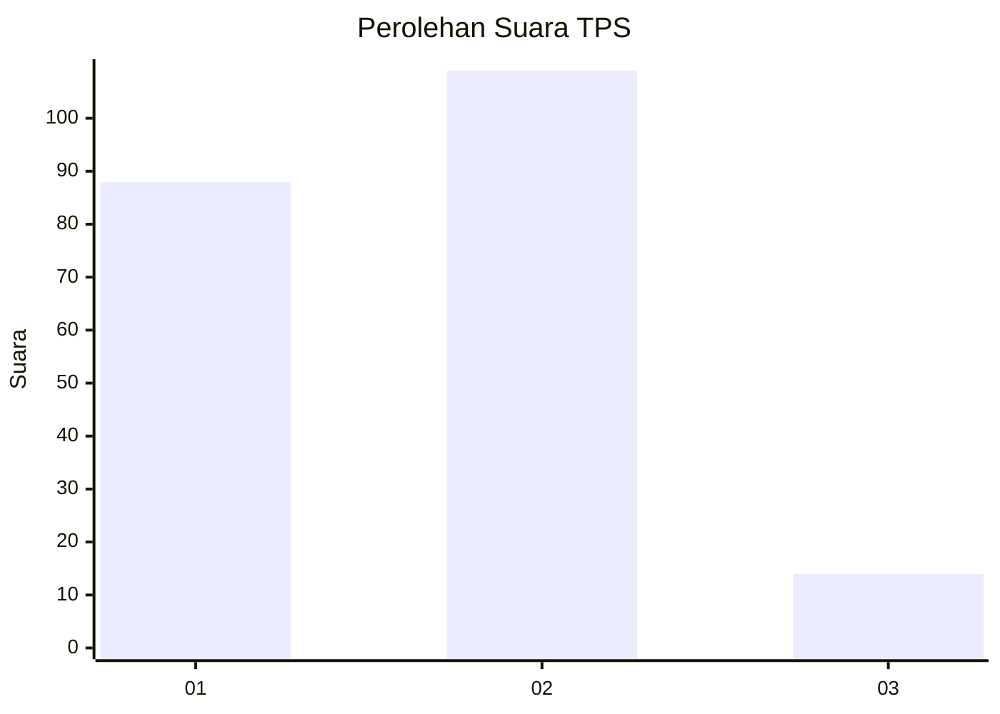

# Hasil

## Grafik

## Tabel

| No. | Nama Paslon    | Suara | Suara (raw) | Persentase |
|:--- |:-------------- | -----:| -----------:| ----------:|
| 1   | ANIES MUHAIMIN | 88    | [88][p-1]   | 41,71      |
| 2   | PRABOWO GIBRAN | 109   | [109][p-2]  | 51,66      |
| 3   | GANJAR MAHFUD  | 14    | [14][p-3]   | 6,64       |

[p-1]: https://github.com/gigit-pemilu/pemilu-2024/blob/main/pilpres/hitung-suara/sub/35-jawa-timur/sub/27-sampang/sub/02-torjun/sub/2007-dulang/sub/005-tps/sub/paslon-1.txt
[p-2]: https://github.com/gigit-pemilu/pemilu-2024/blob/main/pilpres/hitung-suara/sub/35-jawa-timur/sub/27-sampang/sub/02-torjun/sub/2007-dulang/sub/005-tps/sub/paslon-2.txt
[p-3]: https://github.com/gigit-pemilu/pemilu-2024/blob/main/pilpres/hitung-suara/sub/35-jawa-timur/sub/27-sampang/sub/02-torjun/sub/2007-dulang/sub/005-tps/sub/paslon-3.txt

## Foto C Plano

https://sirekap-obj-formc.kpu.go.id/222a/pemilu/ppwp/35/27/02/20/07/3527022007005-20240214-223548--20057a9c-9a01-45a4-a902-75f91e640694.jpg

https://sirekap-obj-formc.kpu.go.id/222a/pemilu/ppwp/35/27/02/20/07/3527022007005-20240214-223720--1d08e4ff-8298-42c5-af29-88041e75724b.jpg

https://sirekap-obj-formc.kpu.go.id/222a/pemilu/ppwp/35/27/02/20/07/3527022007005-20240214-223834--e508d962-41d4-4f4b-872c-3c273d0c4195.jpg

## Metadata

| Key        | Value               |
| ---------- | ------------------- |
| Time Stamp | 2024-02-25 22:00:00 |

