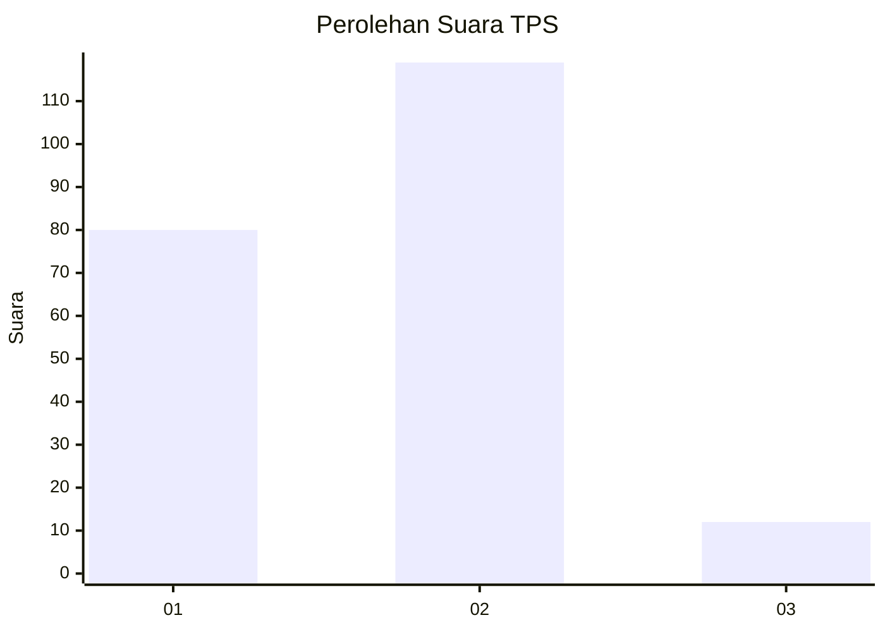
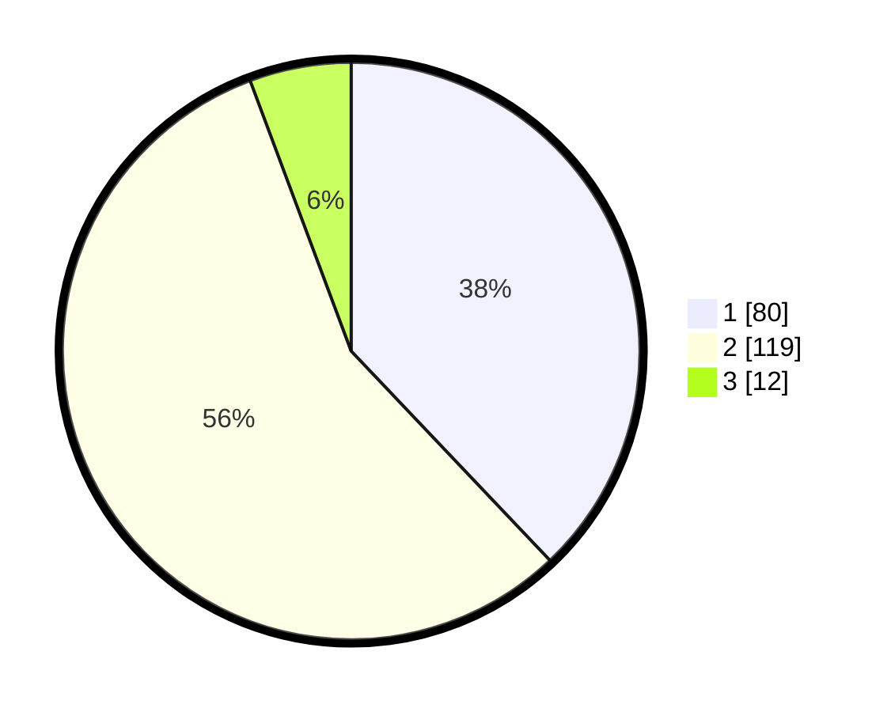

# Hasil

## Grafik

## Tabel

| No. | Nama Paslon    | Suara | Suara (raw) | Persentase |
|:--- |:-------------- | -----:| -----------:| ----------:|
| 1   | ANIES MUHAIMIN | 80    | [80][p-1]   | 37,91      |
| 2   | PRABOWO GIBRAN | 119   | [119][p-2]  | 56,40      |
| 3   | GANJAR MAHFUD  | 12    | [12][p-3]   | 5,69       |

[p-1]: https://github.com/gigit-pemilu/pemilu-2024/blob/main/pilpres/hitung-suara/sub/35-jawa-timur/sub/27-sampang/sub/02-torjun/sub/2007-dulang/sub/006-tps/sub/paslon-1.txt
[p-2]: https://github.com/gigit-pemilu/pemilu-2024/blob/main/pilpres/hitung-suara/sub/35-jawa-timur/sub/27-sampang/sub/02-torjun/sub/2007-dulang/sub/006-tps/sub/paslon-2.txt
[p-3]: https://github.com/gigit-pemilu/pemilu-2024/blob/main/pilpres/hitung-suara/sub/35-jawa-timur/sub/27-sampang/sub/02-torjun/sub/2007-dulang/sub/006-tps/sub/paslon-3.txt

## Foto C Plano

https://sirekap-obj-formc.kpu.go.id/b765/pemilu/ppwp/35/27/02/20/07/3527022007006-20240215-005344--5aef9b86-98d1-40e8-8ef9-84cf7cc1cd1c.jpg

https://sirekap-obj-formc.kpu.go.id/b765/pemilu/ppwp/35/27/02/20/07/3527022007006-20240215-005426--00d6c04b-702e-4d4b-a475-f0ac2a0abf97.jpg

https://sirekap-obj-formc.kpu.go.id/b765/pemilu/ppwp/35/27/02/20/07/3527022007006-20240214-215344--6ae55062-be29-4682-9e83-3cf5aedb5e21.jpg

## Metadata

| Key        | Value               |
| ---------- | ------------------- |
| Time Stamp | 2024-02-16 10:00:28 |

