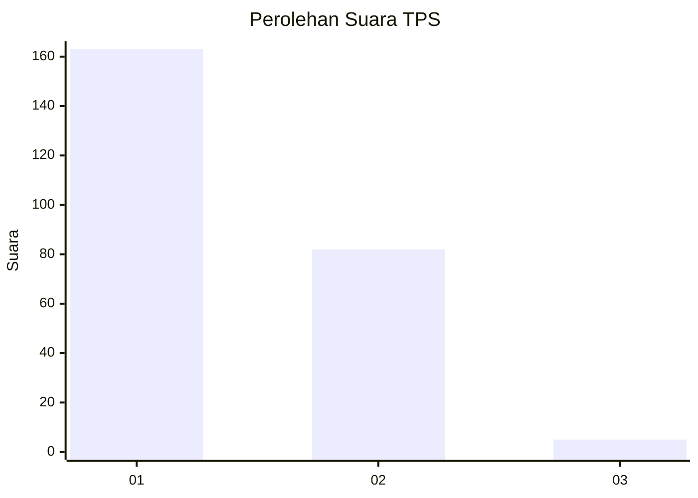
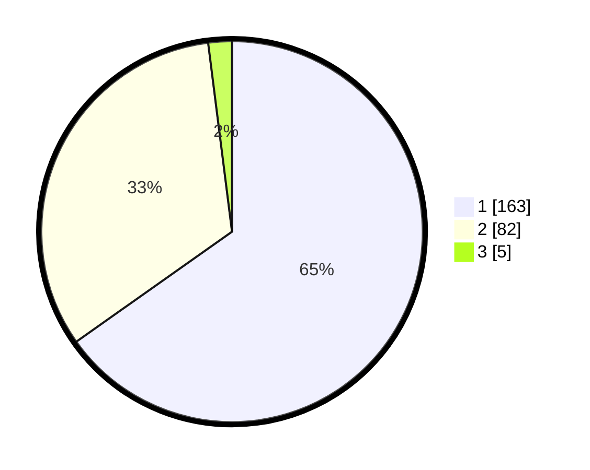

# Hasil

## Grafik

## Tabel

| No. | Nama Paslon    | Suara | Suara (raw) | Persentase |
|:--- |:-------------- | -----:| -----------:| ----------:|
| 1   | ANIES MUHAIMIN | 163   | [163][p-1]  | 65,20      |
| 2   | PRABOWO GIBRAN | 82    | [82][p-2]   | 32,80      |
| 3   | GANJAR MAHFUD  | 5     | [5][p-3]    | 2,00       |

[p-1]: https://github.com/gigit-pemilu/pemilu-2024/blob/main/pilpres/hitung-suara/sub/35-jawa-timur/sub/27-sampang/sub/02-torjun/sub/2007-dulang/sub/008-tps/sub/paslon-1.txt
[p-2]: https://github.com/gigit-pemilu/pemilu-2024/blob/main/pilpres/hitung-suara/sub/35-jawa-timur/sub/27-sampang/sub/02-torjun/sub/2007-dulang/sub/008-tps/sub/paslon-2.txt
[p-3]: https://github.com/gigit-pemilu/pemilu-2024/blob/main/pilpres/hitung-suara/sub/35-jawa-timur/sub/27-sampang/sub/02-torjun/sub/2007-dulang/sub/008-tps/sub/paslon-3.txt

## Foto C Plano

https://sirekap-obj-formc.kpu.go.id/bdc2/pemilu/ppwp/35/27/02/20/07/3527022007008-20240214-235358--cd28e252-80c6-49a3-9e50-259114f4c404.jpg

https://sirekap-obj-formc.kpu.go.id/bdc2/pemilu/ppwp/35/27/02/20/07/3527022007008-20240214-235623--07a0a6b2-5524-44f6-a3c1-a7ba18930d5c.jpg

https://sirekap-obj-formc.kpu.go.id/bdc2/pemilu/ppwp/35/27/02/20/07/3527022007008-20240214-235730--d42bc003-d9d0-4c4d-bf11-84eddd944660.jpg

## Metadata

| Key        | Value               |
| ---------- | ------------------- |
| Time Stamp | 2024-02-16 12:51:22 |

