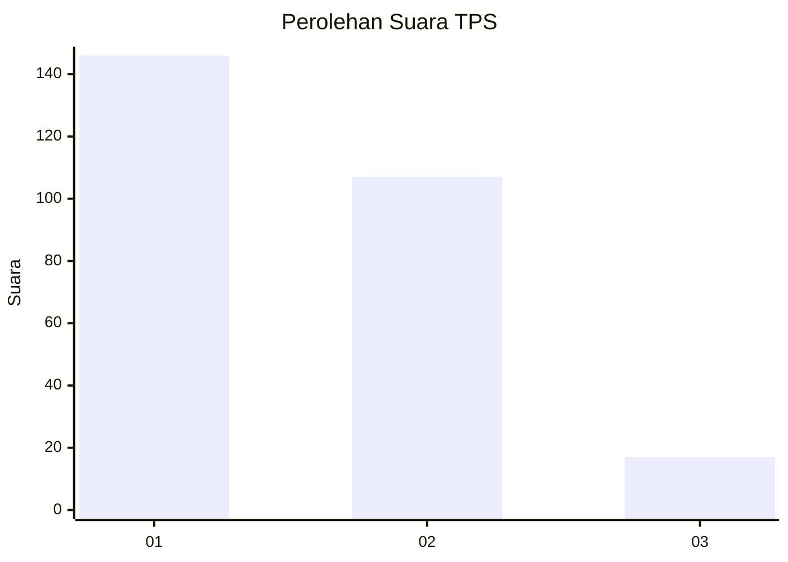
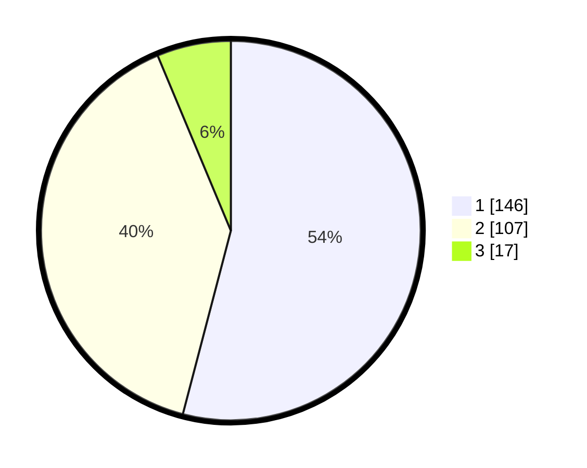

# Hasil

## Grafik

## Tabel

| No. | Nama Paslon    | Suara | Suara (raw) | Persentase |
|:--- |:-------------- | -----:| -----------:| ----------:|
| 1   | ANIES MUHAIMIN | 146   | [146][p-1]  | 54,07      |
| 2   | PRABOWO GIBRAN | 107   | [107][p-2]  | 39,63      |
| 3   | GANJAR MAHFUD  | 17    | [17][p-3]   | 6,30       |

[p-1]: https://github.com/gigit-pemilu/pemilu-2024/blob/main/pilpres/hitung-suara/sub/35-jawa-timur/sub/27-sampang/sub/02-torjun/sub/2007-dulang/sub/009-tps/sub/paslon-1.txt
[p-2]: https://github.com/gigit-pemilu/pemilu-2024/blob/main/pilpres/hitung-suara/sub/35-jawa-timur/sub/27-sampang/sub/02-torjun/sub/2007-dulang/sub/009-tps/sub/paslon-2.txt
[p-3]: https://github.com/gigit-pemilu/pemilu-2024/blob/main/pilpres/hitung-suara/sub/35-jawa-timur/sub/27-sampang/sub/02-torjun/sub/2007-dulang/sub/009-tps/sub/paslon-3.txt

## Foto C Plano

https://sirekap-obj-formc.kpu.go.id/3e20/pemilu/ppwp/35/27/02/20/07/3527022007009-20240214-212013--9efcad3d-b9f8-4bf9-a50d-eb45a34e836c.jpg

https://sirekap-obj-formc.kpu.go.id/3e20/pemilu/ppwp/35/27/02/20/07/3527022007009-20240214-212057--4f821e01-edb6-4519-96d7-cab46161993f.jpg

https://sirekap-obj-formc.kpu.go.id/3e20/pemilu/ppwp/35/27/02/20/07/3527022007009-20240214-212200--6e34323b-8bf4-4ec7-9d2a-a5b4e4968d5d.jpg

## Metadata

| Key        | Value               |
| ---------- | ------------------- |
| Time Stamp | 2024-02-16 10:00:28 |

