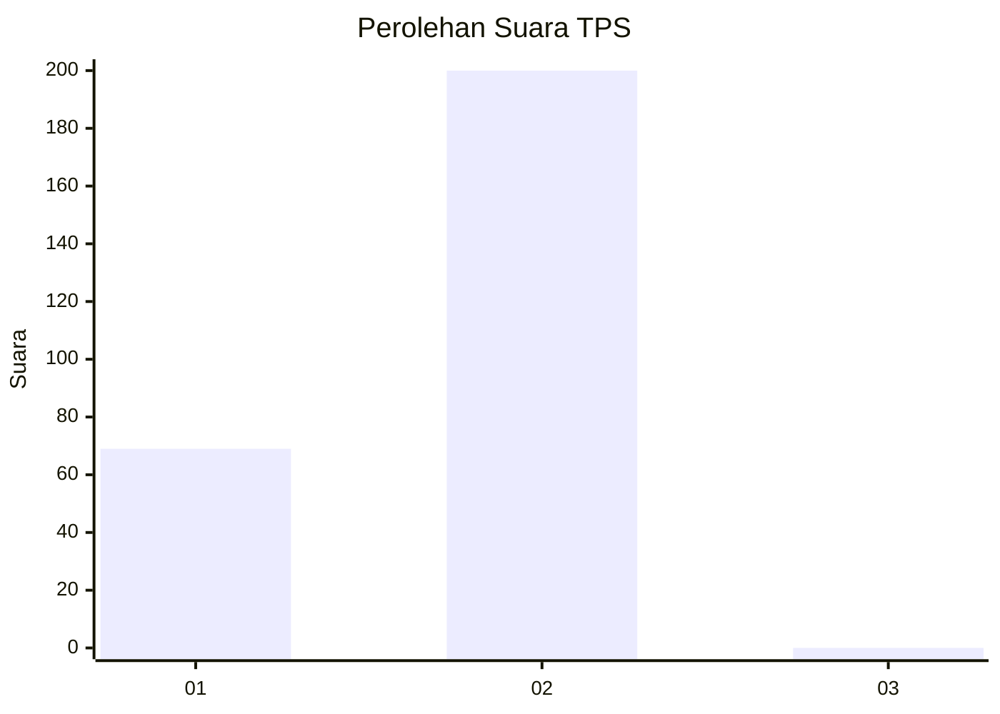
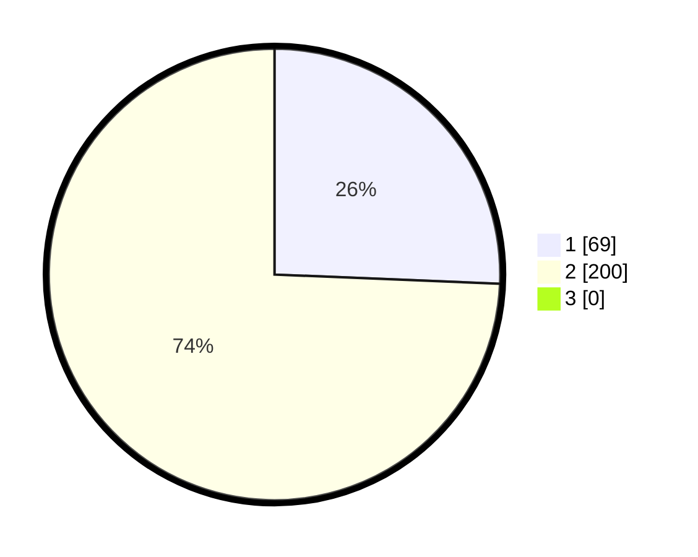

# Hasil

## Grafik

## Tabel

| No. | Nama Paslon    | Suara | Suara (raw) | Persentase |
|:--- |:-------------- | -----:| -----------:| ----------:|
| 1   | ANIES MUHAIMIN | 69    | [69][p-1]   | 25,65      |
| 2   | PRABOWO GIBRAN | 200   | [200][p-2]  | 74,35      |
| 3   | GANJAR MAHFUD  | 0     | [0][p-3]    | 0,00       |

[p-1]: https://github.com/gigit-pemilu/pemilu-2024/blob/main/pilpres/hitung-suara/sub/35-jawa-timur/sub/27-sampang/sub/02-torjun/sub/2008-patarongan/sub/001-tps/sub/paslon-1.txt
[p-2]: https://github.com/gigit-pemilu/pemilu-2024/blob/main/pilpres/hitung-suara/sub/35-jawa-timur/sub/27-sampang/sub/02-torjun/sub/2008-patarongan/sub/001-tps/sub/paslon-2.txt
[p-3]: https://github.com/gigit-pemilu/pemilu-2024/blob/main/pilpres/hitung-suara/sub/35-jawa-timur/sub/27-sampang/sub/02-torjun/sub/2008-patarongan/sub/001-tps/sub/paslon-3.txt

## Foto C Plano

https://sirekap-obj-formc.kpu.go.id/248d/pemilu/ppwp/35/27/02/20/08/3527022008001-20240214-220015--66f98a06-04d0-408f-997f-9008339f9c47.jpg

https://sirekap-obj-formc.kpu.go.id/248d/pemilu/ppwp/35/27/02/20/08/3527022008001-20240214-214956--a264332c-f2d4-42bf-8ac5-60c9eb65d2d0.jpg

https://sirekap-obj-formc.kpu.go.id/248d/pemilu/ppwp/35/27/02/20/08/3527022008001-20240214-215119--906619e9-3f40-4f17-b2a0-581ade66730f.jpg

## Metadata

| Key        | Value               |
| ---------- | ------------------- |
| Time Stamp | 2024-02-16 10:30:29 |

