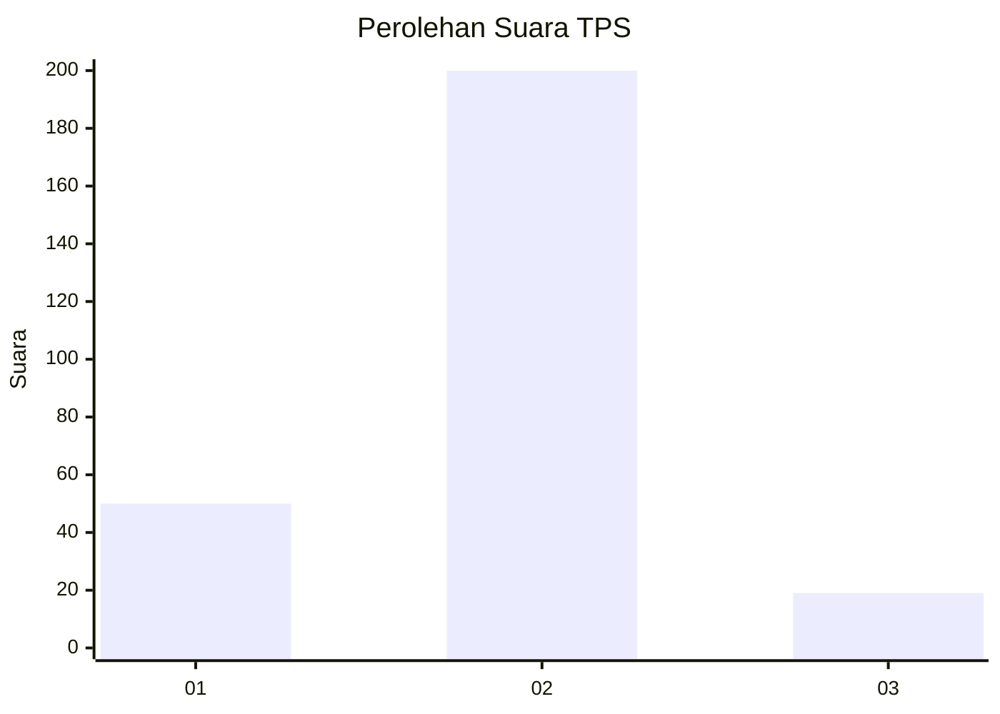
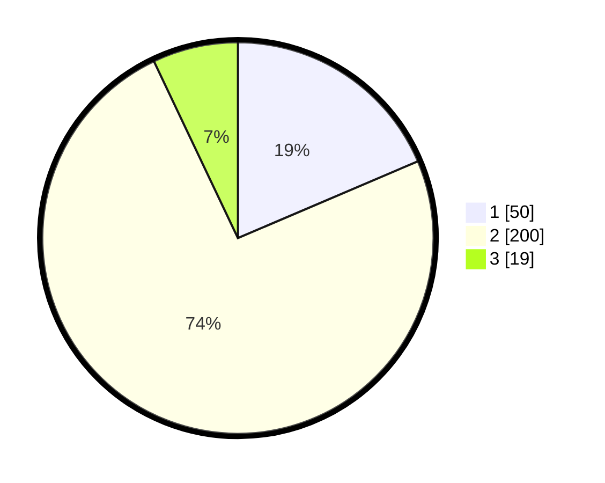

# Hasil

## Grafik

## Tabel

| No. | Nama Paslon    | Suara | Suara (raw) | Persentase |
|:--- |:-------------- | -----:| -----------:| ----------:|
| 1   | ANIES MUHAIMIN | 50    | [50][p-1]   | 18,59      |
| 2   | PRABOWO GIBRAN | 200   | [200][p-2]  | 74,35      |
| 3   | GANJAR MAHFUD  | 19    | [19][p-3]   | 7,06       |

[p-1]: https://github.com/gigit-pemilu/pemilu-2024-35-jawa-timur/blob/main/pilpres/hitung-suara/sub/35-jawa-timur/sub/27-sampang/sub/02-torjun/sub/2008-patarongan/sub/003-tps/sub/paslon-1.txt
[p-2]: https://github.com/gigit-pemilu/pemilu-2024-35-jawa-timur/blob/main/pilpres/hitung-suara/sub/35-jawa-timur/sub/27-sampang/sub/02-torjun/sub/2008-patarongan/sub/003-tps/sub/paslon-2.txt
[p-3]: https://github.com/gigit-pemilu/pemilu-2024-35-jawa-timur/blob/main/pilpres/hitung-suara/sub/35-jawa-timur/sub/27-sampang/sub/02-torjun/sub/2008-patarongan/sub/003-tps/sub/paslon-3.txt

## Foto C Plano

https://sirekap-obj-formc.kpu.go.id/1f45/pemilu/ppwp/35/27/02/20/08/3527022008003-20240214-214642--246c12d6-7d1a-4025-a824-3a32314e9b79.jpg

https://sirekap-obj-formc.kpu.go.id/1f45/pemilu/ppwp/35/27/02/20/08/3527022008003-20240214-214916--99f7d5b6-bc0b-4b3c-bb31-03681039e05b.jpg

https://sirekap-obj-formc.kpu.go.id/1f45/pemilu/ppwp/35/27/02/20/08/3527022008003-20240214-215042--4bff5848-ea5d-4a60-a236-772baa03d791.jpg

## Metadata

| Key        | Value               |
| ---------- | ------------------- |
| Time Stamp | 2024-02-16 10:30:29 |

