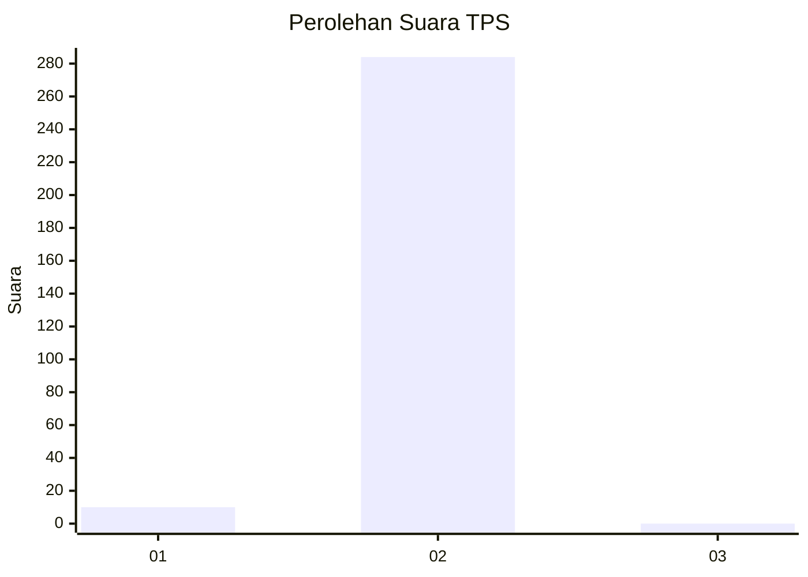
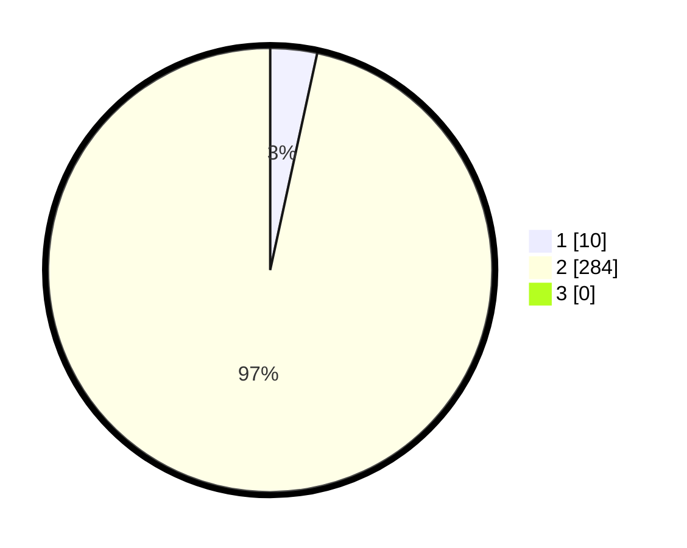

# Hasil

## Grafik

## Tabel

| No. | Nama Paslon    | Suara | Suara (raw) | Persentase |
|:--- |:-------------- | -----:| -----------:| ----------:|
| 1   | ANIES MUHAIMIN | 10    | [10][p-1]   | 3,40       |
| 2   | PRABOWO GIBRAN | 284   | [284][p-2]  | 96,60      |
| 3   | GANJAR MAHFUD  | 0     | [0][p-3]    | 0,00       |

[p-1]: https://github.com/gigit-pemilu/pemilu-2024-35-jawa-timur/blob/main/pilpres/hitung-suara/sub/35-jawa-timur/sub/27-sampang/sub/02-torjun/sub/2008-patarongan/sub/004-tps/sub/paslon-1.txt
[p-2]: https://github.com/gigit-pemilu/pemilu-2024-35-jawa-timur/blob/main/pilpres/hitung-suara/sub/35-jawa-timur/sub/27-sampang/sub/02-torjun/sub/2008-patarongan/sub/004-tps/sub/paslon-2.txt
[p-3]: https://github.com/gigit-pemilu/pemilu-2024-35-jawa-timur/blob/main/pilpres/hitung-suara/sub/35-jawa-timur/sub/27-sampang/sub/02-torjun/sub/2008-patarongan/sub/004-tps/sub/paslon-3.txt

## Foto C Plano

https://sirekap-obj-formc.kpu.go.id/d87a/pemilu/ppwp/35/27/02/20/08/3527022008004-20240214-203842--8999e22c-2b42-4be7-a2e8-753cca98a42a.jpg

https://sirekap-obj-formc.kpu.go.id/d87a/pemilu/ppwp/35/27/02/20/08/3527022008004-20240214-203945--655334b6-7237-4d49-a586-92c02f1f07ad.jpg

https://sirekap-obj-formc.kpu.go.id/d87a/pemilu/ppwp/35/27/02/20/08/3527022008004-20240214-204015--4934c53b-b3d2-45fe-bd2f-2f383dd05786.jpg

## Metadata

| Key        | Value               |
| ---------- | ------------------- |
| Time Stamp | 2024-02-16 10:30:29 |

