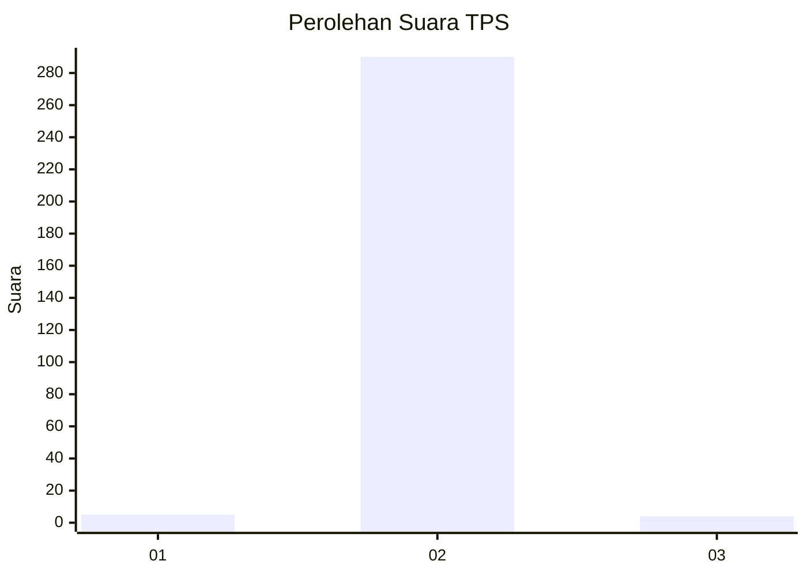
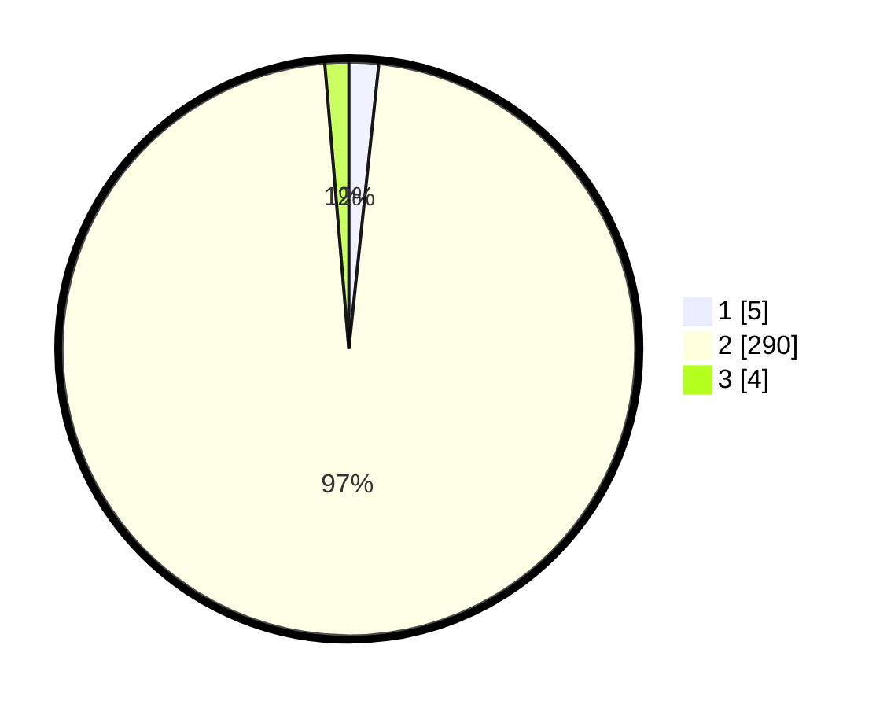

# Hasil

## Grafik

## Tabel

| No. | Nama Paslon    | Suara | Suara (raw) | Persentase |
|:--- |:-------------- | -----:| -----------:| ----------:|
| 1   | ANIES MUHAIMIN | 5     | [5][p-1]    | 1,67       |
| 2   | PRABOWO GIBRAN | 290   | [290][p-2]  | 96,99      |
| 3   | GANJAR MAHFUD  | 4     | [4][p-3]    | 1,34       |

[p-1]: https://github.com/gigit-pemilu/pemilu-2024/blob/main/pilpres/hitung-suara/sub/35-jawa-timur/sub/27-sampang/sub/02-torjun/sub/2008-patarongan/sub/008-tps/sub/paslon-1.txt
[p-2]: https://github.com/gigit-pemilu/pemilu-2024/blob/main/pilpres/hitung-suara/sub/35-jawa-timur/sub/27-sampang/sub/02-torjun/sub/2008-patarongan/sub/008-tps/sub/paslon-2.txt
[p-3]: https://github.com/gigit-pemilu/pemilu-2024/blob/main/pilpres/hitung-suara/sub/35-jawa-timur/sub/27-sampang/sub/02-torjun/sub/2008-patarongan/sub/008-tps/sub/paslon-3.txt

## Foto C Plano

https://sirekap-obj-formc.kpu.go.id/4b02/pemilu/ppwp/35/27/02/20/08/3527022008008-20240214-185240--e302fe2d-ffc5-4301-aeb6-1141ac3b3950.jpg

https://sirekap-obj-formc.kpu.go.id/4b02/pemilu/ppwp/35/27/02/20/08/3527022008008-20240214-185444--8e6d6753-1a3e-47aa-8769-96978ee3f5c1.jpg

https://sirekap-obj-formc.kpu.go.id/4b02/pemilu/ppwp/35/27/02/20/08/3527022008008-20240214-185627--297e6d5a-9f8a-47dd-9154-20b5dc5438b1.jpg

## Metadata

| Key        | Value               |
| ---------- | ------------------- |
| Time Stamp | 2024-02-16 10:30:29 |

