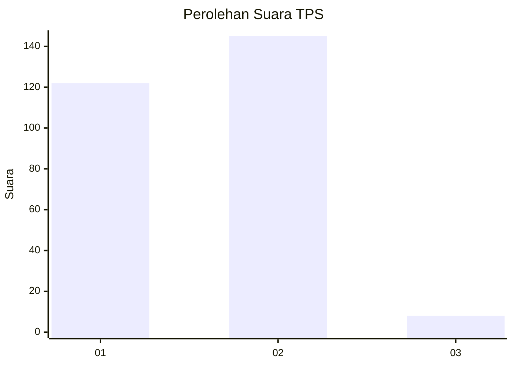
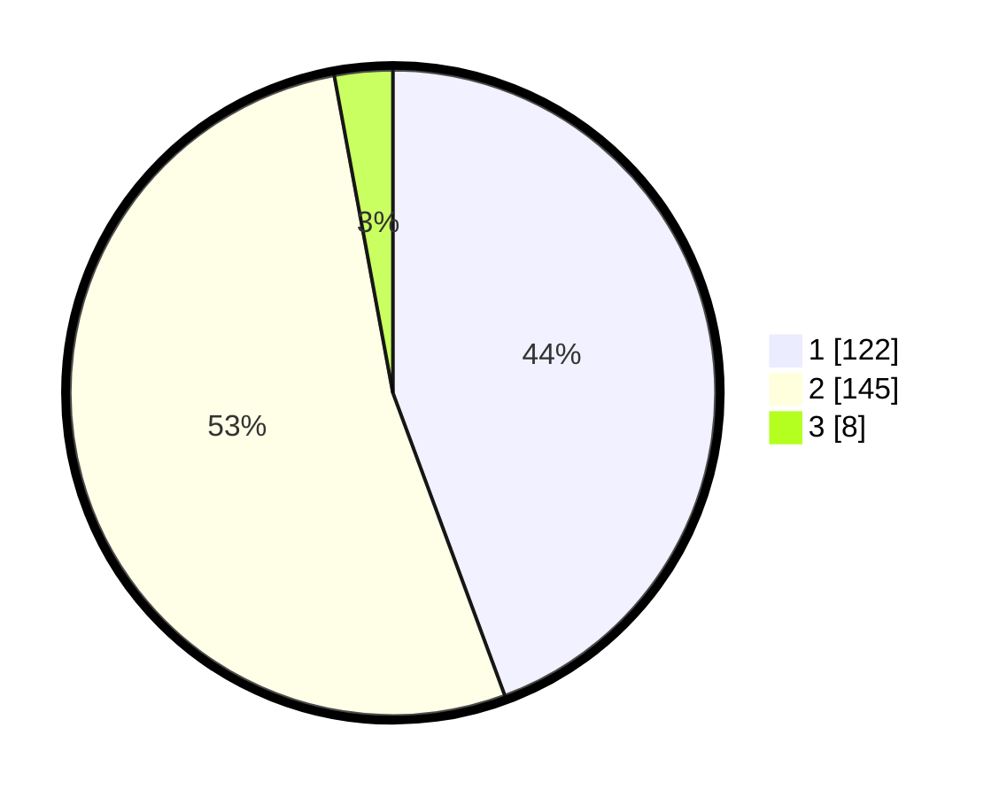

# Hasil

## Grafik

## Tabel

| No. | Nama Paslon    | Suara | Suara (raw) | Persentase |
|:--- |:-------------- | -----:| -----------:| ----------:|
| 1   | ANIES MUHAIMIN | 122   | [122][p-1]  | 44,36      |
| 2   | PRABOWO GIBRAN | 145   | [145][p-2]  | 52,73      |
| 3   | GANJAR MAHFUD  | 8     | [8][p-3]    | 2,91       |

[p-1]: https://github.com/gigit-pemilu/pemilu-2024-35-jawa-timur/blob/main/pilpres/hitung-suara/sub/35-jawa-timur/sub/27-sampang/sub/02-torjun/sub/2010-krampon/sub/001-tps/sub/paslon-1.txt
[p-2]: https://github.com/gigit-pemilu/pemilu-2024-35-jawa-timur/blob/main/pilpres/hitung-suara/sub/35-jawa-timur/sub/27-sampang/sub/02-torjun/sub/2010-krampon/sub/001-tps/sub/paslon-2.txt
[p-3]: https://github.com/gigit-pemilu/pemilu-2024-35-jawa-timur/blob/main/pilpres/hitung-suara/sub/35-jawa-timur/sub/27-sampang/sub/02-torjun/sub/2010-krampon/sub/001-tps/sub/paslon-3.txt

## Foto C Plano

https://sirekap-obj-formc.kpu.go.id/adf9/pemilu/ppwp/35/27/02/20/10/3527022010001-20240214-214101--5a63b52b-f995-4500-8b1b-6c5ad874d577.jpg

https://sirekap-obj-formc.kpu.go.id/adf9/pemilu/ppwp/35/27/02/20/10/3527022010001-20240214-214334--a631ecdb-f7ce-405e-a9da-53f06c029689.jpg

https://sirekap-obj-formc.kpu.go.id/adf9/pemilu/ppwp/35/27/02/20/10/3527022010001-20240214-215334--746310dc-51b2-47aa-8c09-ea8724984195.jpg

## Metadata

| Key        | Value               |
| ---------- | ------------------- |
| Time Stamp | 2024-02-16 10:30:29 |

