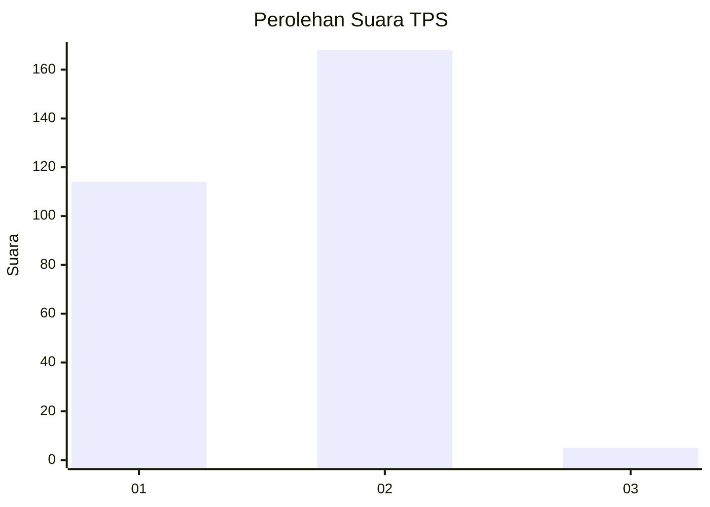
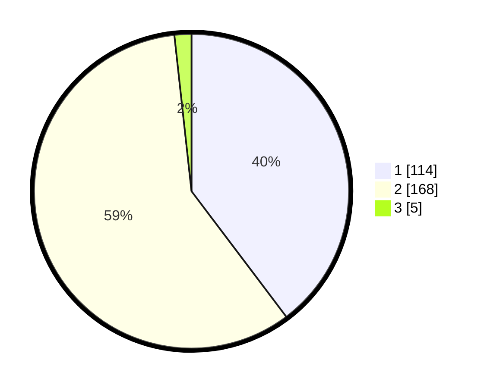

# Hasil

## Grafik

## Tabel

| No. | Nama Paslon    | Suara | Suara (raw) | Persentase |
|:--- |:-------------- | -----:| -----------:| ----------:|
| 1   | ANIES MUHAIMIN | 114   | [114][p-1]  | 39,72      |
| 2   | PRABOWO GIBRAN | 168   | [168][p-2]  | 58,54      |
| 3   | GANJAR MAHFUD  | 5     | [5][p-3]    | 1,74       |

[p-1]: https://github.com/gigit-pemilu/pemilu-2024-35-jawa-timur/blob/main/pilpres/hitung-suara/sub/35-jawa-timur/sub/27-sampang/sub/02-torjun/sub/2010-krampon/sub/002-tps/sub/paslon-1.txt
[p-2]: https://github.com/gigit-pemilu/pemilu-2024-35-jawa-timur/blob/main/pilpres/hitung-suara/sub/35-jawa-timur/sub/27-sampang/sub/02-torjun/sub/2010-krampon/sub/002-tps/sub/paslon-2.txt
[p-3]: https://github.com/gigit-pemilu/pemilu-2024-35-jawa-timur/blob/main/pilpres/hitung-suara/sub/35-jawa-timur/sub/27-sampang/sub/02-torjun/sub/2010-krampon/sub/002-tps/sub/paslon-3.txt

## Foto C Plano

https://sirekap-obj-formc.kpu.go.id/325b/pemilu/ppwp/35/27/02/20/10/3527022010002-20240214-214400--2cdc6bd3-5796-4ff6-aa5b-2c7ae0609003.jpg

https://sirekap-obj-formc.kpu.go.id/325b/pemilu/ppwp/35/27/02/20/10/3527022010002-20240214-214520--73f71073-9a5b-46b6-97bc-20fc4e9d9ed3.jpg

https://sirekap-obj-formc.kpu.go.id/325b/pemilu/ppwp/35/27/02/20/10/3527022010002-20240214-214635--a78d00ff-fcb7-461a-b436-597f10cf7c93.jpg

## Metadata

| Key        | Value               |
| ---------- | ------------------- |
| Time Stamp | 2024-02-16 10:30:29 |

