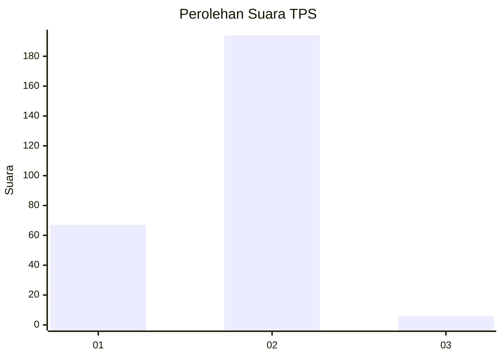
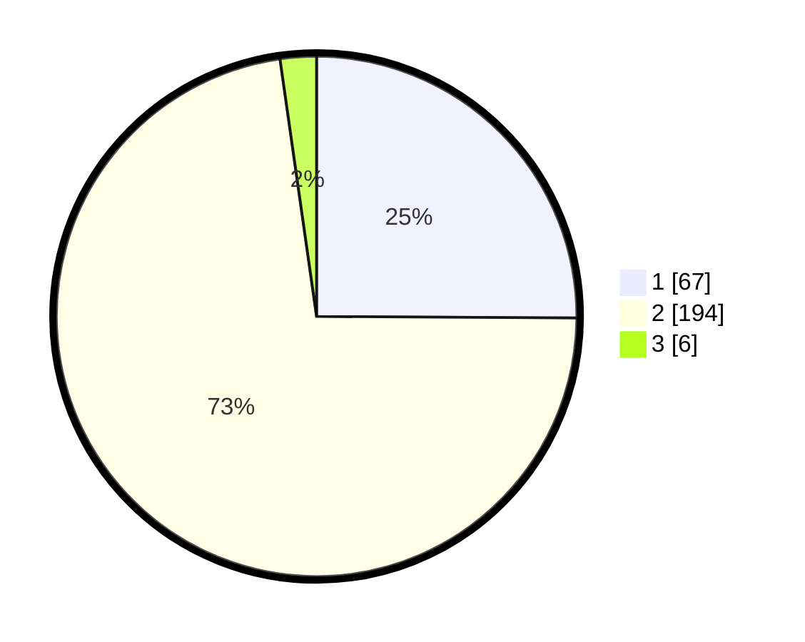

# Hasil

## Grafik

## Tabel

| No. | Nama Paslon    | Suara | Suara (raw) | Persentase |
|:--- |:-------------- | -----:| -----------:| ----------:|
| 1   | ANIES MUHAIMIN | 67    | [67][p-1]   | 25,09      |
| 2   | PRABOWO GIBRAN | 194   | [194][p-2]  | 72,66      |
| 3   | GANJAR MAHFUD  | 6     | [6][p-3]    | 2,25       |

[p-1]: https://github.com/gigit-pemilu/pemilu-2024/blob/main/pilpres/hitung-suara/sub/35-jawa-timur/sub/27-sampang/sub/02-torjun/sub/2010-krampon/sub/007-tps/sub/paslon-1.txt
[p-2]: https://github.com/gigit-pemilu/pemilu-2024/blob/main/pilpres/hitung-suara/sub/35-jawa-timur/sub/27-sampang/sub/02-torjun/sub/2010-krampon/sub/007-tps/sub/paslon-2.txt
[p-3]: https://github.com/gigit-pemilu/pemilu-2024/blob/main/pilpres/hitung-suara/sub/35-jawa-timur/sub/27-sampang/sub/02-torjun/sub/2010-krampon/sub/007-tps/sub/paslon-3.txt

## Foto C Plano

https://sirekap-obj-formc.kpu.go.id/9028/pemilu/ppwp/35/27/02/20/10/3527022010007-20240214-141756--3bd88286-1745-47b1-b51f-681115d66fe6.jpg

https://sirekap-obj-formc.kpu.go.id/9028/pemilu/ppwp/35/27/02/20/10/3527022010007-20240214-210506--d38f3d6f-1e27-4301-b0eb-bd9b076a6bd9.jpg

https://sirekap-obj-formc.kpu.go.id/9028/pemilu/ppwp/35/27/02/20/10/3527022010007-20240214-210854--06b96f6e-f4e2-4c40-9ca8-319e427c9d22.jpg

## Metadata

| Key        | Value               |
| ---------- | ------------------- |
| Time Stamp | 2024-02-16 12:51:22 |

