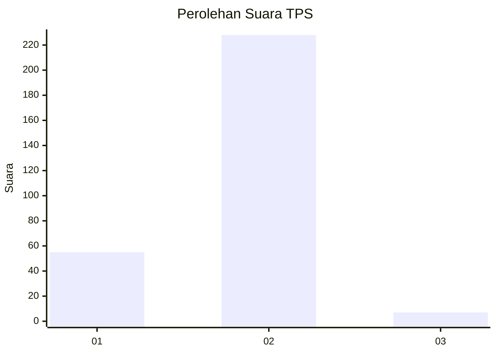
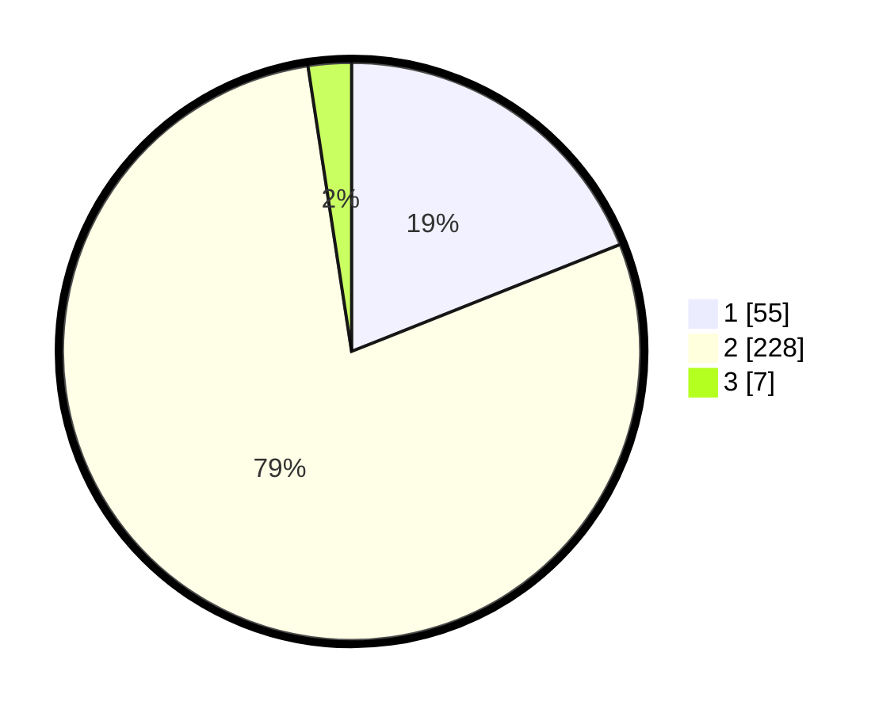

# Hasil

## Grafik

## Tabel

| No. | Nama Paslon    | Suara | Suara (raw) | Persentase |
|:--- |:-------------- | -----:| -----------:| ----------:|
| 1   | ANIES MUHAIMIN | 55    | [55][p-1]   | 18,97      |
| 2   | PRABOWO GIBRAN | 228   | [228][p-2]  | 78,62      |
| 3   | GANJAR MAHFUD  | 7     | [7][p-3]    | 2,41       |

[p-1]: https://github.com/gigit-pemilu/pemilu-2024/blob/main/pilpres/hitung-suara/sub/35-jawa-timur/sub/27-sampang/sub/02-torjun/sub/2012-torjun/sub/001-tps/sub/paslon-1.txt
[p-2]: https://github.com/gigit-pemilu/pemilu-2024/blob/main/pilpres/hitung-suara/sub/35-jawa-timur/sub/27-sampang/sub/02-torjun/sub/2012-torjun/sub/001-tps/sub/paslon-2.txt
[p-3]: https://github.com/gigit-pemilu/pemilu-2024/blob/main/pilpres/hitung-suara/sub/35-jawa-timur/sub/27-sampang/sub/02-torjun/sub/2012-torjun/sub/001-tps/sub/paslon-3.txt

## Foto C Plano

https://sirekap-obj-formc.kpu.go.id/27c8/pemilu/ppwp/35/27/02/20/12/3527022012001-20240214-205902--dcf15e50-c19a-4cc3-8890-9b805ec0bdac.jpg

https://sirekap-obj-formc.kpu.go.id/27c8/pemilu/ppwp/35/27/02/20/12/3527022012001-20240214-210100--3086d22d-b3c8-4741-862f-10ec5fe8255d.jpg

https://sirekap-obj-formc.kpu.go.id/27c8/pemilu/ppwp/35/27/02/20/12/3527022012001-20240214-210135--96c5cc99-971d-4863-bd48-aa2da94cd294.jpg

## Metadata

| Key        | Value               |
| ---------- | ------------------- |
| Time Stamp | 2024-02-16 10:30:29 |

