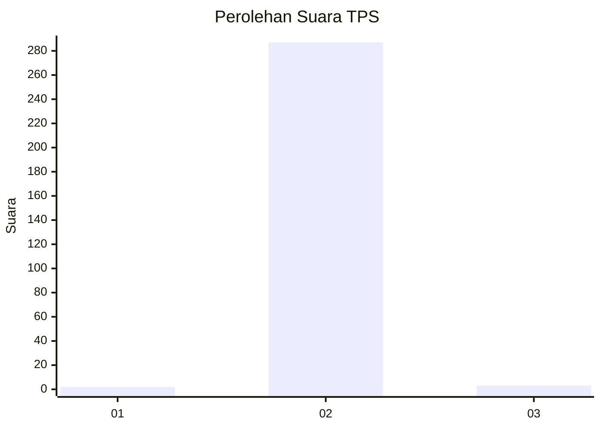
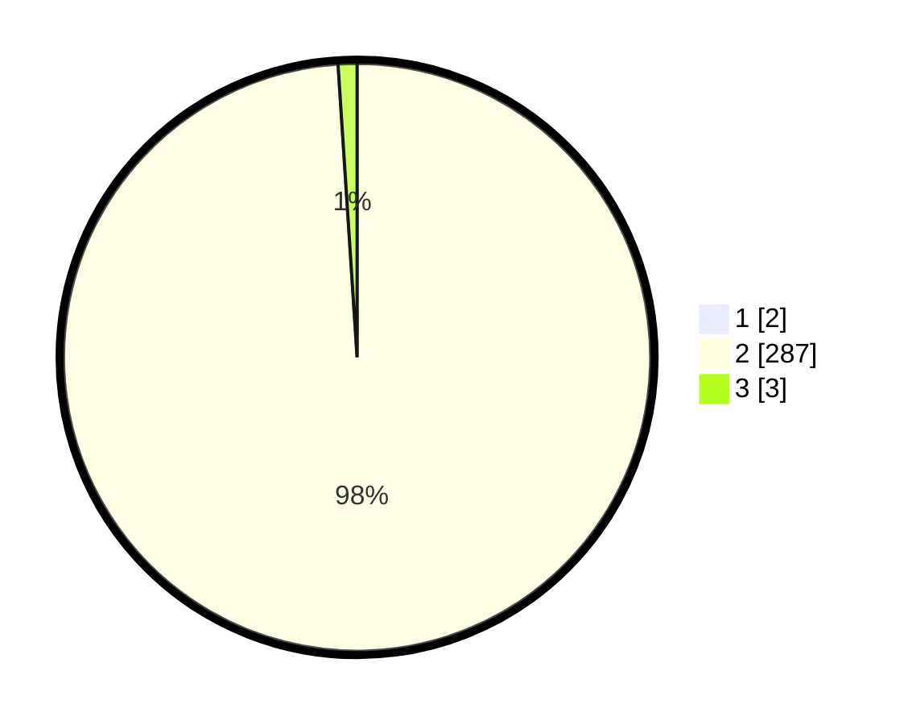

# Hasil

## Grafik

## Tabel

| No. | Nama Paslon    | Suara | Suara (raw) | Persentase |
|:--- |:-------------- | -----:| -----------:| ----------:|
| 1   | ANIES MUHAIMIN | 2     | [2][p-1]    | 0,68       |
| 2   | PRABOWO GIBRAN | 287   | [287][p-2]  | 98,29      |
| 3   | GANJAR MAHFUD  | 3     | [3][p-3]    | 1,03       |

[p-1]: https://github.com/gigit-pemilu/pemilu-2024-35-jawa-timur/blob/main/pilpres/hitung-suara/sub/35-jawa-timur/sub/27-sampang/sub/02-torjun/sub/2012-torjun/sub/004-tps/sub/paslon-1.txt
[p-2]: https://github.com/gigit-pemilu/pemilu-2024-35-jawa-timur/blob/main/pilpres/hitung-suara/sub/35-jawa-timur/sub/27-sampang/sub/02-torjun/sub/2012-torjun/sub/004-tps/sub/paslon-2.txt
[p-3]: https://github.com/gigit-pemilu/pemilu-2024-35-jawa-timur/blob/main/pilpres/hitung-suara/sub/35-jawa-timur/sub/27-sampang/sub/02-torjun/sub/2012-torjun/sub/004-tps/sub/paslon-3.txt

## Foto C Plano

https://sirekap-obj-formc.kpu.go.id/ff6a/pemilu/ppwp/35/27/02/20/12/3527022012004-20240214-234846--d188d0f8-c4ae-4d84-b466-551cda195bbe.jpg

https://sirekap-obj-formc.kpu.go.id/ff6a/pemilu/ppwp/35/27/02/20/12/3527022012004-20240214-235318--7eb485e9-b3a7-44b0-8017-2faf4bd9e932.jpg

https://sirekap-obj-formc.kpu.go.id/ff6a/pemilu/ppwp/35/27/02/20/12/3527022012004-20240214-235416--ce7f2648-aa42-4e41-95bb-cac0bf1e26c9.jpg

## Metadata

| Key        | Value               |
| ---------- | ------------------- |
| Time Stamp | 2024-02-16 10:30:29 |

