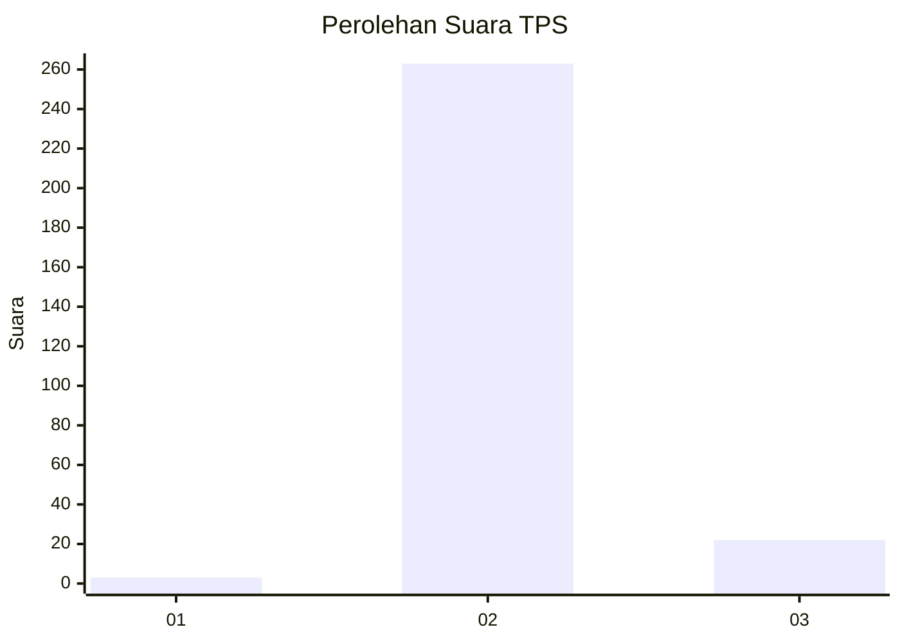
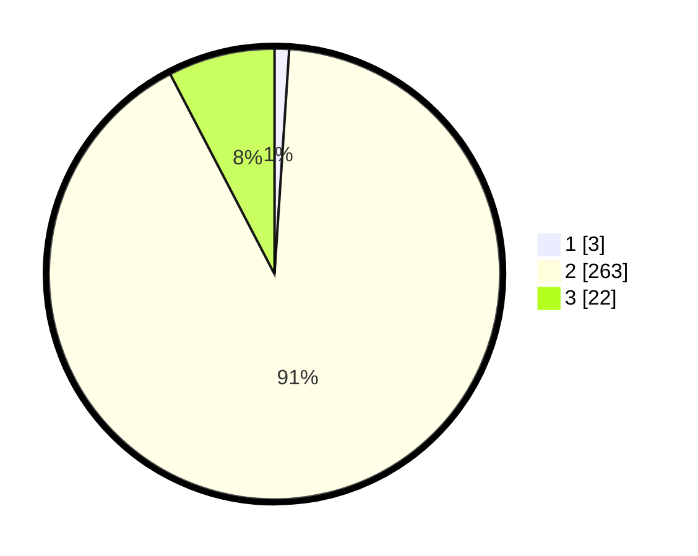

# Hasil

## Grafik

## Tabel

| No. | Nama Paslon    | Suara | Suara (raw) | Persentase |
|:--- |:-------------- | -----:| -----------:| ----------:|
| 1   | ANIES MUHAIMIN | 3     | [3][p-1]    | 1,04       |
| 2   | PRABOWO GIBRAN | 263   | [263][p-2]  | 91,32      |
| 3   | GANJAR MAHFUD  | 22    | [22][p-3]   | 7,64       |

[p-1]: https://github.com/gigit-pemilu/pemilu-2024-35-jawa-timur/blob/main/pilpres/hitung-suara/sub/35-jawa-timur/sub/27-sampang/sub/02-torjun/sub/2012-torjun/sub/005-tps/sub/paslon-1.txt
[p-2]: https://github.com/gigit-pemilu/pemilu-2024-35-jawa-timur/blob/main/pilpres/hitung-suara/sub/35-jawa-timur/sub/27-sampang/sub/02-torjun/sub/2012-torjun/sub/005-tps/sub/paslon-2.txt
[p-3]: https://github.com/gigit-pemilu/pemilu-2024-35-jawa-timur/blob/main/pilpres/hitung-suara/sub/35-jawa-timur/sub/27-sampang/sub/02-torjun/sub/2012-torjun/sub/005-tps/sub/paslon-3.txt

## Foto C Plano

https://sirekap-obj-formc.kpu.go.id/975c/pemilu/ppwp/35/27/02/20/12/3527022012005-20240214-231534--1e164c1f-3ea7-4681-a1ab-5e928e019bfa.jpg

https://sirekap-obj-formc.kpu.go.id/975c/pemilu/ppwp/35/27/02/20/12/3527022012005-20240214-231507--cec49b69-a981-4c97-a41f-a308d16f3139.jpg

https://sirekap-obj-formc.kpu.go.id/975c/pemilu/ppwp/35/27/02/20/12/3527022012005-20240214-231423--6f4f117b-9493-4e57-a308-96566cbde857.jpg

## Metadata

| Key        | Value               |
| ---------- | ------------------- |
| Time Stamp | 2024-02-16 10:30:29 |

