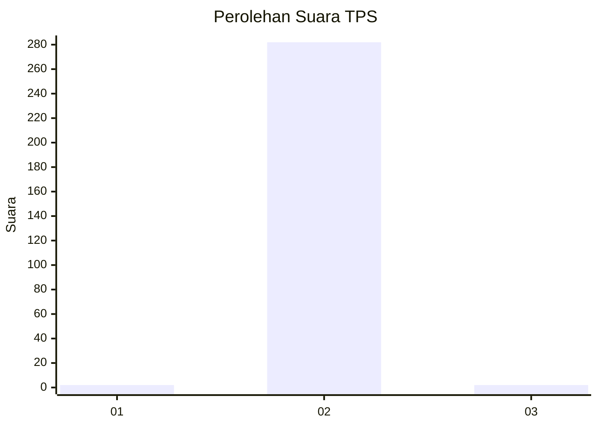
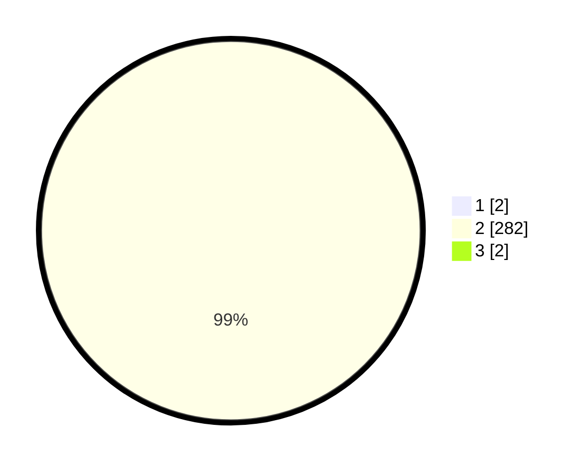

# Hasil

## Grafik

## Tabel

| No. | Nama Paslon    | Suara | Suara (raw) | Persentase |
|:--- |:-------------- | -----:| -----------:| ----------:|
| 1   | ANIES MUHAIMIN | 2     | [2][p-1]    | 0,70       |
| 2   | PRABOWO GIBRAN | 282   | [282][p-2]  | 98,60      |
| 3   | GANJAR MAHFUD  | 2     | [2][p-3]    | 0,70       |

[p-1]: https://github.com/gigit-pemilu/pemilu-2024-35-jawa-timur/blob/main/pilpres/hitung-suara/sub/35-jawa-timur/sub/27-sampang/sub/02-torjun/sub/2012-torjun/sub/008-tps/sub/paslon-1.txt
[p-2]: https://github.com/gigit-pemilu/pemilu-2024-35-jawa-timur/blob/main/pilpres/hitung-suara/sub/35-jawa-timur/sub/27-sampang/sub/02-torjun/sub/2012-torjun/sub/008-tps/sub/paslon-2.txt
[p-3]: https://github.com/gigit-pemilu/pemilu-2024-35-jawa-timur/blob/main/pilpres/hitung-suara/sub/35-jawa-timur/sub/27-sampang/sub/02-torjun/sub/2012-torjun/sub/008-tps/sub/paslon-3.txt

## Foto C Plano

https://sirekap-obj-formc.kpu.go.id/4cde/pemilu/ppwp/35/27/02/20/12/3527022012008-20240214-223003--f98e0421-3a74-4bb9-9be5-92126592100c.jpg

https://sirekap-obj-formc.kpu.go.id/4cde/pemilu/ppwp/35/27/02/20/12/3527022012008-20240214-223233--3047b0c3-f174-4672-82d3-2377c3bf1cc7.jpg

https://sirekap-obj-formc.kpu.go.id/4cde/pemilu/ppwp/35/27/02/20/12/3527022012008-20240214-223338--8602ad65-8653-4655-9823-0c5844f2eda9.jpg

## Metadata

| Key        | Value               |
| ---------- | ------------------- |
| Time Stamp | 2024-02-24 22:31:28 |

