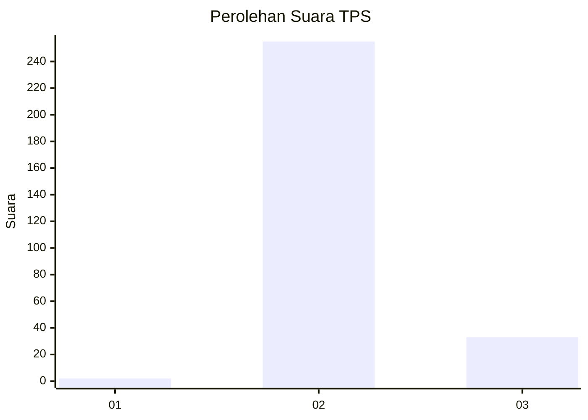
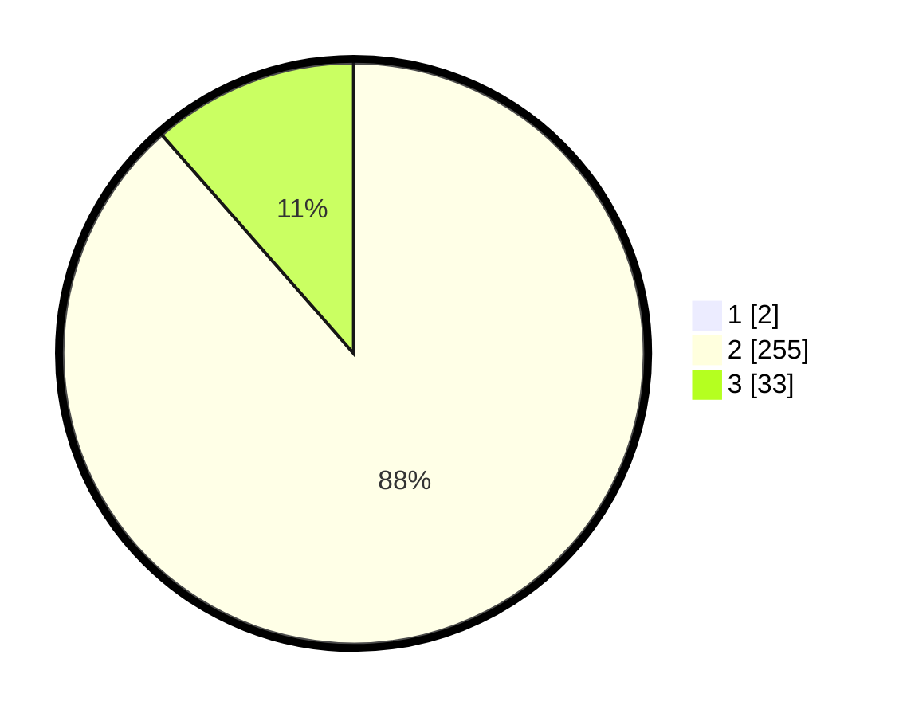

# Hasil

## Grafik

## Tabel

| No. | Nama Paslon    | Suara | Suara (raw) | Persentase |
|:--- |:-------------- | -----:| -----------:| ----------:|
| 1   | ANIES MUHAIMIN | 2     | [2][p-1]    | 0,69       |
| 2   | PRABOWO GIBRAN | 255   | [255][p-2]  | 87,93      |
| 3   | GANJAR MAHFUD  | 33    | [33][p-3]   | 11,38      |

[p-1]: https://github.com/gigit-pemilu/pemilu-2024/blob/main/pilpres/hitung-suara/sub/35-jawa-timur/sub/27-sampang/sub/02-torjun/sub/2012-torjun/sub/009-tps/sub/paslon-1.txt
[p-2]: https://github.com/gigit-pemilu/pemilu-2024/blob/main/pilpres/hitung-suara/sub/35-jawa-timur/sub/27-sampang/sub/02-torjun/sub/2012-torjun/sub/009-tps/sub/paslon-2.txt
[p-3]: https://github.com/gigit-pemilu/pemilu-2024/blob/main/pilpres/hitung-suara/sub/35-jawa-timur/sub/27-sampang/sub/02-torjun/sub/2012-torjun/sub/009-tps/sub/paslon-3.txt

## Foto C Plano

https://sirekap-obj-formc.kpu.go.id/f4a3/pemilu/ppwp/35/27/02/20/12/3527022012009-20240214-224452--17abe580-911f-4a2c-8218-5a0b3bf35a02.jpg

https://sirekap-obj-formc.kpu.go.id/f4a3/pemilu/ppwp/35/27/02/20/12/3527022012009-20240214-224547--8d300070-52f7-4fa5-b9b5-da146699eaff.jpg

https://sirekap-obj-formc.kpu.go.id/f4a3/pemilu/ppwp/35/27/02/20/12/3527022012009-20240214-224714--7c6dfc0c-98c7-4e70-9ee2-14e66153f4fc.jpg

## Metadata

| Key        | Value               |
| ---------- | ------------------- |
| Time Stamp | 2024-02-16 12:51:22 |

