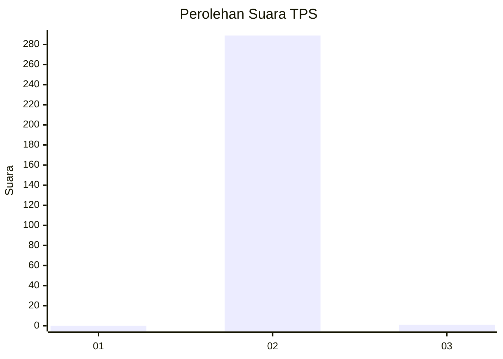
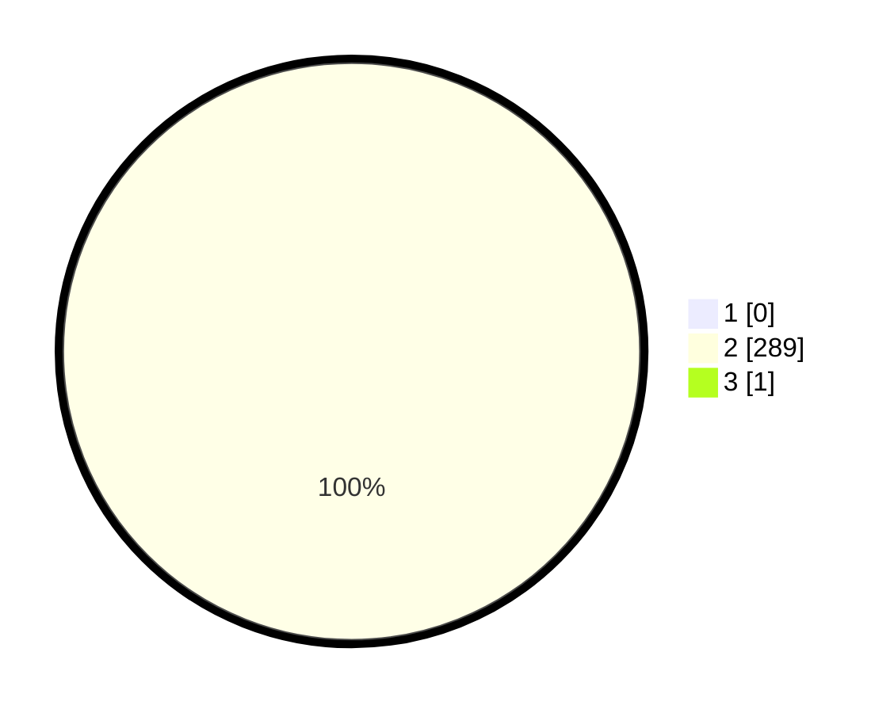

# Hasil

## Grafik

## Tabel

| No. | Nama Paslon    | Suara | Suara (raw) | Persentase |
|:--- |:-------------- | -----:| -----------:| ----------:|
| 1   | ANIES MUHAIMIN | 0     | [0][p-1]    | 0,00       |
| 2   | PRABOWO GIBRAN | 289   | [289][p-2]  | 99,66      |
| 3   | GANJAR MAHFUD  | 1     | [1][p-3]    | 0,34       |

[p-1]: https://github.com/gigit-pemilu/pemilu-2024/blob/main/pilpres/hitung-suara/sub/35-jawa-timur/sub/27-sampang/sub/02-torjun/sub/2012-torjun/sub/011-tps/sub/paslon-1.txt
[p-2]: https://github.com/gigit-pemilu/pemilu-2024/blob/main/pilpres/hitung-suara/sub/35-jawa-timur/sub/27-sampang/sub/02-torjun/sub/2012-torjun/sub/011-tps/sub/paslon-2.txt
[p-3]: https://github.com/gigit-pemilu/pemilu-2024/blob/main/pilpres/hitung-suara/sub/35-jawa-timur/sub/27-sampang/sub/02-torjun/sub/2012-torjun/sub/011-tps/sub/paslon-3.txt

## Foto C Plano

https://sirekap-obj-formc.kpu.go.id/dfe0/pemilu/ppwp/35/27/02/20/12/3527022012011-20240215-000441--6492e8f7-04dd-4cb9-9e6c-cbfdabfdcd63.jpg

https://sirekap-obj-formc.kpu.go.id/dfe0/pemilu/ppwp/35/27/02/20/12/3527022012011-20240214-235711--90aba3e4-2bf7-4c7f-b43e-da402d4e551b.jpg

https://sirekap-obj-formc.kpu.go.id/dfe0/pemilu/ppwp/35/27/02/20/12/3527022012011-20240215-000452--9c8793fa-c560-4a38-bfc3-8299dfb22038.jpg

## Metadata

| Key        | Value               |
| ---------- | ------------------- |
| Time Stamp | 2024-02-16 10:30:29 |

